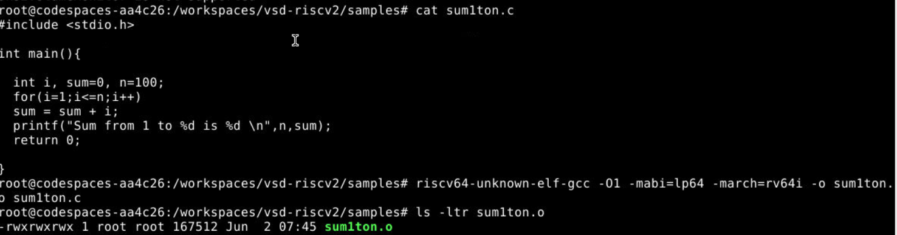
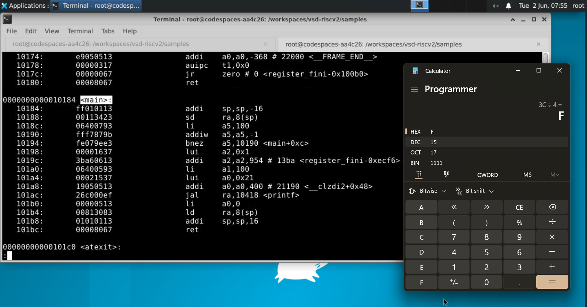
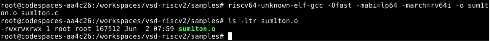
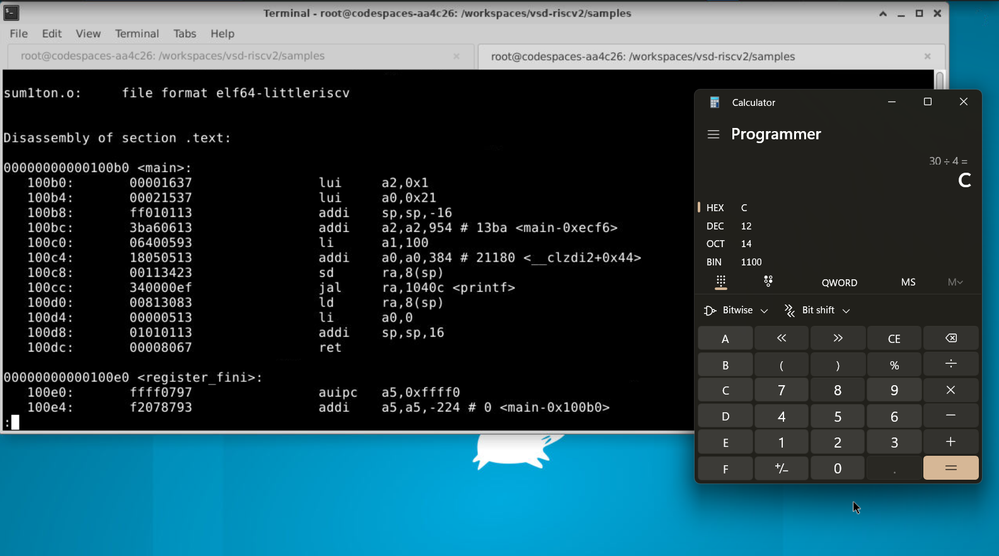

# Task 1: Compilation of C Program using GCC and RISC-V GCC Compiler

## Overview

This task focuses on understanding the compilation and execution flow of a simple C program using both the native GCC compiler and the RISC-V GCC cross-compiler. The objective is to observe how a high-level C program is translated into executable code and verify that the generated RISC-V binary produces the same result as the native implementation. Additionally, the generated assembly code is analyzed under different optimization levels to understand the effect of compiler optimizations.

---

## Objective

- Create and edit a C program using a text editor.
- Compile and execute the program using the native GCC compiler.
- Cross-compile the program using the RISC-V GCC toolchain.
- Execute the generated binary using the Spike simulator.
- Generate and analyze assembly code using different optimization levels.
- Verify that all implementations produce identical outputs.

---

## Program Description

A C program named `sum1ton.c` was created to calculate the sum of natural numbers from **1 to N**.

### Source Code

```c
#include <stdio.h>

int main()
{
    int i, sum = 0, n = 100;

    for(i = 1; i <= n; i++)
        sum = sum + i;

    printf("Sum from 1 to %d is %d\n", n, sum);

    return 0;
}
```

For this experiment:

```text
n = 100
```

Expected Result:

```text
1 + 2 + 3 + ... + 100 = 5050
```

---

# Editing the Source Code

The source code was created and edited using the Gedit text editor.

## Command Used

```bash
gedit sum1ton.c
```

## Screenshot


The program uses a `for` loop to iterate from 1 to `n` and continuously accumulate the sum. The final result is displayed using the `printf()` function.

---

# O0 – Native GCC Compilation and Execution

The C program was compiled and executed using the standard GCC compiler available on the host machine.

## Compilation Command

```bash
gcc sum1ton.c
```

## Execution Command

```bash
./a.out
```

## Screenshot


## Output

```text
Sum from 1 to 100 is 5050
```

## Observation

The successful execution confirms that the source code is functioning correctly. This output serves as the reference output for all subsequent verification stages.

---

# O1 – RISC-V Compilation and Spike Simulation

The same source code was compiled using the RISC-V GCC cross-compiler and executed using the Spike ISA simulator.

## Cross Compilation Command

```bash
riscv64-unknown-elf-gcc -o sum1ton.o sum1ton.c
```

## Simulation Command

```bash
spike pk sum1ton.o
```

## Screenshot


## Output

```text
Sum from 1 to 100 is 5050
```

## Observation

The Spike simulator successfully executed the generated RISC-V binary and produced the expected result.

---

# Assembly Generation and Optimization Analysis

To study the impact of compiler optimizations, the program was compiled using different optimization levels and the generated assembly code was analyzed.

---

# RISC-V Compilation using O1 Optimization

## Source Code Verification

Before compilation, the source code was verified using:

```bash
cat sum1ton.c
```

## Screenshot



## Compilation Command

```bash
riscv64-unknown-elf-gcc -O1 -mabi=lp64 -march=rv64i -o sum1ton.o sum1ton.c
```

## Binary Verification

```bash
ls -ltr sum1ton.o
```

The successful generation of the executable confirms successful compilation.

---

## O1 Disassembly

The generated binary was disassembled using:

```bash
riscv64-unknown-elf-objdump -d sum1ton.o
```

## Screenshot



## Analysis

At the O1 optimization level, the compiler performs moderate optimizations while still preserving the overall structure of the original program.

### Key Observations

- Stack space is allocated at the beginning of the function.
- The return address is stored on the stack.
- The loop structure remains visible in the generated assembly.
- Runtime arithmetic operations are still performed.
- The compiler reduces unnecessary instructions while preserving program flow.

As a result, the assembly code remains relatively easy to understand and closely resembles the original C implementation.

---

# RISC-V Compilation using Ofast Optimization

## Compilation Command

```bash
riscv64-unknown-elf-gcc -Ofast -mabi=lp64 -march=rv64i -o sum1ton.o sum1ton.c
```

## Binary Verification

```bash
ls -ltr sum1ton.o
```

## Screenshot



---

## Ofast Disassembly

The generated binary was disassembled using:

```bash
riscv64-unknown-elf-objdump -d sum1ton.o
```

## Screenshot



## Analysis

At the Ofast optimization level, the compiler applies aggressive optimization techniques to maximize execution performance.

### Key Observations

- The loop structure is heavily optimized.
- Redundant operations are removed.
- Fewer instructions are generated compared to O1.
- The generated assembly is more compact and efficient.
- Execution speed is improved due to aggressive optimization.

The resulting assembly code differs significantly from the O1 version while still producing the same functional output.

---

# Comparison of O1 and Ofast

| Feature | O1 | Ofast |
|----------|----------|----------|
| Optimization Level | Moderate | Aggressive |
| Loop Structure | Largely Preserved | Highly Optimized |
| Runtime Operations | More | Fewer |
| Code Size | Larger | Smaller |
| Execution Speed | Faster than O0 | Fastest |
| Readability | Higher | Lower |

---

# Results and Verification

The program was executed using three different approaches:

1. Native GCC Compilation and Execution
2. RISC-V Compilation with O1 Optimization
3. RISC-V Compilation with Ofast Optimization

The outputs obtained from all three implementations were compared.

| Execution Method | Output |
|------------------|---------|
| GCC (O0) | Sum from 1 to 100 is 5050 |
| RISC-V (O1) | Sum from 1 to 100 is 5050 |
| RISC-V (Ofast) | Sum from 1 to 100 is 5050 |

---

# Verification

The outputs generated using different compilation flows were found to be identical.

```text
GCC (O0) = RISC-V (O1) = RISC-V (Ofast)
```

Output obtained in all cases:

```text
Sum from 1 to 100 is 5050
```

This confirms that the generated RISC-V binaries preserve the functionality of the original C program irrespective of the optimization level used during compilation.

---

# Conclusion

In this task, a simple C program for calculating the sum of natural numbers from 1 to 100 was successfully developed and verified across multiple compilation environments.

The program was first edited using the Gedit text editor and executed using the native GCC compiler to establish a reference output. The same source code was then cross-compiled using the RISC-V GCC toolchain and executed using the Spike simulator. Finally, assembly code generated using the O1 and Ofast optimization levels was analyzed and compared.

The outputs obtained from GCC, RISC-V O1, and RISC-V Ofast executions were identical, demonstrating functional equivalence across all implementations. The experiment also highlighted how compiler optimization levels can significantly alter the generated assembly code while maintaining the correctness of the program output.

This verification confirms the reliability of the RISC-V compilation and simulation flow and provides insight into the impact of compiler optimizations on generated machine code.
