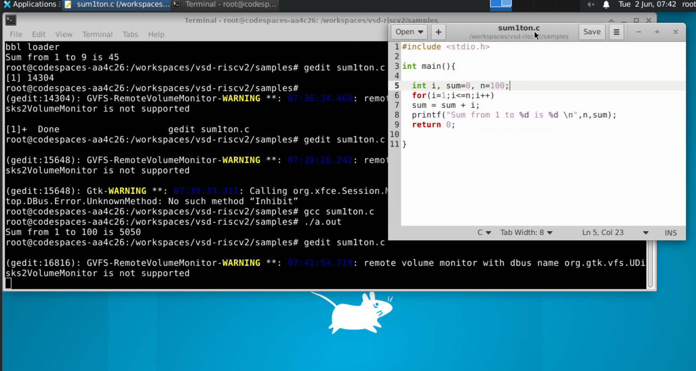
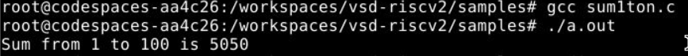
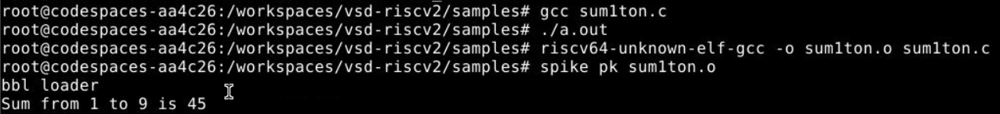

# Task 1: Compilation of C Program using GCC and RISC-V GCC Compiler

## Overview

This task focuses on understanding the compilation process of a C program using both the native GCC compiler and the RISC-V GCC cross-compiler. The objective is to study how source code is translated into machine-level instructions and to analyze the generated RISC-V assembly code under different optimization levels.

---

## Objective

- Compile a C program using the GCC compiler.
- Generate RISC-V assembly code using the RISC-V GCC toolchain.
- Compare assembly outputs generated with different optimization levels.
- Understand the role of compilation in the RISC-V software-to-hardware design flow.

---

## Background

A processor executes machine instructions, not high-level programming languages. Therefore, every C program must be translated into instructions understood by the target architecture.

In this task, the target architecture is **RISC-V**, an open-source Instruction Set Architecture (ISA) widely used in modern processor design and research.

The compilation flow helps bridge the gap between software development and processor implementation.

---

## Verification Stages

### O0 – Native GCC Compilation

At this stage, the C program is compiled and executed using the standard GCC compiler on the host machine.

#### Purpose

- Generate the reference output.
- Verify that the C program functions correctly.
- Establish a baseline for comparison.

#### Example Command

```bash
gcc program.c -o program
./program
```

#### Output

Reference output generated from native execution.

---

### O1 – RISC-V Cross Compilation

The same C program is compiled using the RISC-V GCC cross-compiler.

The generated assembly code is analyzed to understand how the compiler translates high-level code into RISC-V instructions.

#### Purpose

- Generate RISC-V assembly code.
- Observe compiler optimizations.
- Verify consistency with the reference implementation.

#### Example Command

```bash
riscv64-unknown-elf-gcc -O1 -S program.c
```

#### Output

RISC-V assembly (.s) file and corresponding executable.

---

## Expected Validation

The functionality observed after RISC-V compilation should match the reference behavior obtained from native GCC execution.

```text
O0 = O1
```

Where:

- O0 → Output generated using native GCC compilation.
- O1 → Output corresponding to the RISC-V compiled implementation.

If both outputs are identical, the verification is considered successful.

# Experiment: Compilation and Execution of a C Program using GCC and RISC-V Toolchain

## Objective

The objective of this experiment is to understand the compilation and execution flow of a simple C program using both the native GCC compiler and the RISC-V GCC cross-compiler. The generated executable is then simulated using the Spike RISC-V simulator to verify functional correctness.

---

## Program Description

A simple C program named `sum1ton.c` was created to calculate the sum of natural numbers from **1 to N**.

For this experiment:

```c
n = 100;
```

Therefore, the expected result is:

```text
1 + 2 + 3 + ... + 100 = 5050
```

---

## Editing the Source Code

The source code was edited using the **Gedit Text Editor**.

### Command Used

```bash
gedit sum1ton.c
```

### Screenshot



The program initializes a variable `n` and uses a `for` loop to compute the cumulative sum from 1 to `n`. The final result is displayed using the `printf()` function.

---

## O0 – Native GCC Compilation and Execution

At this stage, the program is compiled using the native GCC compiler available on the host machine.

### Compilation Command

```bash
gcc sum1ton.c
```

### Execution Command

```bash
./a.out
```

### Screenshot



### Result

```text
Sum from 1 to 100 is 5050
```

### Observation

The successful execution confirms that the C program is functioning correctly. This output serves as the **reference output (O0)** for later verification.

---

## O1 – RISC-V Cross Compilation

The same source code is now compiled using the RISC-V GCC cross-compiler.

### Compilation Command

```bash
riscv64-unknown-elf-gcc -o sum1ton.o sum1ton.c
```

This generates a RISC-V executable that can be executed on a RISC-V simulator.

---

## Spike Simulation

The generated RISC-V executable is executed using the Spike ISA simulator.

### Simulation Command

```bash
spike pk sum1ton.o
```

### Screenshot



### Result

```text
Sum from 1 to 100 is 5050
```

### Observation

The Spike simulator executes the RISC-V binary and produces the same output as the native GCC execution.

This demonstrates that the RISC-V compiled implementation preserves the functionality of the original C program.

---

## Verification

The outputs obtained from both execution flows are compared.

### Native GCC Output (O0)

```text
Sum from 1 to 100 is 5050
```

### RISC-V + Spike Output (O1)

```text
Sum from 1 to 100 is 5050
```

### Validation

```text
O0 = O1
```

Since both outputs are identical, the verification is successful.

---

## Conclusion

A C program for calculating the sum of natural numbers was successfully:

1. Created and edited using Gedit.
2. Compiled and executed using the native GCC compiler.
3. Cross-compiled using the RISC-V GCC toolchain.
4. Executed on the Spike RISC-V simulator.

The outputs from both execution environments matched exactly, confirming the correctness of the RISC-V compilation and simulation flow.
