# Task 2: SPIKE Simulation and Debugging using RISC-V GCC

## Introduction

After generating a RISC-V executable using the RISC-V GCC cross-compiler, the next step is to verify its execution and observe how the processor behaves internally.

For this purpose, the SPIKE simulator is used. SPIKE is the official functional simulator for the RISC-V Instruction Set Architecture (ISA). It acts as a virtual RISC-V processor and allows RISC-V programs to be executed and debugged even without physical hardware.

In this task, the previously developed `sum1ton.c` program is executed using SPIKE and then analyzed using SPIKE's debugging mode to observe instruction execution and register modifications.

---

## Program Used

The program calculates the sum of natural numbers from 1 to 100.

### Expected Output

```text
Sum from 1 to 100 is 5050
```

---

## SPIKE Simulation

The source code was first compiled using the RISC-V GCC cross-compiler.

### Compilation Command

```bash
riscv64-unknown-elf-gcc -Ofast -mabi=lp64 -march=rv64i -o sum1ton.o sum1ton.c
```

The generated executable was then executed using SPIKE.

### Simulation Command

```bash
spike pk sum1ton.o
```

### Screenshot

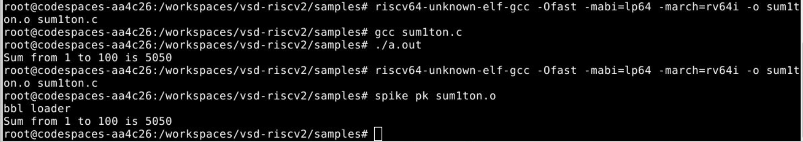

### Observation

The program executes successfully on the SPIKE simulator and produces:

```text
Sum from 1 to 100 is 5050
```

This confirms that the generated RISC-V executable behaves correctly and produces the same output as the native GCC implementation.

---

## SPIKE Debugging

One of the most useful features of SPIKE is its interactive debugging mode.

The debugger can be launched using:

```bash
spike -d pk sum1ton.o
```

This mode allows instruction-by-instruction execution and provides visibility into register values and processor state.

---

### Assembly Reference

Before debugging, the executable was disassembled to identify the instructions generated by the compiler.

```bash
riscv64-unknown-elf-objdump -d sum1ton.o
```

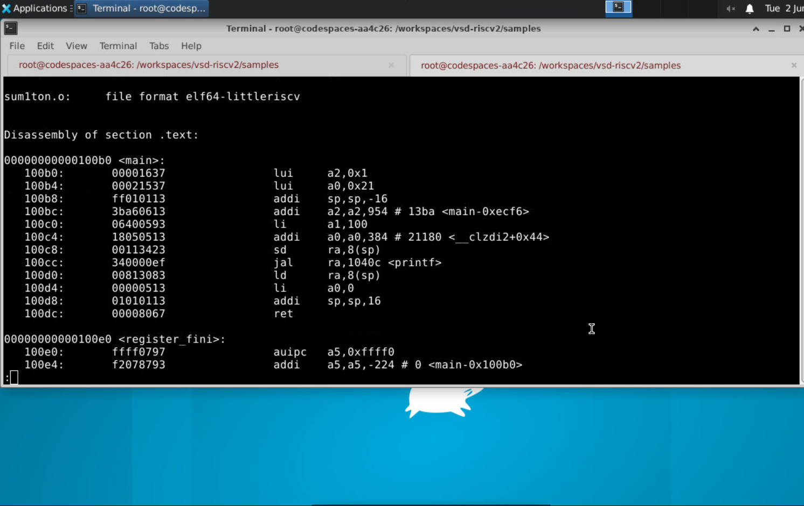

From the disassembly, the `main()` function begins at address:

```text
0x100b0
```

The first few instructions executed by the processor are:

```assembly
lui a2,0x1
lui a0,0x21
addi sp,sp,-16
addi a2,a2,954
li a1,100
```

These instructions initialize registers and prepare the execution environment before the program proceeds further.

The assembly listing serves as a reference during debugging because it allows us to correlate instruction addresses with actual processor activity.

---

### Observing Stack Allocation

The debugger was instructed to stop execution at address:

```text
0x100b8
```

which corresponds to:

```assembly
addi sp, sp, -16
```

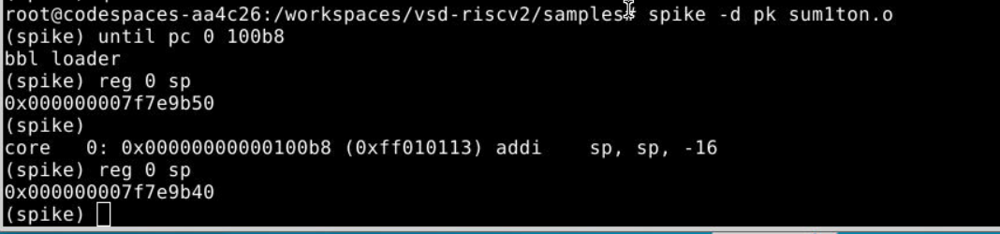

Before execution, the stack pointer contained:

```text
0x000000007f7e9b50
```

After executing the instruction:

```assembly
addi sp, sp, -16
```

the stack pointer became:

```text
0x000000007f7e9b40
```

### What Happened?

The processor reserved 16 bytes of stack memory for the function.

This is a common operation performed at the beginning of a function. The stack space can later be used to store local variables, temporary data, and saved register values.

The debugger clearly shows how a single instruction modifies the processor state.

---

### Observing Register Updates

The next step was to observe how registers change when instructions are executed.

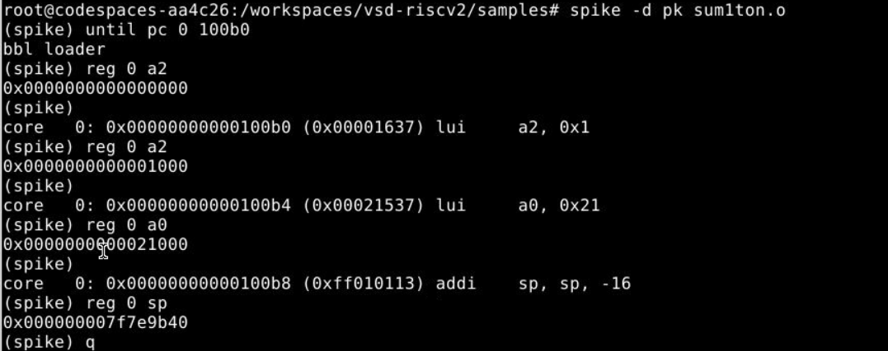

The following instructions were executed:

```assembly
lui a2,0x1
lui a0,0x21
addi sp,sp,-16
```

The debugger allows register values to be inspected immediately after each instruction.

#### Register a2

Instruction:

```assembly
lui a2,0x1
```

Value before execution:

```text
0x0000000000000000
```

Value after execution:

```text
0x0000000000001000
```

The `lui` instruction loads an immediate value into the upper bits of the register.

---

#### Register a0

Instruction:

```assembly
lui a0,0x21
```

Value after execution:

```text
0x0000000000021000
```

This instruction prepares the register with an upper immediate value required later during program execution.

---

#### Stack Pointer Register

Instruction:

```assembly
addi sp,sp,-16
```

Value after execution:

```text
0x000000007f7e9b40
```

The stack pointer is updated to allocate stack memory for the current function.

---

### Debugging Observation

Using SPIKE debug mode, it was possible to:

- Execute instructions one at a time.
- Observe processor register values.
- Monitor stack allocation.
- Track instruction execution.
- Correlate assembly instructions with hardware behavior.

This provides a much deeper understanding of how a RISC-V processor executes machine instructions internally.


---

---

# Application of Digital Design Concepts (Elevator Controller FSM) and compiling it using GCC/RISC-V/SPIKE  

To demonstrate a practical application of digital design concepts, a simple Elevator Controller was implemented using the Finite State Machine (FSM) approach.

An FSM consists of a set of states, transitions, inputs, and outputs. The elevator controller naturally follows FSM behavior because it changes states depending on the current floor and the requested destination floor.

---

## FSM Description

The elevator operates between floors 0 and 9.

### States

- Idle
- Door Closing
- Moving Up
- Moving Down
- Door Opening

### State Transition Flow

```text
Idle
 |
 v
Door Closing
 |
 +-----> Moving Up ------+
 |                       |
 +-----> Moving Down ----+
                         |
                         v
                   Door Opening
                         |
                         v
                        Idle
```

---

## C Program Development

The elevator controller program was created and edited using the gedit text editor.

### Source Code Screenshot

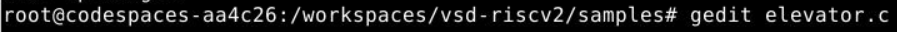

### Source Code

```c
#include <stdio.h>

int main()
{
    int current_floor = 0;
    int target_floor;

    printf("Elevator Controller\n");
    printf("Building Floors: 0 - 9\n");
    printf("Current Floor: %d\n", current_floor);

    printf("\nEnter Target Floor: ");
    scanf("%d", &target_floor);

    if (target_floor < 0 || target_floor > 9)
    {
        printf("Invalid Floor!\n");
        return 0;
    }

    printf("\nDoor Closing...\n");

    if (target_floor > current_floor)
    {
        while (current_floor < target_floor)
        {
            current_floor++;
            printf("Moving Up -> Floor %d\n", current_floor);
        }
    }
    else
    {
        while (current_floor > target_floor)
        {
            current_floor--;
            printf("Moving Down -> Floor %d\n", current_floor);
        }
    }

    printf("Reached Floor %d\n", current_floor);
    printf("Door Opening...\n");

    return 0;
}
```

---

## GCC Compilation and Execution

The program was first compiled using the native GCC compiler and executed on the host system.

### Commands

```bash
gcc elevator.c
./a.out
```

### Output

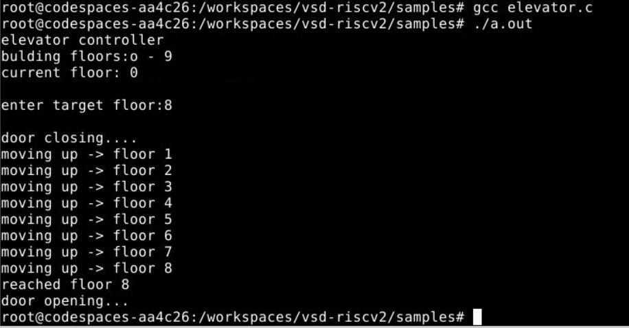

### Observation

The elevator starts at Floor 0 and moves step-by-step toward the requested floor. For the test case shown, the target floor was 8 and the elevator successfully reached the destination before opening the door.

---

## RISC-V Compilation using GCC Cross Compiler

The program was then compiled for the RISC-V architecture using the RISC-V GCC cross-compiler.

### O1 Compilation

```bash
riscv64-unknown-elf-gcc -O1 -mabi=lp64 -march=rv64i -o elevator.o elevator.c
```

### Generated Object File

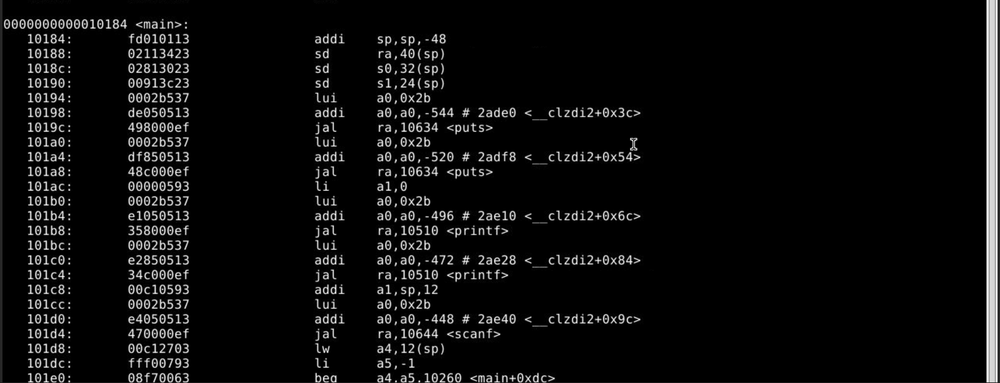

---

## O1 Assembly Analysis

The generated executable was disassembled to inspect the assembly instructions generated by the compiler.

### Command

```bash
riscv64-unknown-elf-objdump -d elevator.o
```

### Assembly Output

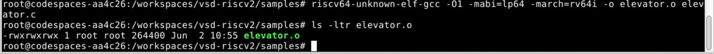

### Observation

The assembly listing shows the low-level instructions generated from the C program. Instructions such as:

```assembly
lui
addi
jal
lw
beq
```

are used for register initialization, arithmetic operations, conditional branching, function calls, and memory access.

---

## Ofast Compilation

The program was also compiled using aggressive compiler optimizations.

### Command

```bash
riscv64-unknown-elf-gcc -Ofast -mabi=lp64 -march=rv64i -o elevator.o elevator.c
```

### Generated Object File

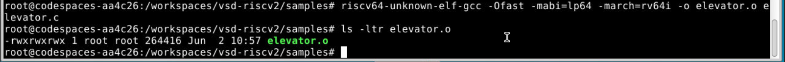

---

## Ofast Assembly Analysis

The optimized executable was disassembled to observe the effect of compiler optimizations.

### Assembly Output

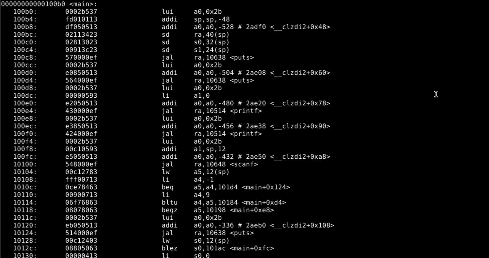

### Observation

With the Ofast optimization level enabled, the compiler performs aggressive optimizations to improve execution speed. The generated assembly may contain fewer instructions and more efficient control flow compared to lower optimization levels.

---

## SPIKE Simulation

The generated RISC-V executable was executed using the SPIKE simulator.

### Command

```bash
spike pk elevator.o
```

### Output

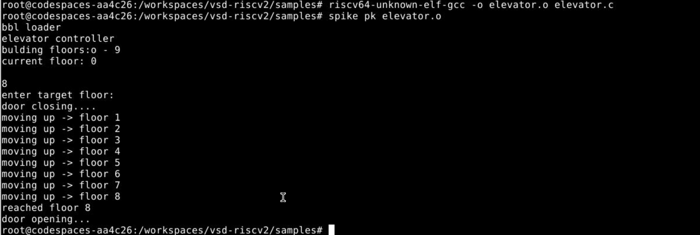

### Observation

The SPIKE simulator successfully executed the RISC-V binary and produced the same behavior observed during native GCC execution.

The elevator moved sequentially through the floors:

```text
0 → 1 → 2 → 3 → 4 → 5 → 6 → 7 → 8
```

before reaching the target floor and opening the door.

This confirms that the RISC-V executable generated by the cross-compiler behaves correctly when executed on a RISC-V simulation environment.

---

## Summary

| Stage | Result |
|---------|---------|
| GCC Compilation | Successful |
| GCC Execution | Successful |
| RISC-V O1 Compilation | Successful |
| RISC-V O1 Disassembly | Successful |
| RISC-V Ofast Compilation | Successful |
| RISC-V Ofast Disassembly | Successful |
| SPIKE Simulation | Successful |

The Elevator Controller FSM successfully demonstrates how a digital design concept can be modeled in C, compiled for the RISC-V architecture, analyzed at the assembly level, and validated using the SPIKE simulator.

## Conclusion

The generated RISC-V executable was successfully executed using the SPIKE simulator and verified against the native GCC output.

Using SPIKE's debugging mode, it was possible to inspect register contents, monitor stack pointer updates, and observe instruction execution at a low level. The experiment demonstrated how SPIKE can be used not only for simulation but also as a powerful debugging tool for understanding and validating RISC-V software.
