# Task-3: Environment Setup & RISC-V Reference Bring-Up

This task establishes a reliable RISC-V development environment and verifies the complete reference execution flow. It ensures that the required toolchain and simulation environment are properly configured before proceeding with advanced FPGA and RISC-V development activities.

---

# Objective

Successfully configure the development environment and validate the RISC-V reference flow by compiling and executing a sample program using both the native compiler and the RISC-V toolchain.

This task focuses on:

- Toolchain verification and readiness
- Understanding the RISC-V compilation flow
- Executing a reference program using the Spike simulator
- Building a stable foundation for upcoming internship tasks

This is an environment validation task and does not involve FPGA programming.

---

# Step 1: Set Up GitHub Codespace

The official **vsd-riscv2** repository was forked and launched using GitHub Codespaces to create a standardized development environment.

The workspace was initialized successfully, after which the sample programs directory was accessed for testing and verification. This environment provides all the necessary tools required for RISC-V development throughout the internship.

---

# Step 2: Verify RISC-V Reference Flow

Inside the configured Codespace environment, the sample C program was compiled and executed to verify the functionality of both the native GCC compiler and the RISC-V toolchain.

The following commands were used during the verification process:

```bash
cd /workspaces/vsd-riscv2
cd samples
ls -ltr

gcc sum1ton.c
./a.out

riscv64-unknown-elf-gcc -o sum1ton.o sum1ton.c
spike pk sum1ton.o
```

The execution completed successfully without any compilation or runtime errors.

## Execution Output

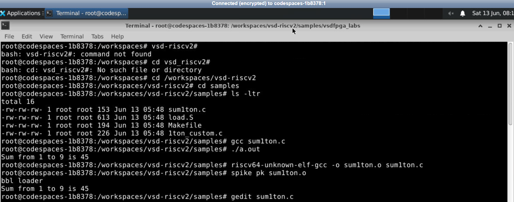

---

essfully configured and validated. The sample program compiled and executed correctly using both the native compiler and the RISC-V simulation flow, confirming that the toolchain is fully functional and ready for subsequent VSD internship tasks.

# Step 3: Clone and Run VSDFPGA Labs (Mandatory)

After successfully setting up the RISC-V reference environment, the VSDFPGA Labs environment was prepared by installing the necessary software packages and development tools. This step ensures that the system is ready for synthesis, simulation, and future FPGA development activities.

---

## 3.1 Install General Development Dependencies

The following command installs the libraries and utilities required for software compilation, debugging, and hardware development.

```bash
sudo apt-get install git vim autoconf automake autotools-dev curl libmpc-dev \
libmpfr-dev libgmp-dev gawk build-essential bison flex texinfo gperf libtool \
patchutils bc zlib1g-dev libexpat1-dev gtkwave picocom -y
```

### Output


---

## 3.2 Install FPGA Toolchain

The FPGA toolchain provides the required synthesis and simulation tools for digital circuit development.

```bash
sudo apt-get install yosys nextpnr-ice40 icestorm iverilog -y
```

During execution, the system reported that the **icestorm** package could not be located, while the remaining installation process continued normally.

### Output


---

## 3.3 Configure the RISC-V GCC Toolchain

The official RISC-V GCC toolchain was downloaded, extracted, and added to the system PATH for easy access from the terminal.

```bash
cd ~

mkdir -p riscv_toolchain && cd riscv_toolchain

wget "https://static.dev.sifive.com/dev-tools/riscv64-unknown-elf-gcc-8.3.0-2019.08.0-x86_64-linux-ubuntu14.tar.gz"

tar -xvzf riscv64-unknown-elf-gcc-*.tar.gz

echo 'export PATH=$HOME/riscv_toolchain/riscv64-unknown-elf-gcc-8.3.0-2019.08.0-x86_64-linux-ubuntu14/bin:$PATH' >> ~/.bashrc

source ~/.bashrc
```

### Output


---

## 3.4 Clone the VSDFPGA Labs Repository

The first step is to download the official VSDFPGA Labs repository into the local workspace. This repository contains the firmware, RTL source files, and Makefiles required for building the Basic RISC-V design.

### Step 1: Move to the Home Directory

```bash
cd ~
```

The `cd ~` command changes the current working directory to the user's home directory, providing a standard location for cloning and managing project files.

### Step 2: Clone the Repository

```bash
git clone https://github.com/vsdip/vsdfpga_labs
```

The `git clone` command downloads the complete VSDFPGA Labs repository from GitHub and creates a local copy containing all source files and project resources.

### Step 3: Enter the Repository

```bash
cd vsdfpga_labs
```

This command navigates into the cloned project directory, allowing access to the firmware, RTL files, and build scripts.

### Output


---

## 3.5 Generate the RISC-V Firmware

The firmware source is reviewed and compiled to generate the BRAM initialization file, which will later be embedded into the FPGA design.

### Step 1: Navigate to the Firmware Directory

```bash
cd ~/vsdfpga_labs/basicRISCV/Firmware
```

This command opens the Firmware directory containing the RISC-V source code and build files.

### Step 2: Review the Source File

```bash
nano riscv_logo.c
```

The `nano` editor is used to inspect the firmware source code. No modifications are required; the file is simply reviewed and then closed.

### Step 3: Generate the BRAM File

```bash
make riscv_logo.bram.hex
```

The `make` command compiles the firmware and generates `riscv_logo.bram.hex`, which serves as the BRAM initialization file for the FPGA design.

### Output

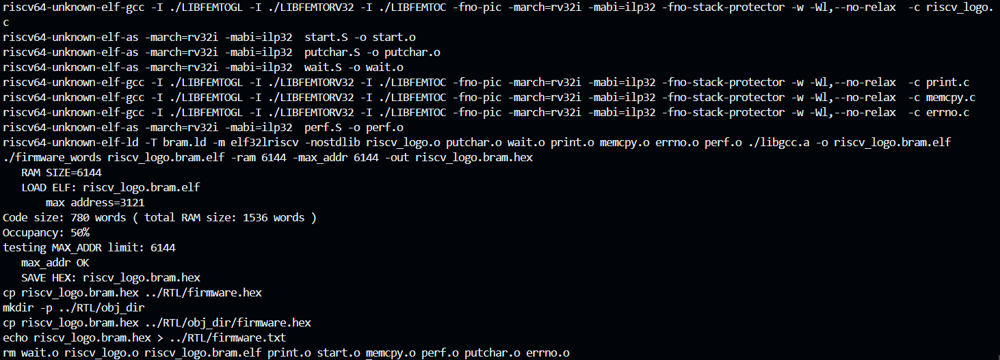

---

## 3.6 Build the FPGA Design

After generating the firmware image, the RTL project is cleaned and rebuilt to produce the FPGA bitstream.

### Step 1: Navigate to the RTL Directory

```bash
cd ~/vsdfpga_labs/basicRISCV/RTL
```

This command opens the RTL directory containing the Verilog source files and Makefile used for FPGA synthesis.

### Step 2: Remove Previous Build Files

```bash
make clean
```

The `make clean` command deletes previously generated files and ensures that the new build starts from a clean state.

### Step 3: Build the FPGA Design

```bash
make build
```

The `make build` command automatically performs synthesis, placement, routing, timing analysis, and finally generates the FPGA bitstream required for hardware implementation.

### Build Commands

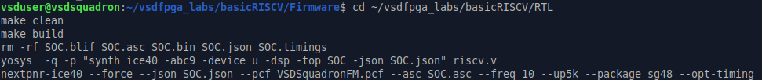

### Build Output


### Step 4: Flash to FPGA

Once the firmware and FPGA bitstream are generated successfully, the next step is to flash the design onto the VSDSquadron FPGA board. The flashing process uses the generated **SOC.bin** file and attempts to program the FPGA through the connected USB interface.

### Command Used

```bash
sudo make flash
```

The `make flash` command invokes the programming utility (`iceprog`) to transfer the generated bitstream to the FPGA board.

### Output

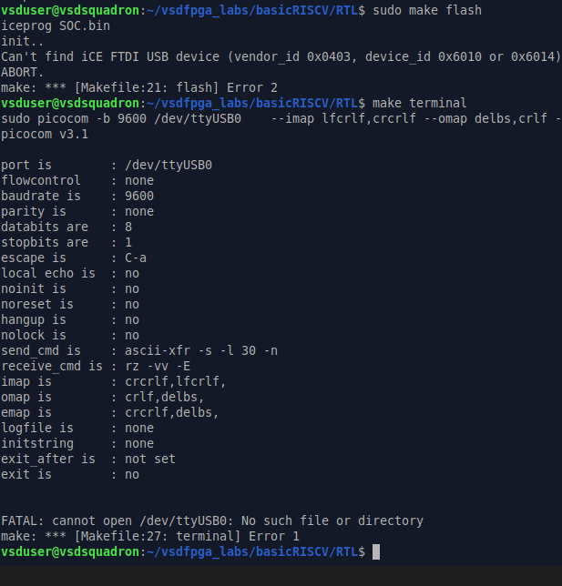

---

## Explanation

During execution, the flashing utility attempted to establish communication with the FPGA board but returned the following message:

```text
Can't find ICE FTDI USB device
ABORT.
make: *** [Makefile:21: flash] Error 2
```


This message indicates that the flashing tool could not detect the required FTDI USB interface.

In this case, the **VSDSquadron FPGA board was not physically connected to the system**, so the programmer was unable to establish communication and the flashing process was terminated.

---

### Step 5: Verify the RISC-V Logo Output

After successfully generating the firmware and completing the build process, the default **VSDSquadron FPGA Mini** ASCII banner can be verified directly within the GitHub Codespace environment.

This step confirms that the firmware is correctly built and that the RISC-V application executes as expected, producing the intended terminal output.

---

### Review the Firmware Source

The `riscv_logo.c` file contains the implementation responsible for displaying the VSDSquadron FPGA Mini ASCII banner. The source file can be viewed using the following command:

```bash
cd ~/vsdfpga_labs/basicRISCV/Firmware

cat riscv_logo.c
```

The `cat` command prints the contents of the source file directly in the terminal, allowing the banner implementation to be verified without modifying the program.

---

### Verify the Output in GitHub Codespace

After executing the previous firmware generation and build steps, the RISC-V application displays the default VSDSquadron FPGA Mini ASCII banner in the GitHub Codespace terminal.

### Output

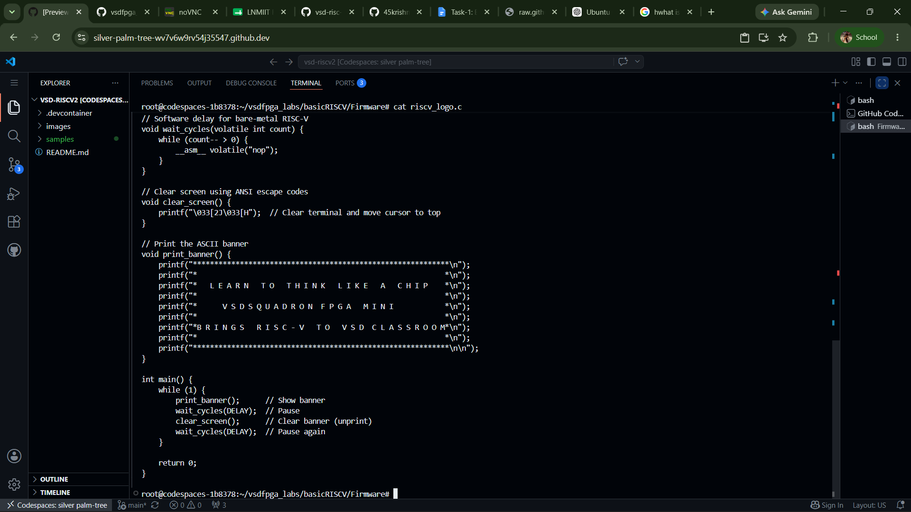

---

## Observations

- Successfully accessed the `riscv_logo.c` firmware source.
- Verified the implementation responsible for generating the ASCII banner.
- The expected VSDSquadron FPGA Mini banner was displayed correctly in the GitHub Codespace terminal.
- The output confirms successful firmware generation and execution.

---

# Step 4: Local Machine Preparation (Strongly Encouraged)

To prepare the local development environment for future FPGA experiments, the required repositories and project structure were verified on the Oracle Virtual Machine. This ensures that all subsequent FPGA compilation and execution tasks can be performed locally without relying solely on GitHub Codespaces.

---

## 4.1 Verify the Local Workspace

The previously cloned **vsdfpga_labs** repository was accessed from the local machine, and the required project directories were verified.

### Commands Used

```bash
cd ~/vsdfpga_labs/basicRISCV/Firmware

cd ~/vsdfpga_labs/basicRISCV/RTL
```

The first command navigates to the **Firmware** directory containing the RISC-V application source files, while the second command switches to the **RTL** directory containing the Verilog design files and build scripts.

### Output

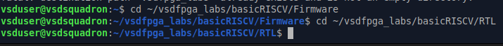

---

## 4.2 Verify the RISC-V Banner Program

The default **VSDSquadron FPGA Mini** ASCII banner was successfully verified on the local Oracle Virtual Machine environment. The banner confirms that the firmware and local development setup are functioning correctly.

### Firmware Source

The `riscv_logo.c` file contains the implementation responsible for displaying the ASCII banner.

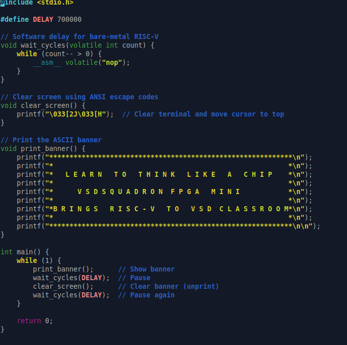

---

### RISCV Banner Output on Oracle Virtual Machine

The following output was observed after executing the previously generated firmware on the local machine.

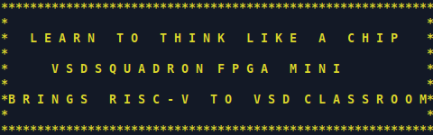

---

# Understanding the RISC-V Reference Design

This document summarizes the key concepts explored while working with the **vsd-riscv2** repository. It provides a concise overview of the program structure, compilation flow, memory organization, and the logical integration of custom FPGA IP blocks.

---

# 1. Where is the RISC-V program located in the `vsd-riscv2` repository?

The RISC-V reference program is located inside the **`samples`** directory of the `vsd-riscv2` repository. This directory contains sample source files along with the necessary build scripts used to understand and verify the RISC-V compilation and execution flow.

The sample programs are designed to demonstrate basic RISC-V functionality and can be compiled using both the native GCC compiler and the RISC-V cross-compilation toolchain. The accompanying Makefile simplifies the build process by automating compilation and linking steps.

During this task, the `samples` directory was used to access and execute the reference program, making it the primary workspace for learning the RISC-V software flow within the repository.

---

# 2. How is the program compiled and loaded into memory?

The source code is first compiled using the RISC-V cross compiler, producing an executable object file.

```bash
riscv64-unknown-elf-gcc -o sum1ton.o sum1ton.c
```

The generated executable is then loaded and executed through the Spike simulator using the Proxy Kernel.

```bash
spike pk sum1ton.o
```

### Execution Flow

```
C Source File
      │
      ▼
RISC-V Cross Compiler
      │
      ▼
Executable Object File
      │
      ▼
Spike + Proxy Kernel
      │
      ▼
Program Loaded into Memory
      │
      ▼
Execution
```

---

# 3. How does the RISC-V core access memory and memory-mapped I/O?

The RISC-V processor follows a **memory-mapped I/O (MMIO)** architecture, where hardware peripherals are assigned unique memory addresses.

Instead of using dedicated input/output instructions, the processor interacts with peripherals through standard load and store operations.

### Memory Organization

```
                +----------------+
                |   RISC-V Core  |
                +----------------+
                         |
                -------------------
                |                 |
                ▼                 ▼
         Program Memory    Memory-Mapped I/O
                                   |
              --------------------------------------
              |           |            |           |
              ▼           ▼            ▼           ▼
            UART        GPIO         Timer     Other Peripherals
```

This architecture provides a simple and uniform interface between software and hardware.

---

# 4. Where would a new FPGA IP block logically integrate in this system?

A new FPGA IP block would be connected as a **memory-mapped peripheral** on the system bus.

The processor can communicate with the IP block by reading from or writing to its assigned address range, allowing software to control custom hardware modules without modifying the processor core.

### Logical Integration

```
                     +------------------+
                     |    RISC-V Core   |
                     +------------------+
                              |
                       System Bus / MMIO
                              |
      -------------------------------------------------
      |                 |               |             |
      ▼                 ▼               ▼             ▼
 Program Memory       UART            GPIO      Custom FPGA IP
                                                 (New Module)
```

This modular architecture allows additional hardware accelerators and peripherals to be integrated seamlessly into the existing system.

---

# Optional Confidence Task

This optional task demonstrates the ability to understand, modify, and rebuild an existing RISC-V firmware application. Instead of modifying `riscv_logo.c`, the **`mandel.c`** source file was explored and updated to observe the effect of changing program constants.

---

## Step 1: Open the Firmware Source

Navigate to the RTL directory and open the `mandel.c` source file located inside the Firmware folder.

### Command Used

```bash
nano ../Firmware/mandel.c
```

This command opens the Mandelbrot firmware source in the Nano text editor, allowing the program constants to be reviewed and modified.

### Source File

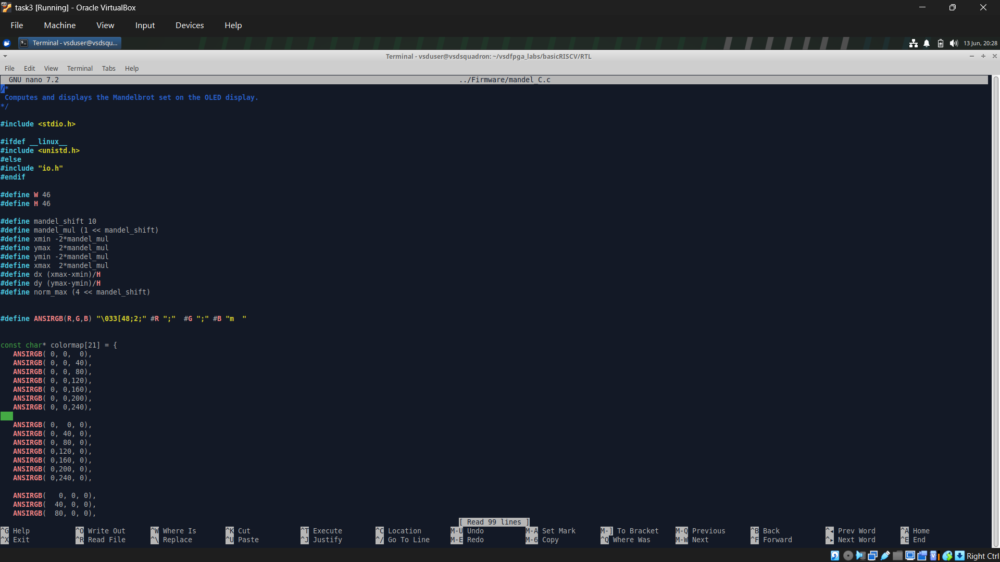

---

## Step 2: Modify Program Constants

The display resolution constants were updated from their default values:

```c
#define W 46
#define H 46
```

to

```c
#define W 100
#define H 1000
```

This modification changes the dimensions used by the Mandelbrot rendering algorithm, demonstrating how altering compile-time constants affects the firmware behavior.

## Step 3: Save and Rebuild the Project

After making the required changes, the project was rebuilt to generate an updated firmware image.

### Commands Used

```bash
make clean

make build
```

- `make clean` removes previously generated build files.
- `make build` recompiles the firmware and rebuilds the FPGA design using the updated source code.

### Commands Executed

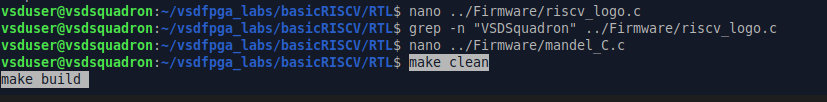

---

## Step 4: Verify the Updated Source

After rebuilding, the modified `mandel.c` file was reviewed to confirm that the updated constants were successfully saved.

### Verification

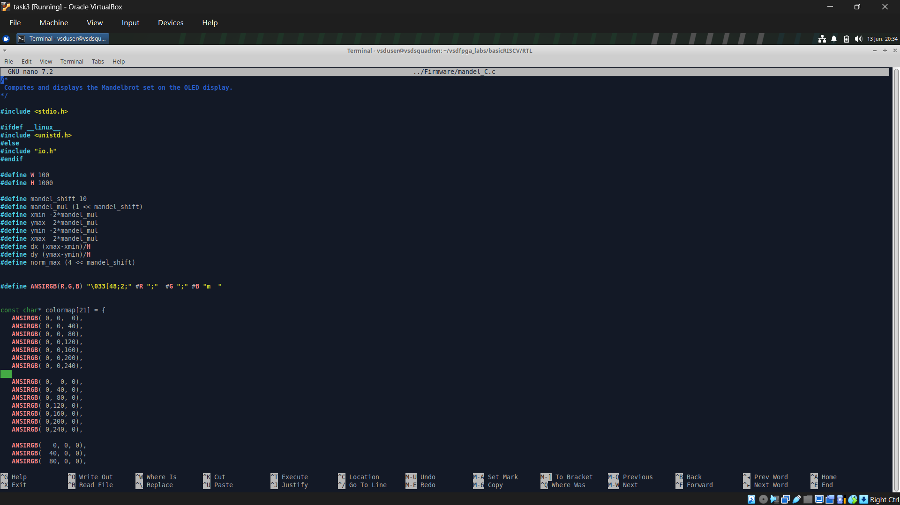

---

# Overview of Optional Task

## File Modified

`mandel.c`

---

## Original Configuration

```c
#define W 46
#define H 46
```

---

## Modified Configuration

```c
#define W 100
#define H 1000
```

---

## Commands Executed

```bash
nano ../Firmware/mandel.c

make clean

make build
```

---

## Observation of Optional Task

As part of the optional confidence task, the `mandel.c` firmware was selected to demonstrate source-level customization within the VSDFPGA environment. The rendering dimension constants (`W` and `H`) were modified from their default values to new values (`100` and `1000`) and the project was rebuilt using the standard build process.

The updated source was compiled successfully without any build errors, confirming that the firmware modifications were correctly integrated into the FPGA build flow. This exercise highlights the ease of modifying application parameters and regenerating the firmware while maintaining a consistent development workflow.

# Observations of Task-3

Throughout this task, the complete RISC-V reference workflow was explored and verified before attempting any hardware-specific implementation. The development environment was successfully configured in both **GitHub Codespaces** and the **Oracle Virtual Machine**, providing a stable and reproducible setup for firmware development.

The reference RISC-V programs were compiled and executed successfully using the provided toolchain, validating that the software environment was functioning correctly. The VSDFPGA Labs repository was cloned, the firmware was generated, and the FPGA build flow completed successfully without any compilation issues.

As part of the optional confidence task, the `mandel.c` firmware source was examined and its compile-time constants were modified. The project rebuilt successfully after these changes, demonstrating that firmware parameters can be customized while preserving the integrity of the build process.

The FPGA flashing step could not be completed because the VSDSquadron FPGA board was not physically connected to the system. However, the generated bitstream and firmware images confirmed that the software and build environment were correctly configured and ready for hardware deployment.

This workflow closely reflects the standard methodology followed by semiconductor and FPGA development teams:

- **Environment first** – Establish a stable and reproducible development environment before beginning implementation.
- **Reference design validation** – Verify the provided reference design and ensure the complete build flow works as expected.
- **Understanding before modification** – Study and validate the existing firmware before making any source-level changes.
- **Hardware later, not first** – Complete software validation and build verification before programming or debugging the physical FPGA board.

---

# Results of Task-3

- ✅ Successfully configured the RISC-V development environment in GitHub Codespaces and Oracle Virtual Machine.
- ✅ Verified the reference RISC-V software execution flow using the provided sample programs.
- ✅ Successfully cloned and explored the VSDFPGA Labs repository.
- ✅ Generated firmware and completed the FPGA build process without compilation errors.
- ✅ Verified the default VSDSquadron FPGA Mini ASCII banner execution.
- ✅ Successfully modified and rebuilt the `mandel.c` firmware as part of the optional confidence task.
- ✅ Gained a clear understanding of the RISC-V compilation flow, firmware organization, and memory-mapped architecture.
- ⚠️ FPGA flashing could not be performed because the VSDSquadron FPGA board was not connected, although the generated build artifacts confirmed that the design was ready for deployment.

Overall, the task successfully established a strong software foundation for future FPGA development by emphasizing environment setup, reference design validation, source-level understanding, and systematic verification before hardware interaction.
