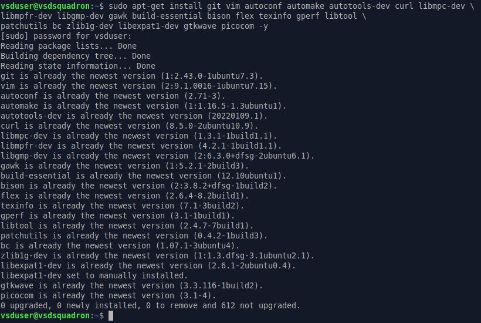
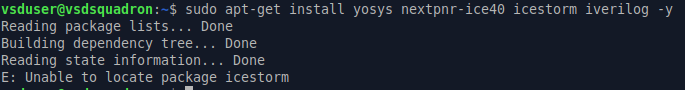
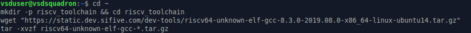
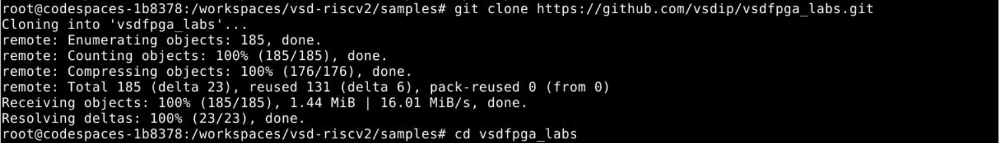
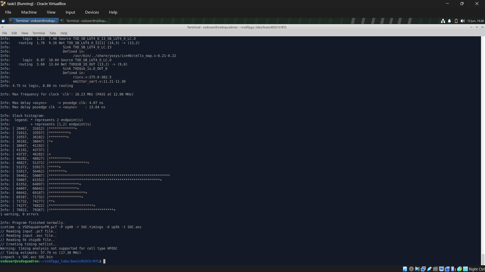

# Task-3: Environment Setup & RISC-V Reference Bring-Up

This task establishes a reliable RISC-V development environment and verifies the complete reference execution flow. It ensures that the required toolchain and simulation environment are properly configured before proceeding with advanced FPGA and RISC-V development activities.

---

# Objective

Successfully configure the development environment and validate the RISC-V reference flow by compiling and executing a sample program using both the native compiler and the RISC-V toolchain.

This task focuses on:

- Toolchain verification and readiness
- Understanding the RISC-V compilation flow
- Executing a reference program using the Spike simulator
- Building a stable foundation for upcoming internship tasks

This is an environment validation task and does not involve FPGA programming.

---

# Step 1: Set Up GitHub Codespace

The official **vsd-riscv2** repository was forked and launched using GitHub Codespaces to create a standardized development environment.

The workspace was initialized successfully, after which the sample programs directory was accessed for testing and verification. This environment provides all the necessary tools required for RISC-V development throughout the internship.

---

# Step 2: Verify RISC-V Reference Flow

Inside the configured Codespace environment, the sample C program was compiled and executed to verify the functionality of both the native GCC compiler and the RISC-V toolchain.

The following commands were used during the verification process:

```bash
cd /workspaces/vsd-riscv2
cd samples
ls -ltr

gcc sum1ton.c
./a.out

riscv64-unknown-elf-gcc -o sum1ton.o sum1ton.c
spike pk sum1ton.o
```

The execution completed successfully without any compilation or runtime errors.

## Execution Output


---

essfully configured and validated. The sample program compiled and executed correctly using both the native compiler and the RISC-V simulation flow, confirming that the toolchain is fully functional and ready for subsequent VSD internship tasks.

# Step 3: Clone and Run VSDFPGA Labs (Mandatory)

After successfully setting up the RISC-V reference environment, the VSDFPGA Labs environment was prepared by installing the necessary software packages and development tools. This step ensures that the system is ready for synthesis, simulation, and future FPGA development activities.

---

## 3.1 Install General Development Dependencies

The following command installs the libraries and utilities required for software compilation, debugging, and hardware development.

```bash
sudo apt-get install git vim autoconf automake autotools-dev curl libmpc-dev \
libmpfr-dev libgmp-dev gawk build-essential bison flex texinfo gperf libtool \
patchutils bc zlib1g-dev libexpat1-dev gtkwave picocom -y
```

### Output



---

## 3.2 Install FPGA Toolchain

The FPGA toolchain provides the required synthesis and simulation tools for digital circuit development.

```bash
sudo apt-get install yosys nextpnr-ice40 icestorm iverilog -y
```

During execution, the system reported that the **icestorm** package could not be located, while the remaining installation process continued normally.

### Output



---

## 3.3 Configure the RISC-V GCC Toolchain

The official RISC-V GCC toolchain was downloaded, extracted, and added to the system PATH for easy access from the terminal.

```bash
cd ~

mkdir -p riscv_toolchain && cd riscv_toolchain

wget "https://static.dev.sifive.com/dev-tools/riscv64-unknown-elf-gcc-8.3.0-2019.08.0-x86_64-linux-ubuntu14.tar.gz"

tar -xvzf riscv64-unknown-elf-gcc-*.tar.gz

echo 'export PATH=$HOME/riscv_toolchain/riscv64-unknown-elf-gcc-8.3.0-2019.08.0-x86_64-linux-ubuntu14/bin:$PATH' >> ~/.bashrc

source ~/.bashrc
```

### Output



---

## 3.4 Clone the VSDFPGA Labs Repository

The first step is to download the official VSDFPGA Labs repository into the local workspace. This repository contains the firmware, RTL source files, and Makefiles required for building the Basic RISC-V design.

### Step 1: Move to the Home Directory

```bash
cd ~
```

The `cd ~` command changes the current working directory to the user's home directory, providing a standard location for cloning and managing project files.

### Step 2: Clone the Repository

```bash
git clone https://github.com/vsdip/vsdfpga_labs
```

The `git clone` command downloads the complete VSDFPGA Labs repository from GitHub and creates a local copy containing all source files and project resources.

### Step 3: Enter the Repository

```bash
cd vsdfpga_labs
```

This command navigates into the cloned project directory, allowing access to the firmware, RTL files, and build scripts.

### Output



---

## 3.5 Generate the RISC-V Firmware

The firmware source is reviewed and compiled to generate the BRAM initialization file, which will later be embedded into the FPGA design.

### Step 1: Navigate to the Firmware Directory

```bash
cd ~/vsdfpga_labs/basicRISCV/Firmware
```

This command opens the Firmware directory containing the RISC-V source code and build files.

### Step 2: Review the Source File

```bash
nano riscv_logo.c
```

The `nano` editor is used to inspect the firmware source code. No modifications are required; the file is simply reviewed and then closed.

### Step 3: Generate the BRAM File

```bash
make riscv_logo.bram.hex
```

The `make` command compiles the firmware and generates `riscv_logo.bram.hex`, which serves as the BRAM initialization file for the FPGA design.

### Output


---

## 3.6 Build the FPGA Design

After generating the firmware image, the RTL project is cleaned and rebuilt to produce the FPGA bitstream.

### Step 1: Navigate to the RTL Directory

```bash
cd ~/vsdfpga_labs/basicRISCV/RTL
```

This command opens the RTL directory containing the Verilog source files and Makefile used for FPGA synthesis.

### Step 2: Remove Previous Build Files

```bash
make clean
```

The `make clean` command deletes previously generated files and ensures that the new build starts from a clean state.

### Step 3: Build the FPGA Design

```bash
make build
```

The `make build` command automatically performs synthesis, placement, routing, timing analysis, and finally generates the FPGA bitstream required for hardware implementation.

### Build Commands


### Build Output



## 3.7 Verify the RISC-V Logo Output

After successfully generating the firmware image and completing the FPGA build process, the default **VSDSquadron FPGA Mini** ASCII banner is displayed during execution. The appearance of this banner confirms that the firmware has been built correctly and that the RISC-V environment is functioning as expected.

The output was verified in both **GitHub Codespace** and **Oracle Virtual Machine**, while the corresponding firmware source was also reviewed to understand how the banner is generated.

---

### Firmware Source (`riscv_logo.c`)

The `riscv_logo.c` file contains the implementation responsible for printing the VSDSquadron FPGA Mini ASCII banner along with the required delay and screen refresh functionality.


---

### Output in GitHub Codespace

After executing the previous build steps, the firmware displays the following banner in the GitHub Codespace terminal.


---

### Output in Oracle Virtual Machine

The same firmware was also executed in the Oracle Virtual Machine environment, producing an identical ASCII banner and confirming consistent behavior across both development platforms.


---

## Observations

- Successfully verified the `riscv_logo.c` firmware implementation.
- The default VSDSquadron FPGA Mini ASCII banner was generated correctly.
- The output remained consistent across both GitHub Codespace and Oracle Virtual Machine.
- The successful execution confirms that the firmware generation and build flow completed without any critical errors.

---

## Result

- ✅ Firmware verified successfully.
- ✅ Expected RISC-V ASCII banner displayed correctly.
- ✅ Output validated in GitHub Codespace.
- ✅ Output validated in Oracle Virtual Machine.

---

