# Task-4: Design & Integrate Your First Memory-Mapped IP

## Overview

This task marks the transition from environment setup to real IP development. The goal is to design and integrate a simple memory-mapped IP into the existing RISC-V SoC and validate its functionality through simulation.

---

## Objective

Design a **Simple GPIO Output IP (Write-Only)**, integrate it into the existing RISC-V SoC, and understand how the processor communicates with peripherals using memory-mapped interfaces.

---

## IP to be Built

**IP Name:** Simple GPIO Output IP (Write-Only)

### Why this IP?

- Simple and easy to understand
- Introduces core IP design concepts
- Demonstrates real-world memory-mapped peripheral integration

---

## IP Specification

### Functionality

- One 32-bit register
- Writing updates the GPIO output
- Reading returns the last written value

### Interface

- Memory-mapped peripheral
- Connected to the existing CPU bus
- Uses the same bus signals already present in the SoC

### Example Address Map

| Address | Function |
|----------|----------|
| Base Address | Assigned by mentor |
| Offset `0x00` | GPIO Output Register |

---

# Step 1: Understanding the Existing SoC (Mandatory)

## Objective

Before creating a new IP, it is important to understand how the existing SoC is organized and how the processor communicates with memory and peripherals.

During this step, we identify:

- Memory-mapped peripheral decoding
- CPU read/write interface
- Existing peripherals (LED / UART)

> **Note:** This step focuses only on reading and understanding the existing design.

---

## 1. Explore the RTL Directory

```bash
cd ~/vsdfpga_labs/basicRISCV/RTL
pwd
ls
```

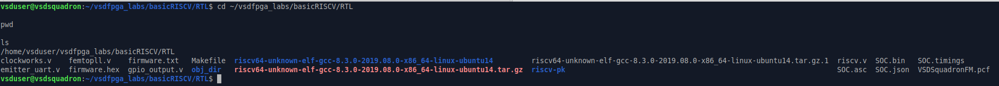

The RTL directory contains the Verilog source files required for the complete RISC-V SoC implementation.

---

## 2. Inspect the Memory Module

```bash
head -50 riscv.v
```

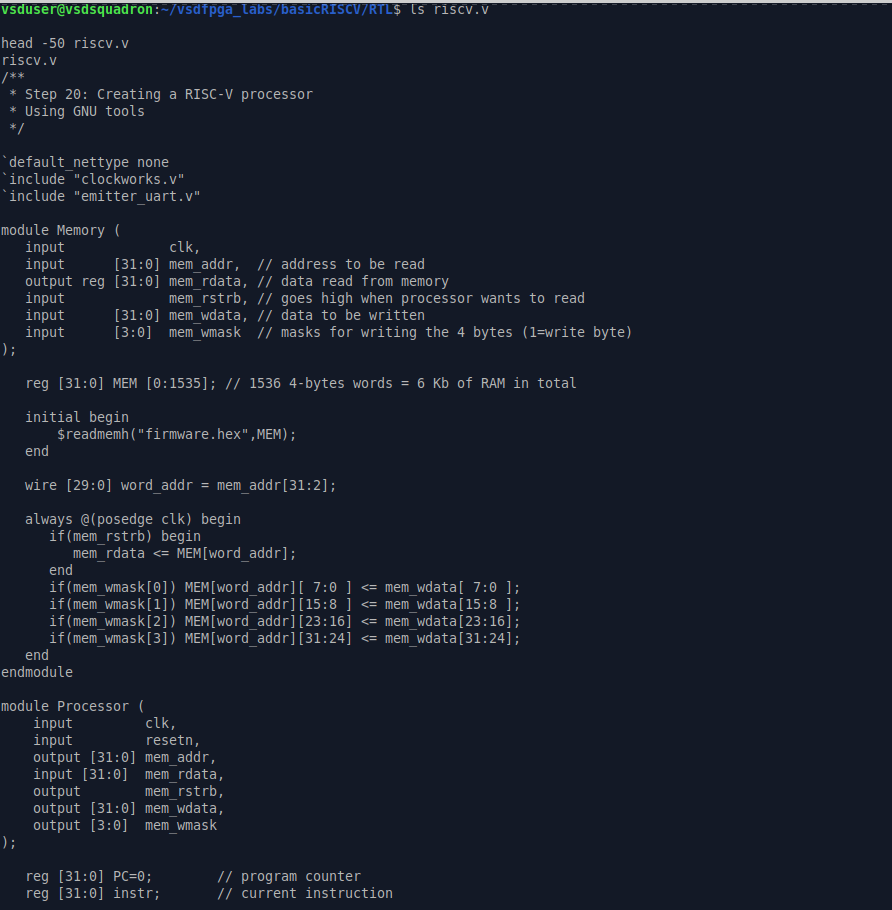

The `Memory` module provides the interface between the processor and memory using signals such as `mem_addr`, `mem_wdata`, `mem_rdata`, and `mem_wmask`.

---

## 3. Locate `mem_addr`

```bash
grep -n "mem_addr" riscv.v
```

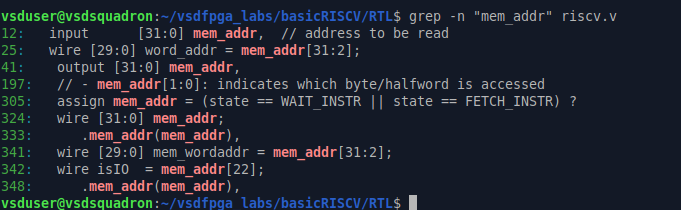

`mem_addr` represents the address generated by the processor for every memory read or write operation and is used for peripheral selection.

---

## 4. Locate `mem_wdata`

```bash
grep -n "mem_wdata" riscv.v
```

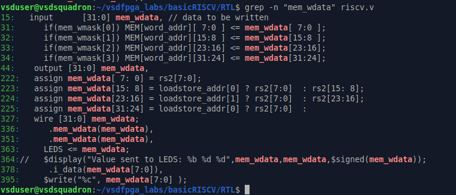

`mem_wdata` carries the data from the processor to memory or any memory-mapped peripheral during write operations.

---

## 5. Locate `mem_rdata`

```bash
grep -n "mem_rdata" riscv.v
```

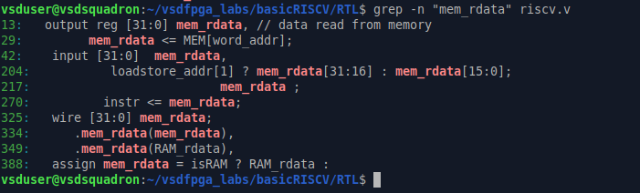

`mem_rdata` returns data from memory back to the processor during read operations.

---

## 6. Inspect the UART Module

```bash
head -40 emitter_uart.v
tail -20 emitter_uart.v
```

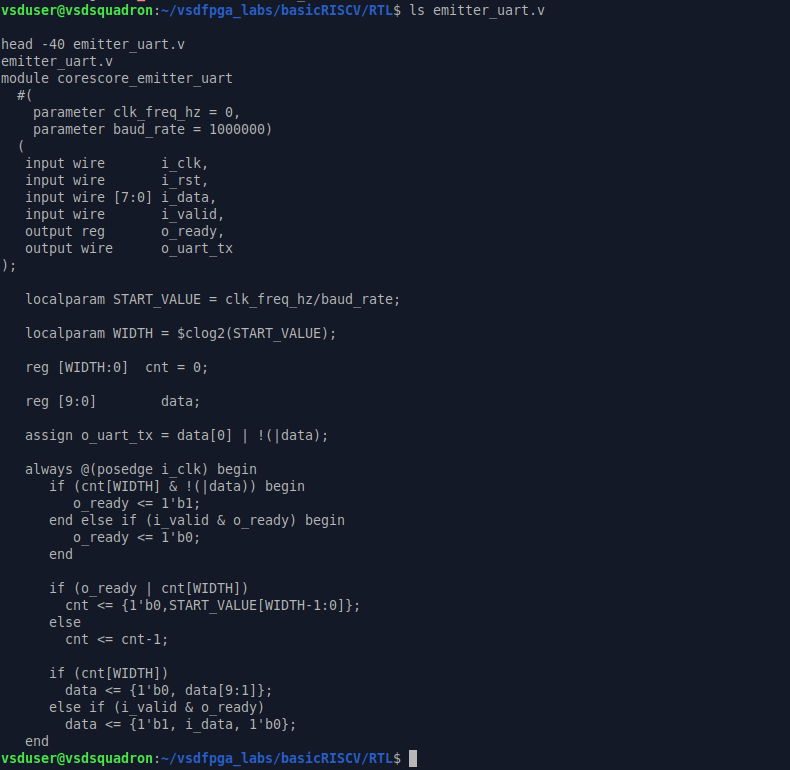

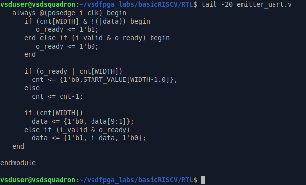

The UART module serializes 8-bit parallel data and transmits it through the `o_uart_tx` output, enabling communication between the processor and external devices.

---

## Validation

✅ Successfully explored the RTL source directory.

✅ Identified the Memory module and its interface signals.

✅ Verified the usage of `mem_addr`, `mem_wdata`, and `mem_rdata`.

✅ Inspected the UART transmitter module and understood its role in the existing SoC architecture.

# Step 2: Write the IP RTL (Mandatory)

## Objective

Create a new GPIO Output IP RTL module and implement register storage, write logic, and readback logic using synchronous design principles.

---

# 1. Create the GPIO RTL File

```bash
cd ~/vsdfpga_labs/basicRISCV/RTL

touch gpio_output.v

ls
```

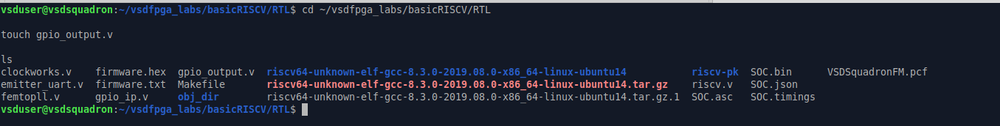

A new RTL file `gpio_output.v` was created inside the RTL directory for implementing the GPIO Output IP.

---

# 2. GPIO Output IP RTL

```verilog
module gpio_output(

    input wire clk,
    input wire reset,

    input wire write_enable,
    input wire read_enable,

    input wire [31:0] write_data,

    output reg [31:0] gpio_out,
    output reg [31:0] read_data

);

reg [31:0] gpio_reg;

always @(posedge clk)
begin
    if(reset)
        gpio_reg <= 32'b0;
    else if(write_enable)
        gpio_reg <= write_data;
end

always @(*)
begin
    gpio_out = gpio_reg;
end

always @(*)
begin
    if(read_enable)
        read_data = gpio_reg;
    else
        read_data = 32'b0;
end

endmodule
```

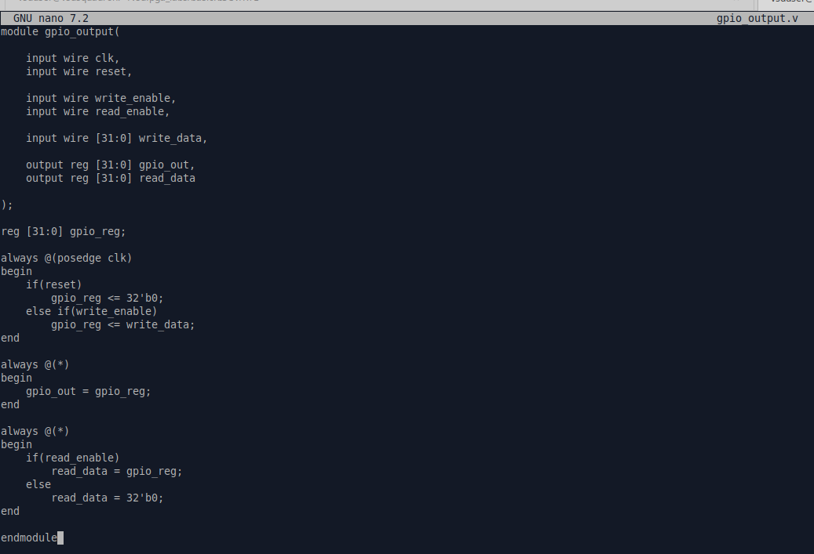

The GPIO IP consists of a 32-bit register that stores data written by the processor and provides the same value for GPIO output and readback operations.

---

# 3. Register Storage

```bash
grep -n "gpio_reg" gpio_output.v
```

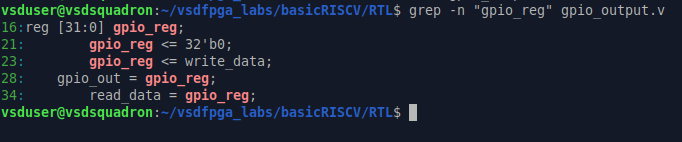

`gpio_reg` acts as the internal 32-bit storage register. It is reset to zero and updated whenever `write_enable` becomes active.

---

# 4. Write Logic

```bash
grep -n "write_enable" gpio_output.v
```

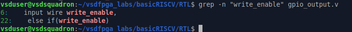

The write logic updates `gpio_reg` with `write_data` on the positive edge of the clock whenever `write_enable` is asserted.

---

# 5. Readback Logic

```bash
grep -n "read_data" gpio_output.v
```


The readback logic returns the stored GPIO register value when `read_enable` is active; otherwise, the output remains zero.

---

# Validation

- ✅ Successfully created the `gpio_output.v` RTL file.
- ✅ Implemented a 32-bit GPIO register for data storage.
- ✅ Verified synchronous write operation using `write_enable`.
- ✅ Verified readback functionality through `read_data`.
- ✅ The RTL follows a simple and correct synchronous design without additional optimizations.

# Step 3: Integrate the IP into the SoC (Mandatory)

## Objective

Integrate the GPIO Output IP into the existing RISC-V SoC by instantiating the module, adding address decoding, connecting the bus signals, and exposing the GPIO output signal.

---

# 1. Add GPIO Address Decode

```bash
grep -n "localparam IO_" riscv.v
```


A new address bit `IO_GPIO_bit` is added to the existing I/O address map, allowing the processor to uniquely identify the GPIO peripheral.

---

# 2. Declare GPIO Signals

```bash
grep -n "gpio_read\|gpio_out" riscv.v
```


Two internal signals are declared:

- `gpio_out` : Stores the GPIO output value
- `gpio_read` : Returns the stored register value during read operations

---

# 3. Instantiate GPIO IP

```bash
grep -n "gpio_output" -A 15 riscv.v
```

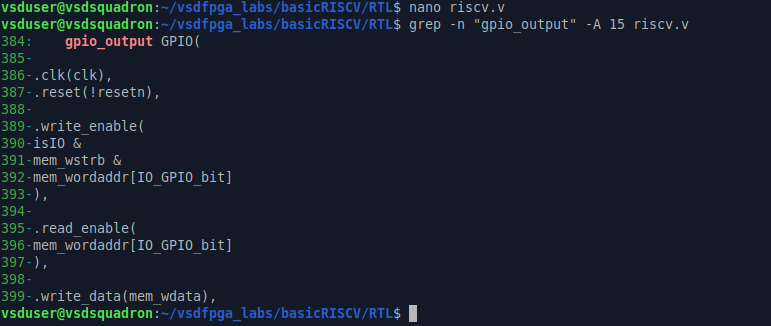

The `gpio_output` module is instantiated and connected with the system clock, reset, bus control signals, and data bus.

### Connected Signals

| Signal | Purpose |
|----------|---------------------------|
| clk | System Clock |
| reset | Reset Signal |
| write_enable | Enables register write |
| read_enable | Enables register read |
| write_data | Data from CPU |
| gpio_out | GPIO Output |
| read_data | Readback Data |

---

# 4. Connect Read Data Path

```bash
grep -n "IO_rdata" -A 6 riscv.v
```

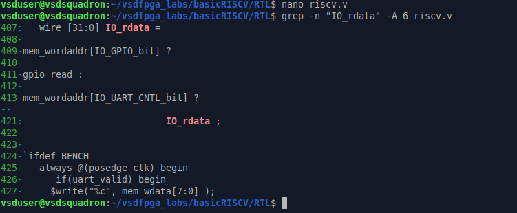

The GPIO readback value is connected to `IO_rdata`, allowing the processor to read the last stored GPIO register value.

---

# 5. Verify GPIO Address Mapping

```bash
grep -n "IO_GPIO_bit" riscv.v
```

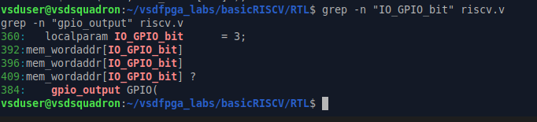

The output confirms that `IO_GPIO_bit` is declared and used consistently for:

- Address decoding
- Write logic
- Read logic
- GPIO module selection

---

# 6. Verify Bus Connections

```bash
grep -n "mem_addr" riscv.v

grep -n "mem_wdata" riscv.v

grep -n "mem_rdata" riscv.v

grep -n "gpio_read" riscv.v
```

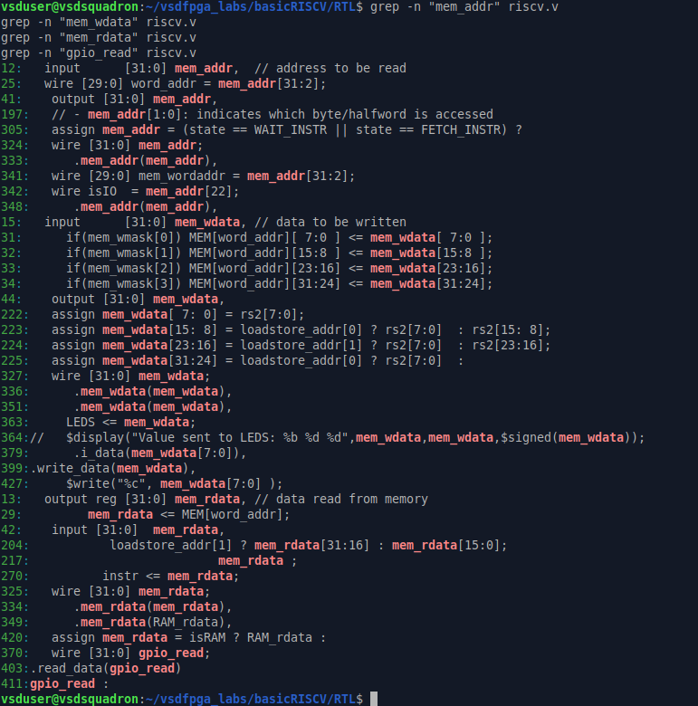

The GPIO IP is connected to the existing memory bus using:

- `mem_addr` for address decoding
- `mem_wdata` for write operations
- `mem_rdata` for read operations

This allows the processor to access the GPIO IP exactly like any other memory-mapped peripheral.

---

# 7. Verify Output Signal

```bash
grep -n "gpio_out" riscv.v
```

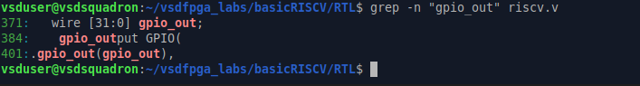

The GPIO output signal is exposed internally through `gpio_out`, making the stored register value available to the rest of the SoC.

---

# 8. Final SoC Integration

```bash
sed -n '350,430p' riscv.v
```

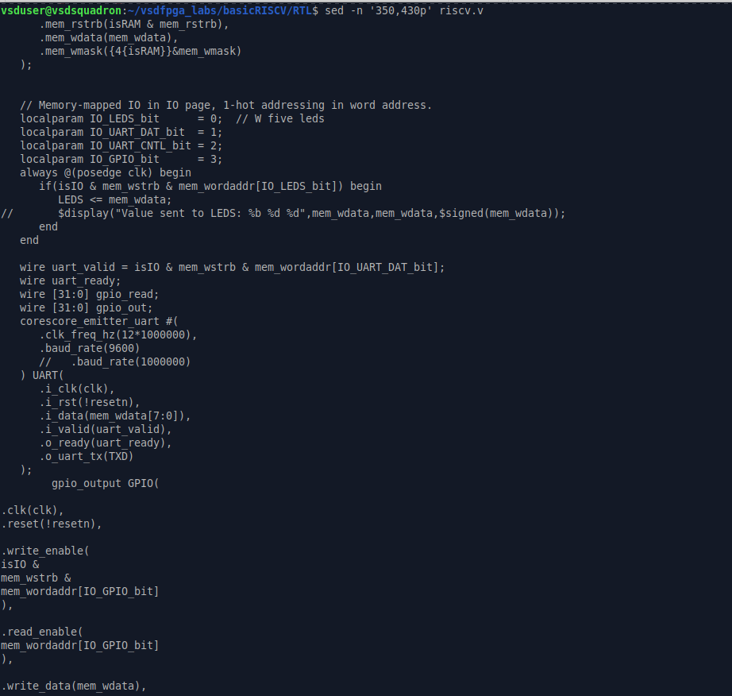

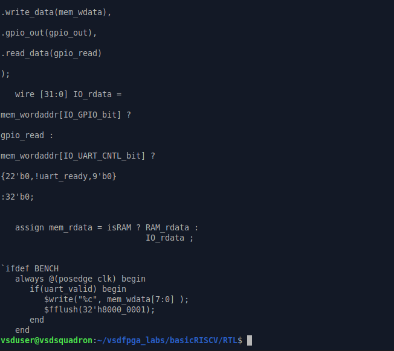

The final integration combines:

- GPIO address decoding
- GPIO signal declarations
- GPIO module instantiation
- Bus signal connections
- Readback logic

The GPIO IP is now fully integrated into the RISC-V SoC and behaves as a standard memory-mapped peripheral.

---

# SoC Integration

The custom GPIO Output IP was integrated into the existing RISC-V SoC by instantiating the `gpio_output` module in `riscv.v`. A dedicated address bit (`IO_GPIO_bit = 3`) was assigned for address decoding, allowing the processor to uniquely access the GPIO peripheral.

The IP was connected to the system bus using:
- `mem_addr` for address selection
- `mem_wdata` for write operations
- `mem_rdata` (through `IO_rdata`) for readback operations

The GPIO module receives the system clock and reset signals, updates its internal register on valid write transactions, and returns the stored value during read operations. The output signal (`gpio_out`) is also exposed internally, making the GPIO IP a fully functional memory-mapped peripheral within the SoC.


---


# Short Explanation

The GPIO Output IP was successfully instantiated inside the SoC top-level design. A dedicated address bit (`IO_GPIO_bit`) was assigned for address decoding, and the module was connected to the existing memory bus using `mem_addr`, `mem_wdata`, and `mem_rdata`. The GPIO output and readback signals were exposed through the internal bus, allowing the processor to perform standard read and write operations.

---


# Validation

- ✅ GPIO IP instantiated successfully.
- ✅ Address decoding added using `IO_GPIO_bit`.
- ✅ Bus signals connected correctly.
- ✅ Readback path integrated through `IO_rdata`.
- ✅ GPIO output signal exposed within the SoC.
- ✅ The GPIO IP is now part of the complete RISC-V system.


# Step 4: Validate using Simulation (Mandatory)

## Objective

Validate the GPIO Output IP using simulation by writing data into the GPIO register, reading it back, and verifying the functionality through simulation output and GTKWave.

---

# 1. Explore Firmware Directory

```bash
cd ~/vsdfpga_labs/basicRISCV/Firmware

pwd

ls
```

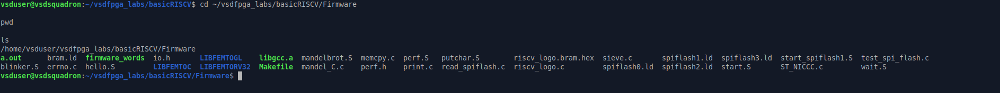

The Firmware directory contains the source files, startup files, linker scripts, and examples used for software execution on the RISC-V SoC.

---

# 2. Inspect Existing Firmware

```bash
cat hello.S
```

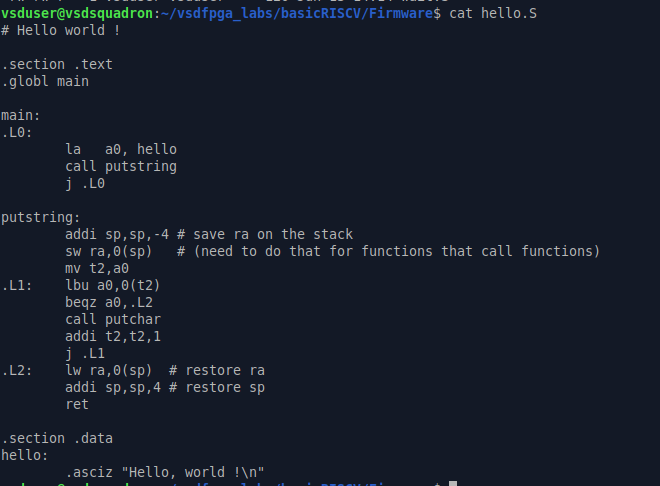

The existing firmware demonstrates a simple RISC-V assembly program that prints **"Hello, World!"** through UART. This serves as a reference for understanding software execution before validating the custom GPIO IP.

---

# 3. GPIO IP RTL Used for Simulation

```bash
cat gpio_ip.v
```

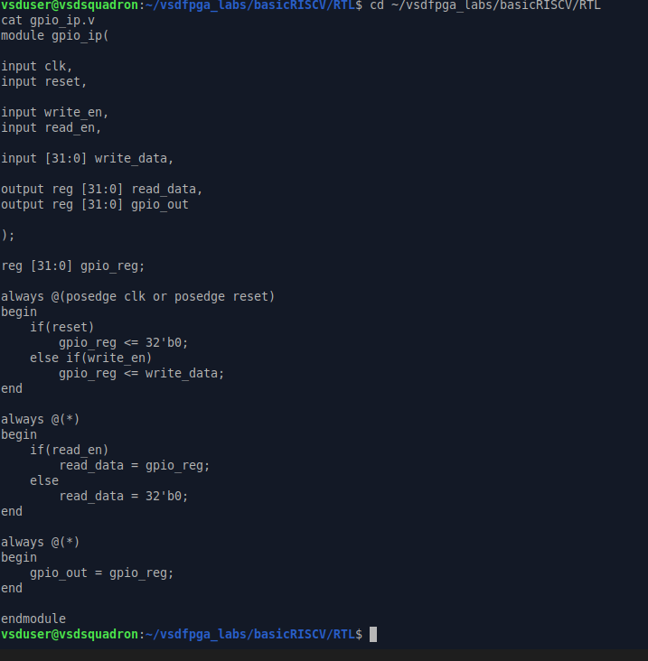

The GPIO IP contains:

- 32-bit GPIO register (`gpio_reg`)
- Synchronous write logic
- Readback logic
- GPIO output assignment

During simulation, data written through `write_en` is stored in `gpio_reg`, while `read_en` returns the stored value through `read_data`.

---

# 4. Testbench Used for Validation

```bash
cat gpio_tb.v
```

### Testbench (Part 1)

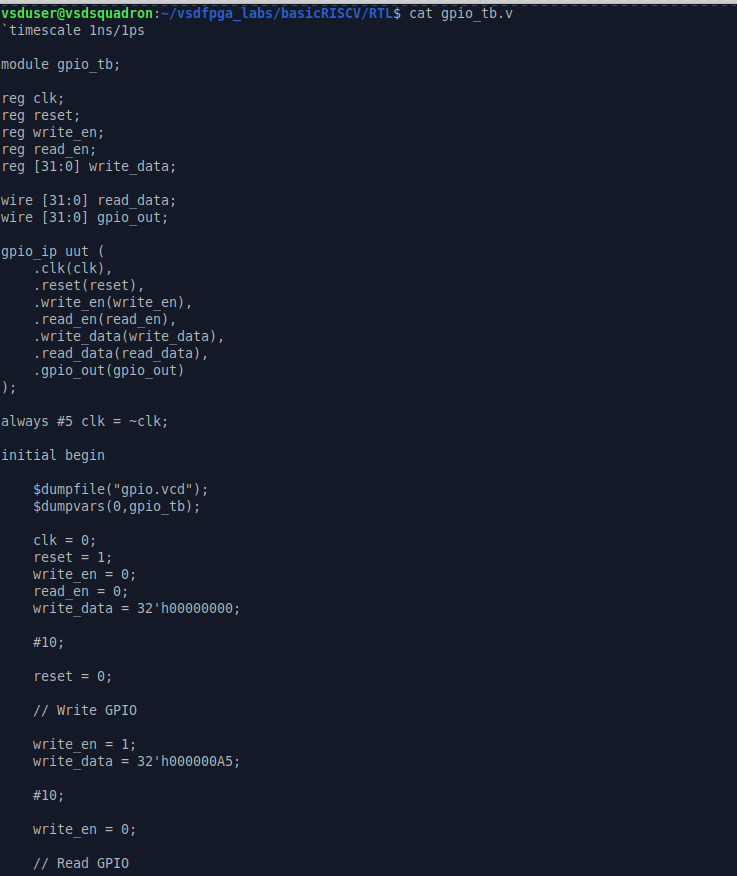

### Testbench (Part 2)

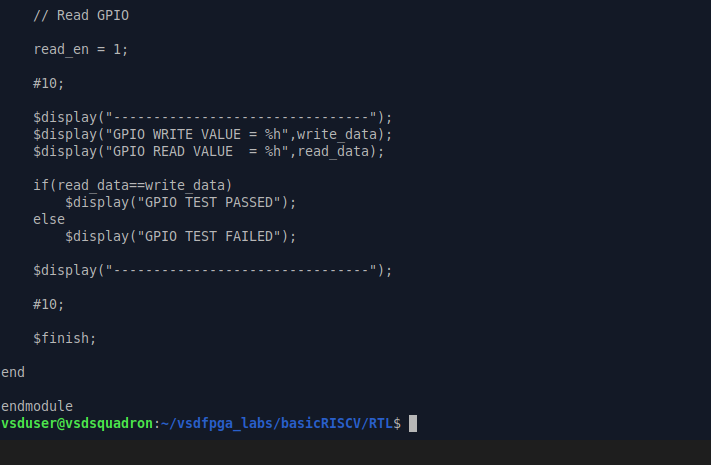

The testbench performs the following sequence:

1. Apply reset
2. Write `32'h000000A5` into the GPIO register
3. Disable write operation
4. Enable read operation
5. Compare the read value with the written value
6. Display PASS or FAIL status

This verifies both write and read functionality of the GPIO IP.

---

# 5. Compile the Design

```bash
iverilog -o gpio_sim gpio_ip.v gpio_tb.v

ls
```

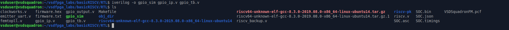

The successful creation of the executable `gpio_sim` confirms that both the GPIO RTL and testbench compile without any syntax or connectivity errors.

---

# 6. Run Simulation

```bash
vvp gpio_sim
```

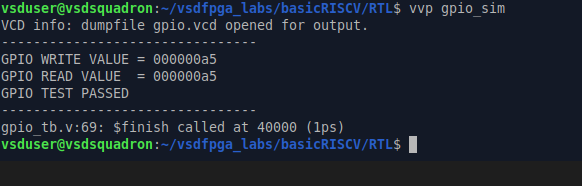

### Simulation Result

```
GPIO WRITE VALUE = 000000a5
GPIO READ VALUE  = 000000a5

GPIO TEST PASSED
```

### Explanation

- The processor/testbench writes the value **0x000000A5** into the GPIO register.
- The same value is read back successfully.
- Since both values match, the simulation prints **GPIO TEST PASSED**, confirming correct register storage and readback behavior.

---

# 7. Verify Using GTKWave

```bash
gtkwave gpio.vcd
```

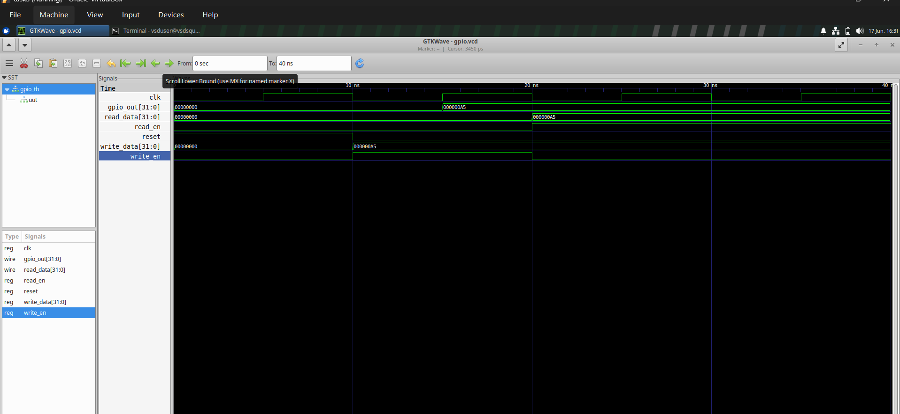

### Waveform Analysis

| Signal | Observation |
|-------------|----------------------------------|
| `reset` | Active initially and then released |
| `write_en` | Enabled during write operation |
| `write_data` | Changes to `000000A5` |
| `gpio_out` | Updates to `000000A5` after write |
| `read_en` | Enabled during read operation |
| `read_data` | Returns `000000A5` |
| `clk` | Continuous clock driving the design |

The waveform clearly shows that after `write_en` becomes active, the GPIO register stores **0xA5**, updates `gpio_out`, and later returns the same value on `read_data` when `read_en` is asserted.

---

# Address Used

| Signal | Purpose |
|-------------|-------------------------|
| `write_data` | Value written to GPIO register |
| `gpio_reg` | Internal 32-bit storage |
| `gpio_out` | GPIO output signal |
| `read_data` | Readback value returned by IP |

---

# How the Simulation Validates the IP

```
Testbench
    │
    │ write_en = 1
    ▼
GPIO Register (gpio_reg)
    │
    ├────────► gpio_out
    │
    ▼
read_en = 1
    │
    ▼
read_data
```

The testbench writes a value into the GPIO register and immediately performs a read operation. Matching write and read values confirm that the GPIO register stores and returns data correctly.

---

# Validation

- ✅ GPIO IP compiled successfully using **Icarus Verilog (iverilog)**.
- ✅ Testbench executed successfully using **vvp**.
- ✅ GTKWave confirmed correct timing and signal transitions.
- ✅ GPIO register updated with **0x000000A5**.
- ✅ Readback returned the same stored value.
- ✅ Simulation displayed **GPIO TEST PASSED**, validating correct register updates and readback behavior.


# Short Explanation

## Address Used

The GPIO IP is integrated as a memory-mapped peripheral inside the RISC-V SoC.

- **GPIO Address Bit:** `IO_GPIO_bit = 3`
- **Register:** 32-bit GPIO Output Register
- **Access Type:** Memory-Mapped I/O

The processor accesses the GPIO register using the dedicated GPIO address decode logic implemented in `riscv.v`.

---

## How CPU Accesses the IP

The CPU communicates with the GPIO IP through the existing memory bus.

```
CPU
 │
 │ mem_addr
 ▼
Address Decode (IO_GPIO_bit)
 │
 ├── write_enable
 ├── read_enable
 │
 ▼
GPIO Register
 │
 ├── gpio_out
 └── read_data
```

- `mem_addr` selects the GPIO peripheral.
- `mem_wdata` writes data into the GPIO register.
- `write_enable` updates the stored value.
- `read_enable` returns the stored value through `read_data`.
- `gpio_out` reflects the current register value.

---

## What Was Validated in Simulation

The GPIO IP was validated using Icarus Verilog and GTKWave.

### Verified Operations

- ✅ Register stores the written value correctly.
- ✅ `gpio_out` updates after a write operation.
- ✅ Readback returns the same value stored in the register.
- ✅ Testbench comparison reports **GPIO TEST PASSED**.
- ✅ GTKWave confirms correct timing of `clk`, `write_en`, `read_en`, `write_data`, `gpio_out`, and `read_data`.

Simulation Output:

```
GPIO WRITE VALUE = 000000A5
GPIO READ VALUE  = 000000A5

GPIO TEST PASSED
```

This confirms that the GPIO IP performs correct write and read operations and is successfully integrated into the RISC-V SoC.

# Step 5: Hardware Validation (Optional)

## Objective

Program the generated SoC bitstream on the VSDSquadron FPGA board and verify successful hardware configuration.

---

# 1. Check FPGA Connection

```bash
ls /dev/ttyUSB*
```

### Output

```
/dev/ttyUSB0
```

This confirms that the FPGA board is detected by the system.

---

# 2. Navigate to RTL Directory

```bash
cd ~/vsdfpga_labs/basicRISCV/RTL

ls
```

The RTL directory contains the generated `SOC.bin` file along with the RTL and simulation files.

---

# 3. Program the FPGA

```bash
iceprog SOC.bin
```

### Output

```
Can't find iCE FTDI USB device
ABORT.
```

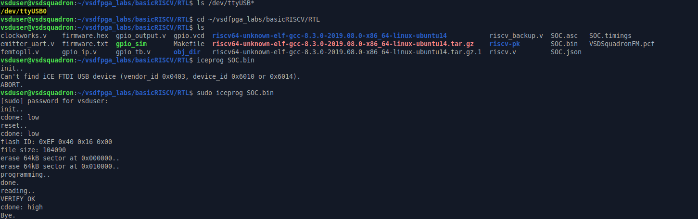

### Explanation

The programming attempt failed because `iceprog` could not access the FTDI USB programming interface. This is a permission issue and not an RTL or SoC integration error.

---

# 4. Program with Administrator Permission

```bash
sudo iceprog SOC.bin
```

### Output

```
flash ID: 0xEF 0x40 0x16 0x00

programming...

done.

reading...

VERIFY OK

cdone: high
```

The FPGA was successfully programmed after providing administrator privileges.

- **VERIFY OK** confirms that the bitstream was written correctly.
- **cdone: high** indicates successful FPGA configuration.

---

# 5. Hardware Validation

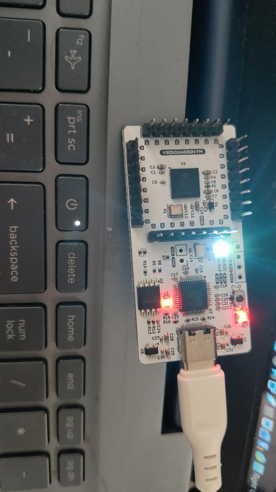

The FPGA board powers up successfully after programming. The power and status LEDs are ON, confirming that the board is active.

---

# Validation

- ✅ FPGA board detected successfully.
- ✅ Initial programming failed due to USB permission issue.
- ✅ Programming completed successfully using `sudo iceprog SOC.bin`.
- ✅ Bitstream verification completed successfully (`VERIFY OK`).
- ✅ FPGA configured successfully (`cdone: high`).

# Results

- Successfully explored and understood the existing RISC-V SoC architecture and memory-mapped I/O interface.
- Designed and implemented a custom **32-bit GPIO Output IP** using Verilog RTL.
- Implemented synchronous register storage, write logic, and readback logic following standard RTL design principles.
- Integrated the GPIO IP into the existing SoC by adding address decoding, bus signal connections, and GPIO module instantiation.
- Verified the integrated design through simulation using **Icarus Verilog** and **GTKWave**.
- Simulation confirmed correct register updates and successful readback of the written value (`0x000000A5`).
- Generated the FPGA bitstream and successfully programmed the VSDSquadron FPGA board.
- Initial programming failed due to USB permission restrictions and was resolved using `sudo iceprog SOC.bin`.
- Hardware programming completed successfully with **VERIFY OK** and **cdone: high**, confirming successful FPGA configuration.

---

# Observations

- The existing SoC uses a memory-mapped architecture where peripherals are accessed through dedicated addresses.
- The GPIO IP correctly stores data on a valid write operation and returns the same value during a read operation.
- Simulation waveforms clearly show proper operation of `write_en`, `read_en`, `gpio_out`, and `read_data` signals.
- The testbench successfully validates both write and read functionality, resulting in **GPIO TEST PASSED**.
- The FPGA board was detected successfully and accepted the generated bitstream without any programming errors after using administrator privileges.
- Although the GPIO IP was successfully integrated and programmed, no external LED output was observed because the internal `gpio_out` signal was not mapped to a physical FPGA pin through the top-level design and PCF constraints.

---

# Conclusion

In this task, a **Simple GPIO Output IP (Write-Only)** was successfully designed, implemented, integrated, and validated within the existing RISC-V SoC. The GPIO register correctly stores data, updates the output signal, and supports readback functionality. Simulation results verified correct operation through waveform analysis and successful testbench execution. The generated design was also programmed onto the VSDSquadron FPGA board, where successful programming and verification confirmed correct hardware deployment. Overall, the task provided practical understanding of memory-mapped IP design, SoC integration, RTL development, and simulation-based hardware validation.
