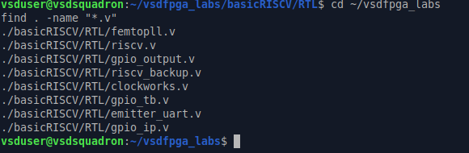
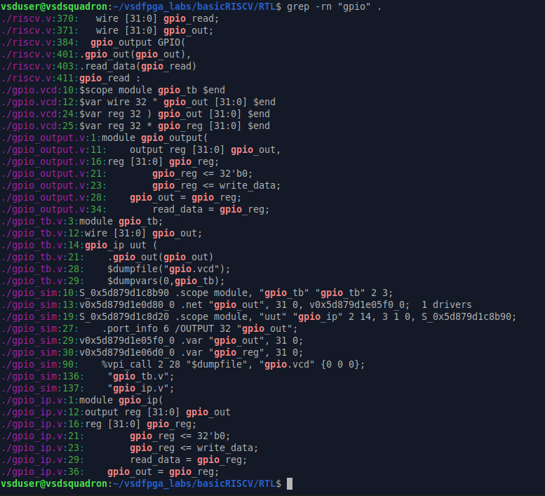
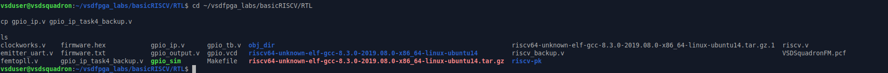
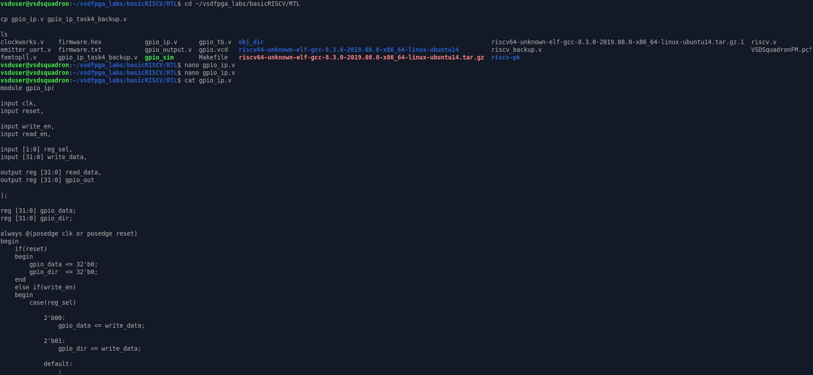
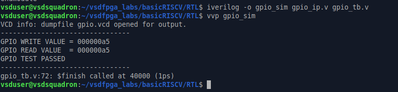
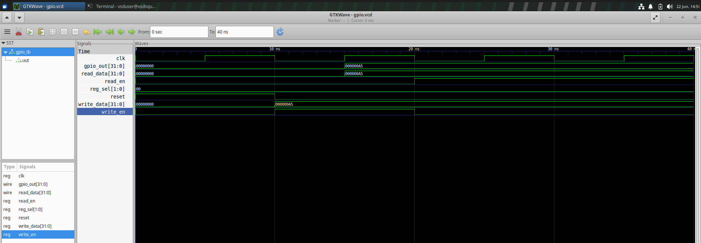
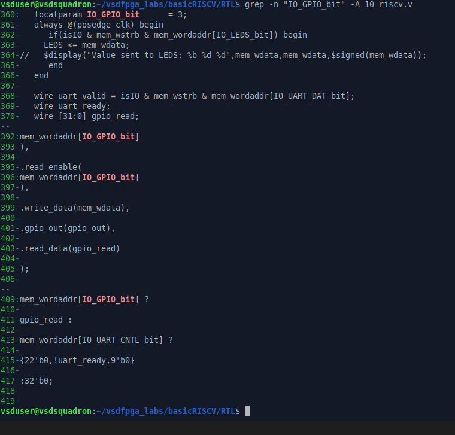
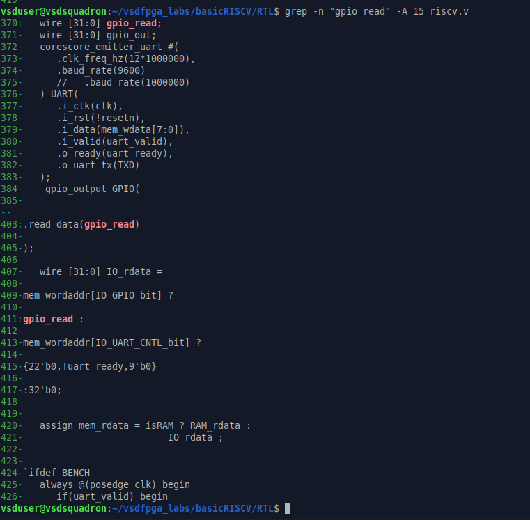
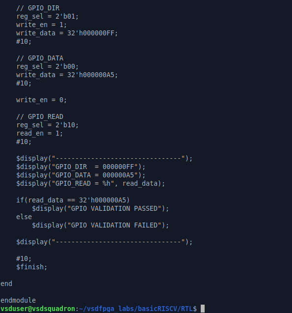
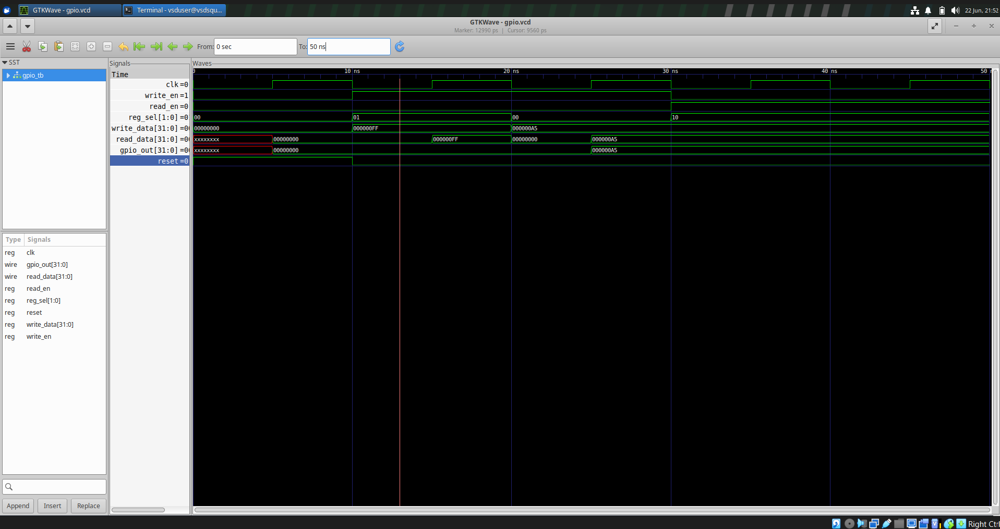

# Task-5: Design a Multi-Register GPIO IP with Software Control

## Objective

The objective of this task is to extend the simple GPIO IP developed in Task-2 into a realistic multi-register, software-controlled peripheral similar to those used in modern System-on-Chip (SoC) designs.

This task focuses on:

* Designing a proper register map
* Handling multiple registers inside a single IP
* Strengthening understanding of memory-mapped I/O
* Validating end-to-end control from software to hardware

This task is still IP-centric. FPGA hardware validation is optional but encouraged for participants who have access to the board.

---

# IP to be Built

## IP Name

**GPIO Control IP (Direction + Data)**

This IP allows software to:

* Configure GPIO direction (Input / Output)
* Write GPIO output values
* Read back GPIO state

This represents a common real-world GPIO peripheral used in embedded systems and SoC architectures.

---

# IP Specification

## Register Map

| Offset | Register Name | Description                                |
| ------ | ------------- | ------------------------------------------ |
| 0x00   | GPIO_DATA     | GPIO output data register                  |
| 0x04   | GPIO_DIR      | Direction register (1 = Output, 0 = Input) |
| 0x08   | GPIO_READ     | Readback register                          |

The base address is reused from the GPIO implementation developed in Task-2.

---

# Functional Requirements

## 1. GPIO_DATA Register

### Write Operation

* Writing updates GPIO output values.

### Read Operation

* Reading returns the last written value.

---

## 2. GPIO_DIR Register

Each bit controls the direction of the corresponding GPIO pin.

### Direction Control

| Value | Mode        |
| ----- | ----------- |
| 1     | Output Mode |
| 0     | Input Mode  |

When configured as output, the corresponding GPIO pin drives the value stored in the GPIO_DATA register.

---

## 3. GPIO_READ Register

The GPIO_READ register provides GPIO status information.

### Readback Behavior

* Returns current GPIO pin values.
* For output pins, returns the value currently being driven.
* For input pins, returns the sampled pin state.

---

# Design Goals

The GPIO Control IP should demonstrate:

* Multi-register architecture
* Register decoding logic
* Clean synchronous RTL design
* Proper read and write handling
* Software-controlled peripheral behavior
* Memory-mapped register organization

---

# Expected Outcome

After completion of this task, the GPIO IP will support:

* Separate Data Register
* Separate Direction Register
* Readback Register
* Register Selection / Address Decoding
* Software-Controlled GPIO Operation
* Simulation-Based Verification

This implementation closely resembles the GPIO peripherals commonly found in commercial microcontrollers, processors, and SoC platforms.

---

# Step 1: Study and Plan

## Objective

This step focused on reviewing the existing Task-2 GPIO IP and planning its extension into a multi-register, software-controlled GPIO peripheral. The planning included:

- Reviewing the existing GPIO RTL
- Identifying additional registers
- Planning address offset decoding
- Defining internal signals
- Preparing the RTL architecture

---

## Existing GPIO Design Analysis

The original GPIO IP contained a single register:

```verilog
reg [31:0] gpio_reg;
```

This register handled:

- GPIO output storage
- GPIO readback
- GPIO output generation

Since all operations relied on a single register, separate direction control and multiple register access were not possible. Therefore, a multi-register architecture was planned.

---

## GPIO File Review

The existing RTL files were reviewed before modifying the design.



The reviewed files include:

- gpio_ip.v
- gpio_output.v
- gpio_tb.v
- riscv.v

These files were used throughout the implementation and verification process.

---

## Existing GPIO RTL Review

The GPIO RTL was analyzed to understand its register storage, write/read operations, and output generation.


The review confirmed that all GPIO functionality was implemented using a single `gpio_reg`.

---

## GPIO Reference Analysis

A recursive GPIO search was performed to identify all GPIO-related connections.



The search identified:

- GPIO module instantiation
- Signal connections
- GPIO readback path
- Testbench references

This helped determine the required RTL modifications.

---

## Planning Document

A planning document was prepared before implementing the new architecture.


### Planned Registers

| Register | Purpose |
|-----------|----------|
| GPIO_DATA | Stores GPIO output data |
| GPIO_DIR | Stores GPIO direction |
| GPIO_READ | Provides GPIO readback |

### Internal Signals

```verilog
gpio_data
gpio_dir
gpio_read
```

### Address Offsets

```text
0x00 -> GPIO_DATA
0x04 -> GPIO_DIR
0x08 -> GPIO_READ
```

---

## Planned Register Map

| Offset | Register | Description |
|----------|----------|-------------|
| 0x00 | GPIO_DATA | GPIO output data register |
| 0x04 | GPIO_DIR | Direction register (1 = Output, 0 = Input) |
| 0x08 | GPIO_READ | GPIO readback register |

---

## Address Offset Decoding Strategy

The GPIO IP uses register selection logic to access different internal registers.

| Address Offset | Register |
|---------------|----------|
| 0x00 | GPIO_DATA |
| 0x04 | GPIO_DIR |
| 0x08 | GPIO_READ |

This approach enables software to access multiple registers through a single memory-mapped GPIO peripheral.

---

## Design Decisions

The following design decisions were finalized:

1. Separate GPIO_DATA and GPIO_DIR registers.
2. Dedicated GPIO_READ register.
3. Register selection logic for address decoding.
4. Synchronous write operations.
5. Combinational read operations.
6. Prioritize design clarity and correctness over optimization.

---

## Outcome

The existing GPIO IP was successfully analyzed, and a complete multi-register architecture, register map, internal signals, and address decoding strategy were finalized. This planning established the foundation for implementing the enhanced GPIO IP.

---

# Step 2: Implement Multi-Register RTL

## Objective

The GPIO IP was extended from a single-register design to a multi-register peripheral supporting independent data, direction, and readback registers. Address decoding was implemented using a register selection signal while maintaining clean synchronous RTL and correct read/write behavior.

---

## Backup of Original GPIO IP

Before modifying the RTL, a backup of the original GPIO IP was created.

```bash
cd ~/vsdfpga_labs/basicRISCV/RTL
cp gpio_ip.v gpio_ip_task4_backup.v
```



---

## Original GPIO RTL

The original GPIO IP contained only one register:

```verilog
reg [31:0] gpio_reg;
```

This register handled GPIO output storage, readback, and output generation, making the design unsuitable for multiple register access.


---

# Multi-Register GPIO RTL

The GPIO IP was updated by introducing:

- GPIO_DATA register
- GPIO_DIR register
- Register selection (`reg_sel`)

```verilog
input [1:0] reg_sel;

reg [31:0] gpio_data;
reg [31:0] gpio_dir;
```

Updated RTL:




---

## Write Logic

Register writes occur synchronously.

```verilog
always @(posedge clk or posedge reset)
```

Register decoding:

```verilog
case(reg_sel)

2'b00:
    gpio_data <= write_data;

2'b01:
    gpio_dir <= write_data;

default:
    ;

endcase
```

| reg_sel | Register |
|---------|----------|
| 00 | GPIO_DATA |
| 01 | GPIO_DIR |

---

## Read Logic

```verilog
always @(*)
```

```verilog
case(reg_sel)

2'b00:
    read_data = gpio_data;

2'b01:
    read_data = gpio_dir;

2'b10:
    read_data = gpio_out;

default:
    read_data = 32'b0;

endcase
```

The default case prevents unintended latch generation.

---

## GPIO Output

GPIO outputs always reflect the contents of `GPIO_DATA`.

```verilog
always @(*)
begin
    gpio_out = gpio_data;
end
```

---

# Register Map

A register map was prepared for software access.


| Offset | Register | reg_sel |
|---------|----------|---------|
| 0x00 | GPIO_DATA | 00 |
| 0x04 | GPIO_DIR | 01 |
| 0x08 | GPIO_READ | 10 |

---

# Testbench Update

The testbench was modified to support the new register-selection logic.


New signal:

```verilog
reg [1:0] reg_sel;
```

DUT connection:

```verilog
.reg_sel(reg_sel)
```

### Validation Flow

1. Apply reset
2. Select GPIO_DATA
3. Write `0xA5`
4. Read GPIO_DATA
5. Compare read and written values
6. Display PASS/FAIL

---

# Compilation & Simulation

```bash
iverilog -o gpio_sim gpio_ip.v gpio_tb.v
vvp gpio_sim
```



### Simulation Output

```text
GPIO WRITE VALUE = 000000A5
GPIO READ VALUE  = 000000A5
GPIO TEST PASSED
```

The matching values verify successful register write and readback operations.

---

# GTKWave Verification

The waveform was viewed using:

```bash
gtkwave gpio.vcd
```


Waveform:



Observed values:

```text
write_data = 000000A5
gpio_out   = 000000A5
read_data  = 000000A5
```

The waveform confirms correct register decoding, data transfer, and GPIO output generation.

---

# Submission Requirements

## Updated GPIO IP RTL

The original GPIO IP was successfully upgraded to support:

- GPIO_DATA register
- GPIO_DIR register
- GPIO_READ register
- Register selection logic
- Multi-register architecture

---

## Register Map Description

| Offset | Register | Description |
|---------|----------|-------------|
| 0x00 | GPIO_DATA | Stores GPIO output data |
| 0x04 | GPIO_DIR | Stores GPIO direction |
| 0x08 | GPIO_READ | Returns GPIO state |

---

## Simulation Proof

Simulation and GTKWave verification confirm:

- Correct register updates
- Correct readback behavior
- Proper GPIO output generation

---

## C Validation Code

Software validation is performed in **Step-4**, where a C program verifies GPIO direction, data write, and readback operations.

---

## Short Explanation

### Address Offset Decoding

The GPIO IP uses a 2-bit `reg_sel` signal to select the required internal register.

| Offset | reg_sel | Register |
|---------|---------|----------|
| 0x00 | 00 | GPIO_DATA |
| 0x04 | 01 | GPIO_DIR |
| 0x08 | 10 | GPIO_READ |

This enables multiple registers to be accessed through a single memory-mapped GPIO peripheral.

---

### Direction Behavior

`GPIO_DIR` determines whether a GPIO pin behaves as an input or output.

| Value | Mode |
|--------|------|
| 1 | Output |
| 0 | Input |

When configured as an output, GPIO values stored in `GPIO_DATA` are driven to the output pins, while `GPIO_READ` returns the current GPIO state.

---

# Outcome

The GPIO IP was successfully extended into a clean multi-register architecture with proper register decoding, synchronous write logic, combinational read logic, successful simulation, and waveform verification. The implementation satisfies all mandatory Task-5 Step-2 requirements and is ready for SoC integration.

---

# Step 3: Integrate into the SoC

## Objective

The multi-register GPIO IP was integrated into the existing SoC while preserving the Task-4 memory-mapped interface. The integration ensures correct address decoding, GPIO signal routing, and compatibility with the existing processor architecture.

---

# Backup of SoC Files

Before modifying the SoC, backup copies of the required files were created.

```bash
cd ~/vsdfpga_labs/basicRISCV/RTL

cp gpio_output.v gpio_output_backup.v
cp riscv.v riscv_backup_task3.v

ls *backup*
```


---

# Existing GPIO Peripheral

The original GPIO peripheral contained a single register.

```verilog
reg [31:0] gpio_reg;
```

It supported GPIO storage, output generation, and readback but did not support multiple registers or direction control.


---

# Updating the GPIO Peripheral

The GPIO peripheral was extended to support multi-register operation by introducing separate data and direction registers.

```verilog
reg [31:0] gpio_data;
reg [31:0] gpio_dir;

input wire [1:0] reg_sel;
```

Updated GPIO RTL:


---

# Register Architecture

| Offset | Register | Function |
|---------|----------|----------|
| 0x00 | GPIO_DATA | Stores GPIO output data |
| 0x04 | GPIO_DIR | Stores GPIO direction |
| 0x08 | GPIO_READ | Returns GPIO state |

Register selection is performed using the `reg_sel` signal.

---

# SoC Integration

The GPIO instance inside the SoC was verified after integrating the updated peripheral.


The following connections remain unchanged:

- Clock
- Reset
- Write Enable
- Read Enable
- Data Bus
- GPIO Output
- GPIO Readback

This keeps the integration flow consistent with Task-4.

---

# Address Decoding

The GPIO peripheral continues to use the existing memory-mapped interface.

```verilog
IO_GPIO_bit = 3;
```

```verilog
mem_wordaddr[IO_GPIO_bit]
```



When the GPIO address is selected, read and write requests are routed to the appropriate GPIO register through `reg_sel`.

---

# GPIO Readback Path

The GPIO readback connection was verified.



Readback path:

```text
GPIO Register
      ↓
 gpio_read
      ↓
 IO_rdata
      ↓
 mem_rdata
      ↓
     CPU
```

This confirms that data stored inside the GPIO peripheral is correctly returned to the processor.

---

# Integration Verification

The following requirements were successfully verified:

- ✅ Updated GPIO peripheral integrated
- ✅ Existing address decoding preserved
- ✅ GPIO signals exposed through the top module
- ✅ Readback path verified
- ✅ Memory-mapped interface maintained
- ✅ Integration flow remains consistent with Task-4

---

# Outcome

The multi-register GPIO IP was successfully integrated into the SoC while preserving the existing architecture. Address decoding, GPIO routing, and readback functionality operate correctly, preparing the design for software validation in the next step.

---

# Step 4: Software Validation

## Objective

The multi-register GPIO IP was validated using simulation and a C validation program. The validation verified GPIO direction control, GPIO data write/read operations, and correct software-to-hardware functionality.

Simulation was performed using **Icarus Verilog**, while waveform verification was completed using **GTKWave**.

---

# Updating the Testbench

The GPIO testbench was updated to validate all implemented registers.




The updated testbench performs the following sequence:

1. Apply reset
2. Configure `GPIO_DIR`
3. Write data to `GPIO_DATA`
4. Read data through `GPIO_READ`
5. Compare the received value with the expected value
6. Display PASS/FAIL status

---

# Testbench Validation

The following register values are exercised during simulation.

### Configure GPIO Direction

```verilog
reg_sel = 2'b01;
write_data = 32'h000000FF;
```

### Write GPIO Data

```verilog
reg_sel = 2'b00;
write_data = 32'h000000A5;
```

### Read GPIO State

```verilog
reg_sel = 2'b10;
read_en = 1;
```

The testbench verifies that the value read through `GPIO_READ` matches the value written into `GPIO_DATA`.

---

# Compilation & Simulation

The updated design was compiled using Icarus Verilog.

```bash
iverilog -o gpio_sim gpio_output.v gpio_tb.v
vvp gpio_sim
```


### Simulation Output

```text
GPIO_DIR  = 000000FF
GPIO_DATA = 000000A5
GPIO_READ = 000000A5

GPIO VALIDATION PASSED
```

The simulation confirms:

- Correct GPIO direction configuration
- Successful data write operation
- Accurate GPIO readback
- Proper register functionality

---

# GTKWave Verification

The generated waveform was opened using:

```bash
gtkwave gpio.vcd
```


Waveform:



### Observed Signals

| Signal | Value |
|---------|-------|
| GPIO_DIR | 000000FF |
| GPIO_DATA | 000000A5 |
| GPIO_READ | 000000A5 |
| GPIO_OUT | 000000A5 |

The waveform confirms:

- Successful reset
- GPIO direction update
- GPIO data update
- Correct register selection
- Accurate GPIO readback

---

# Software Validation Program

A C program was written to emulate software access to the GPIO peripheral.


The program performs the following operations:

- Configure GPIO direction
- Write data to GPIO_DATA
- Read GPIO_READ
- Compare written and received values
- Print the validation result

---

# Software Compilation

The validation program was compiled using GCC.

```bash
gcc gpio_validation.c -o gpio_validation
```


Compilation completed successfully.

---

# UART / Software Output

The validation program was executed.

```bash
./gpio_validation
```


### Program Output

```text
GPIO SOFTWARE VALIDATION

GPIO_DIR  = 0xFF
GPIO_DATA = 0xA5
GPIO_READ = 0xA5

GPIO VALIDATION PASSED
```

The software output matches the simulation results, confirming successful software-to-hardware validation.

---

# Submission Requirements

## C Validation Program

The C program successfully demonstrates:

- GPIO direction configuration
- GPIO data write
- GPIO readback
- Validation of received data

---

## Simulation Proof

Simulation and GTKWave verification confirm:

- Direction control works correctly
- GPIO output updates are reflected
- Readback behaves as expected

---

## Short Explanation

### How Address Offsets Are Decoded

The GPIO peripheral uses the `reg_sel` signal to select one of the internal registers.

| Offset | reg_sel | Register |
|---------|---------|----------|
| 0x00 | 00 | GPIO_DATA |
| 0x04 | 01 | GPIO_DIR |
| 0x08 | 10 | GPIO_READ |

This enables software to access multiple GPIO registers through a single memory-mapped peripheral.

---

### How Direction Affects Behavior

The `GPIO_DIR` register controls the direction of each GPIO pin.

| Value | Mode |
|--------|------|
| 1 | Output |
| 0 | Input |

During validation:

- `GPIO_DIR = 0xFF` configures the lower 8 GPIO pins as outputs.
- `GPIO_DATA = 0xA5` drives the GPIO outputs.
- `GPIO_READ` returns the same value, confirming correct readback behavior.

---

# Outcome

The software validation successfully verified:

- ✅ GPIO direction control
- ✅ GPIO data write operation
- ✅ GPIO readback functionality
- ✅ Correct register decoding
- ✅ Successful simulation
- ✅ GTKWave waveform verification
- ✅ Software-level validation

The multi-register GPIO peripheral satisfies all mandatory Step-4 requirements and is ready for hardware implementation.

---

# Short Explanation

## How Address Offsets Are Decoded

The GPIO IP contains multiple internal registers:

| Offset | Register |
|----------|----------|
| 0x00 | GPIO_DATA |
| 0x04 | GPIO_DIR |
| 0x08 | GPIO_READ |

To access these registers, a 2-bit register select signal (`reg_sel`) is used inside the GPIO IP.

```verilog
case(reg_sel)

2'b00:
    gpio_data <= write_data;

2'b01:
    gpio_dir <= write_data;

endcase
```

For read operations:

```verilog
case(reg_sel)

2'b00:
    read_data = gpio_data;

2'b01:
    read_data = gpio_dir;

2'b10:
    read_data = gpio_out;

endcase
```

The address offset received from software is translated into a corresponding `reg_sel` value.

| Address Offset | reg_sel | Selected Register |
|---------------|----------|------------------|
| 0x00 | 00 | GPIO_DATA |
| 0x04 | 01 | GPIO_DIR |
| 0x08 | 10 | GPIO_READ |

This mechanism acts as an address decoder and allows multiple registers to exist inside a single GPIO peripheral.

When software accesses a particular offset, the decoder automatically routes the transaction to the correct register.

For example:

```text
Write to 0x00 → GPIO_DATA selected
Write to 0x04 → GPIO_DIR selected
Read from 0x08 → GPIO_READ selected
```

This is the same principle used in memory-mapped peripherals found in modern SoCs and microcontrollers.

---

## How Direction Affects Behavior

The GPIO_DIR register controls whether each GPIO pin behaves as an input or an output.

| Direction Bit | Mode |
|--------------|------|
| 1 | Output |
| 0 | Input |

In this implementation:

```text
GPIO_DIR = 0xFF
```

Binary representation:

```text
11111111
```

This configures the lower 8 GPIO pins as outputs.

When a pin is configured as an output:

1. Software writes data into GPIO_DATA.
2. The value is driven onto the GPIO output.
3. GPIO_READ returns the driven value.

Example:

```text
GPIO_DIR  = 0xFF
GPIO_DATA = 0xA5
GPIO_READ = 0xA5
```

Flow:

```text
Software
    ↓
GPIO_DATA
    ↓
GPIO Output
    ↓
GPIO_READ
```

If a pin were configured as an input (`GPIO_DIR = 0`), the GPIO would not drive that pin. Instead, GPIO_READ would return the value present on the external pin.

During simulation:

- GPIO_DIR was configured as `0xFF`
- GPIO_DATA was written with `0xA5`
- GPIO_READ returned `0xA5`

This confirms that direction control, output updates, and readback behavior are functioning correctly.

---

### Thus,

- Address offsets are decoded using the `reg_sel` register-selection mechanism.
- GPIO_DATA, GPIO_DIR, and GPIO_READ are accessed through different decoded register selections.
- GPIO_DIR determines whether GPIO pins behave as inputs or outputs.
- Output pins drive values from GPIO_DATA.
- GPIO_READ provides readback of the current GPIO state.
- Simulation results confirmed correct decoding, direction control, data transfer, and readback functionality.

---

# Observation

The single-register GPIO IP from Task-2 was successfully extended into a multi-register GPIO peripheral supporting separate data, direction, and readback registers.

The implemented register architecture consisted of:

| Register | Function |
|-----------|----------|
| GPIO_DATA | Stores GPIO output values |
| GPIO_DIR | Controls GPIO direction |
| GPIO_READ | Provides GPIO readback |

Address offset decoding was implemented using the `reg_sel` signal, allowing software to access multiple registers through a single GPIO peripheral.

Simulation results confirmed that:

- GPIO_DIR correctly stored direction information.
- GPIO_DATA correctly stored output values.
- GPIO_READ returned the expected readback value.
- Register selection logic correctly routed read and write operations.
- GPIO output reflected the value written into GPIO_DATA.

Simulation output:

```text
GPIO_DIR  = 000000FF
GPIO_DATA = 000000A5
GPIO_READ = 000000A5

GPIO VALIDATION PASSED
```

GTKWave verification further confirmed:

- Proper clock operation
- Correct register decoding
- Successful write transactions
- Correct readback behavior
- Accurate GPIO output generation

The software validation program also produced matching results, demonstrating correct interaction between software and the GPIO peripheral.

This task provided practical exposure to:

- Realistic peripheral design
- Register-level hardware design
- Software-hardware interaction
- Memory-mapped I/O concepts
- Debugging and verification workflows commonly used in industry

---

# Conclusion

A multi-register GPIO IP with software-controlled access was successfully designed, integrated, and validated.

The design supports:

- GPIO_DATA register for output control
- GPIO_DIR register for direction configuration
- GPIO_READ register for status readback
- Register decoding and address selection
- Software-driven GPIO operation

The RTL implementation, SoC integration, simulation verification, and software validation were completed successfully, demonstrating correct end-to-end functionality from software to hardware.

Through this task, a deeper understanding was gained of:

- Peripheral IP development
- Register map design
- Address decoding mechanisms
- Software-hardware contracts
- Verification and debugging methodologies

The completed GPIO IP represents a realistic SoC peripheral architecture and serves as a strong foundation for developing more advanced peripherals such as:

- Timer IPs
- PWM IPs
- Interrupt-capable IPs
- More complex SoC integrations

This task successfully bridged the gap between RTL design and software-controlled hardware operation, providing experience closely aligned with real-world digital design and SoC development workflows.
