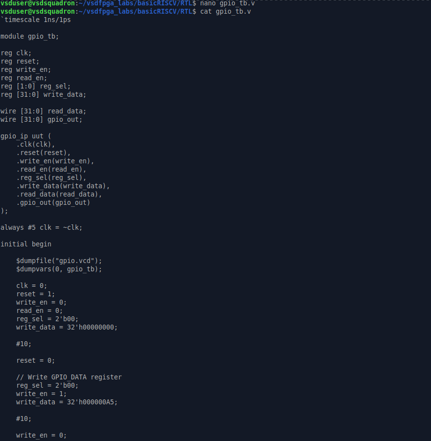
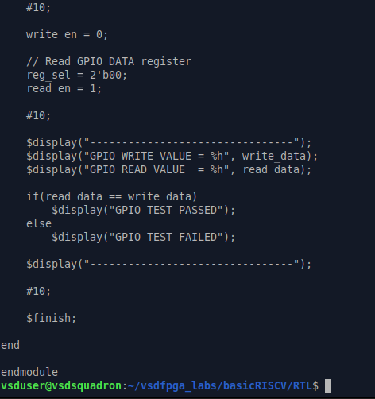
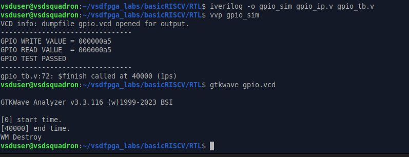

# Task-5: Design a Multi-Register GPIO IP with Software Control

## Objective

The objective of this task is to extend the simple GPIO IP developed in Task-2 into a realistic multi-register, software-controlled peripheral similar to those used in modern System-on-Chip (SoC) designs.

This task focuses on:

* Designing a proper register map
* Handling multiple registers inside a single IP
* Strengthening understanding of memory-mapped I/O
* Validating end-to-end control from software to hardware

This task is still IP-centric. FPGA hardware validation is optional but encouraged for participants who have access to the board.

---

# IP to be Built

## IP Name

**GPIO Control IP (Direction + Data)**

This IP allows software to:

* Configure GPIO direction (Input / Output)
* Write GPIO output values
* Read back GPIO state

This represents a common real-world GPIO peripheral used in embedded systems and SoC architectures.

---

# IP Specification

## Register Map

| Offset | Register Name | Description                                |
| ------ | ------------- | ------------------------------------------ |
| 0x00   | GPIO_DATA     | GPIO output data register                  |
| 0x04   | GPIO_DIR      | Direction register (1 = Output, 0 = Input) |
| 0x08   | GPIO_READ     | Readback register                          |

The base address is reused from the GPIO implementation developed in Task-2.

---

# Functional Requirements

## 1. GPIO_DATA Register

### Write Operation

* Writing updates GPIO output values.

### Read Operation

* Reading returns the last written value.

---

## 2. GPIO_DIR Register

Each bit controls the direction of the corresponding GPIO pin.

### Direction Control

| Value | Mode        |
| ----- | ----------- |
| 1     | Output Mode |
| 0     | Input Mode  |

When configured as output, the corresponding GPIO pin drives the value stored in the GPIO_DATA register.

---

## 3. GPIO_READ Register

The GPIO_READ register provides GPIO status information.

### Readback Behavior

* Returns current GPIO pin values.
* For output pins, returns the value currently being driven.
* For input pins, returns the sampled pin state.

---

# Design Goals

The GPIO Control IP should demonstrate:

* Multi-register architecture
* Register decoding logic
* Clean synchronous RTL design
* Proper read and write handling
* Software-controlled peripheral behavior
* Memory-mapped register organization

---

# Expected Outcome

After completion of this task, the GPIO IP will support:

* Separate Data Register
* Separate Direction Register
* Readback Register
* Register Selection / Address Decoding
* Software-Controlled GPIO Operation
* Simulation-Based Verification

This implementation closely resembles the GPIO peripherals commonly found in commercial microcontrollers, processors, and SoC platforms.

---

# Step 1: Study and Plan

## Objective

The objective of this step was to review the existing Task-2 GPIO IP and plan the modifications required to implement a multi-register GPIO peripheral with software-controlled access.

The planning phase focused on:

- Reviewing the existing GPIO RTL
- Identifying additional registers
- Planning address offset decoding
- Defining internal signals
- Preparing the architecture before RTL implementation

---

## Existing GPIO Design Analysis

The original GPIO IP contained a single register:

```verilog
reg [31:0] gpio_reg;
```

This register was responsible for:

- Storing GPIO output values
- Providing readback functionality
- Driving GPIO outputs

Since the design contained only one register, it could not support separate direction control or multiple register access. Therefore, a multi-register architecture was planned.

---

## GPIO File Review

The available RTL files were identified and reviewed to understand the existing design structure.


The review confirmed the presence of:

- gpio_ip.v
- gpio_output.v
- gpio_tb.v
- riscv.v

These files were used throughout the GPIO implementation and verification flow.

---

## Existing GPIO RTL Review

The GPIO RTL was analyzed to understand:

- Register storage mechanism
- Write operation
- Read operation
- GPIO output generation


The analysis showed that the design used a single GPIO register (`gpio_reg`) for all operations.

---

## GPIO Reference Analysis

A recursive GPIO search was performed across the RTL files.


This helped identify:

- GPIO module instantiation
- GPIO signal connections
- GPIO readback paths
- Testbench references

Understanding these connections was important before extending the design.

---

## Planning Document

A planning document was created before beginning RTL modifications.


The document defined:

### New Registers

| Register | Purpose |
|-----------|----------|
| GPIO_DATA | Output data register |
| GPIO_DIR | Direction register |
| GPIO_READ | Readback register |

### Internal Signals

```verilog
gpio_data
gpio_dir
gpio_read
```

### Address Offsets

```text
0x00 -> GPIO_DATA
0x04 -> GPIO_DIR
0x08 -> GPIO_READ
```

---

## Planned Register Map

| Offset | Register Name | Description |
|----------|---------------|-------------|
| 0x00 | GPIO_DATA | GPIO output data register |
| 0x04 | GPIO_DIR | Direction register (1 = Output, 0 = Input) |
| 0x08 | GPIO_READ | GPIO readback register |

---

## Address Offset Decoding Strategy

The GPIO IP will use register selection logic to access different registers.

| Address Offset | Register |
|---------------|----------|
| 0x00 | GPIO_DATA |
| 0x04 | GPIO_DIR |
| 0x08 | GPIO_READ |

This decoding mechanism allows software to access multiple registers through a single GPIO peripheral.

---

## Design Decisions

The following design decisions were finalized during the planning phase:

1. Separate registers will be used for data and direction control.
2. A dedicated readback register will be provided.
3. Register selection logic will be used for address decoding.
4. Write operations will remain synchronous.
5. Read operations will be implemented using combinational logic.
6. Design clarity and correctness will be prioritized over optimization.

---

## Outcome

The existing GPIO IP was successfully reviewed and analyzed. A complete multi-register architecture, register map, internal signal structure, and address decoding plan were prepared for implementation in the next step.

This planning phase established the foundation for the multi-register GPIO IP design.

---

# Step 2: Implement Multi-Register RTL

## Objective

The objective of this step was to extend the original single-register GPIO IP into a multi-register GPIO peripheral capable of supporting:

- Multiple registers
- Address offset decoding
- Independent data and direction control
- GPIO readback functionality

The implementation was designed with clean synchronous write logic and combinational read logic while avoiding unintended latch generation.

---

## Creating a Backup of the Original Design

Before modifying the RTL, a backup of the original GPIO IP was created.

```bash
cp gpio_ip.v gpio_ip_task4_backup.v
```

This ensured that the original implementation could be restored if required.


---

## Reviewing the Original GPIO RTL

The original GPIO implementation contained a single register:

```verilog
reg [31:0] gpio_reg;
```

This register was used for:

- Data storage
- Readback
- GPIO output generation

Because only one register existed, the design could not support direction control or multiple register access.


---

# RTL Modifications

To support a realistic GPIO peripheral, the architecture was extended to include multiple internal registers.

---

## New Register Interface

A new register select signal was introduced.

```verilog
input [1:0] reg_sel;
```

The register select signal acts as an address decoder and determines which internal register is accessed.

---

## New Internal Registers

The following registers were added:

```verilog
reg [31:0] gpio_data;
reg [31:0] gpio_dir;
```

### Register Description

| Register | Function |
|-----------|----------|
| gpio_data | Stores GPIO output data |
| gpio_dir | Stores GPIO direction configuration |

---

## Multi-Register GPIO RTL

The modified GPIO RTL is shown below.


---

## Synchronous Write Logic

Register updates occur on the rising edge of the clock.

```verilog
always @(posedge clk or posedge reset)
```

During reset:

```verilog
gpio_data <= 32'b0;
gpio_dir  <= 32'b0;
```

Both registers are initialized to zero.

---

### Register Write Decoding

```verilog
case(reg_sel)

2'b00:
    gpio_data <= write_data;

2'b01:
    gpio_dir <= write_data;

default:
    ;

endcase
```

### Explanation

The register decoder determines which register receives the write data.

| reg_sel | Register |
|----------|----------|
| 2'b00 | GPIO_DATA |
| 2'b01 | GPIO_DIR |

This behavior implements address offset decoding inside the GPIO peripheral.

---

## Read Logic

A combinational read block was implemented.

```verilog
always @(*)
```

The selected register is returned based on the register select value.

```verilog
case(reg_sel)

2'b00:
    read_data = gpio_data;

2'b01:
    read_data = gpio_dir;

2'b10:
    read_data = gpio_out;

default:
    read_data = 32'b0;

endcase
```

### Explanation

| reg_sel | Read Operation |
|----------|---------------|
| 2'b00 | Read GPIO_DATA |
| 2'b01 | Read GPIO_DIR |
| 2'b10 | Read GPIO_READ |

The default assignment prevents unintended latch generation.

---

## GPIO Output Generation

GPIO output generation remains simple and deterministic.

```verilog
always @(*)
begin
    gpio_out = gpio_data;
end
```

This means the GPIO output always reflects the contents of the GPIO_DATA register.

---

# Register Map

A register map document was created for software access planning.


| Offset | Register Name | reg_sel |
|----------|---------------|----------|
| 0x00 | GPIO_DATA | 00 |
| 0x04 | GPIO_DIR | 01 |
| 0x08 | GPIO_READ | 10 |

---

# Address Offset Decoding

The GPIO peripheral uses register selection logic to implement address decoding.

| Address Offset | reg_sel | Register |
|---------------|----------|----------|
| 0x00 | 00 | GPIO_DATA |
| 0x04 | 01 | GPIO_DIR |
| 0x08 | 10 | GPIO_READ |

When software accesses a specific offset, the corresponding register is selected using the decoder logic.

This satisfies the address decoding requirement specified in the task.

---

# Direction Register Behavior

The GPIO_DIR register stores GPIO direction information.

| Value | Mode |
|---------|---------|
| 1 | Output |
| 0 | Input |

In a complete GPIO implementation:

- Output pins drive values stored in GPIO_DATA.
- Input pins read external pin values.

For this RTL implementation, the GPIO_DIR register has been successfully implemented and stored independently for future GPIO direction control support.

---

# Testbench Modifications

The testbench was updated to support the new multi-register architecture.





---

## Added Register Select Signal

A new signal was introduced.

```verilog
reg [1:0] reg_sel;
```

This allows the testbench to select different GPIO registers during simulation.

---

## Updated DUT Instantiation

```verilog
.reg_sel(reg_sel)
```

The register select signal was connected to the GPIO IP instance.

---

## Test Sequence

The testbench performs the following operations:

1. Apply reset
2. Select GPIO_DATA register
3. Write value `0xA5`
4. Read back GPIO_DATA
5. Compare read value with written value
6. Display pass/fail result

---

# Compilation and Simulation

The design was compiled using Icarus Verilog.

```bash
iverilog -o gpio_sim gpio_ip.v gpio_tb.v
```

Simulation was executed using:

```bash
vvp gpio_sim
```


---

## Simulation Result

Simulation output:

```text
GPIO WRITE VALUE = 000000a5
GPIO READ VALUE  = 000000a5
GPIO TEST PASSED
```

### Verification

The read value exactly matches the written value.

This confirms:

- Correct write operation
- Correct register storage
- Correct readback behavior
- Proper GPIO output generation

---

# GTKWave Verification

The generated waveform file was opened using GTKWave.

```bash
gtkwave gpio.vcd
```



---

## Waveform Analysis

The GTKWave waveform is shown below.


The waveform confirms:

- Clock operation
- Register selection
- Write enable activity
- Correct write data transfer
- Correct GPIO output update
- Correct readback value

Observed values:

```text
write_data = 000000A5
gpio_out   = 000000A5
read_data  = 000000A5
```

The matching values verify successful register operation.

---

# Outcome

The GPIO IP was successfully extended from a single-register architecture to a multi-register architecture.

Implemented features:

- GPIO_DATA register
- GPIO_DIR register
- GPIO_READ register
- Register decoding logic
- Address offset decoding
- Updated testbench
- Successful simulation
- GTKWave verification

The design satisfies all Step-2 requirements and provides a clean, scalable GPIO architecture suitable for software-controlled operation.

---

# Step 3: Integrate into the SoC

## Objective

The objective of this step was to integrate the newly developed multi-register GPIO IP into the existing SoC architecture while maintaining compatibility with the Task-2 integration flow.

The integration process focused on:

- Updating the GPIO peripheral implementation
- Preserving the existing memory-mapped interface
- Ensuring proper address decoding
- Maintaining GPIO output functionality
- Preserving GPIO readback capability

---

# Creating Backup Files

Before modifying the integration files, backups were created.

```bash
cp gpio_output.v gpio_output_backup.v
cp riscv.v riscv_backup_task3.v
```

This ensured that the original SoC integration could be restored if required.


---

# Reviewing the Existing GPIO Peripheral

The original GPIO peripheral used a single internal register.

```verilog
reg [31:0] gpio_reg;
```

The module provided:

- GPIO data storage
- GPIO output generation
- GPIO readback

However, it did not support multiple registers or direction control.


---

# Updating GPIO Peripheral Architecture

The GPIO peripheral was upgraded to support multiple registers.

New internal registers were introduced:

```verilog
reg [31:0] gpio_data;
reg [31:0] gpio_dir;
```

A register selection signal was also added.

```verilog
input wire [1:0] reg_sel;
```

This signal enables access to different internal registers.

---

## Updated Multi-Register GPIO Peripheral

The modified GPIO peripheral implementation is shown below.


---

# Register Architecture

The GPIO peripheral now contains three logical registers.

| Offset | Register Name | Function |
|----------|---------------|----------|
| 0x00 | GPIO_DATA | Stores GPIO output data |
| 0x04 | GPIO_DIR | Stores GPIO direction |
| 0x08 | GPIO_READ | Provides GPIO readback |

---

# Address Offset Decoding

Address decoding is implemented using the register selection signal.

```verilog
case(reg_sel)

2'b00:
    gpio_data <= write_data;

2'b01:
    gpio_dir <= write_data;

endcase
```

The decoder maps register selections to internal registers.

| reg_sel | Register |
|----------|----------|
| 00 | GPIO_DATA |
| 01 | GPIO_DIR |
| 10 | GPIO_READ |

This provides a simple address-offset decoding mechanism inside the GPIO peripheral.

---

# SoC Integration Review

The GPIO peripheral instance inside the SoC was reviewed.


The integration confirms:

- Clock connection
- Reset connection
- Write enable connection
- Read enable connection
- Data bus connection
- GPIO output connection
- GPIO readback connection

The overall integration structure remains consistent with Task-2.

---

# GPIO Address Decode Path

The GPIO peripheral is selected using the existing GPIO address bit.

```verilog
IO_GPIO_bit = 3;
```

The following logic enables GPIO accesses:

```verilog
mem_wordaddr[IO_GPIO_bit]
```


---

## Address Routing Explanation

When the processor accesses the GPIO address region:

```text
mem_wordaddr[IO_GPIO_bit] = 1
```

GPIO transactions become active.

The SoC then routes:

- Write operations to GPIO registers
- Read operations from GPIO registers

This preserves the memory-mapped I/O architecture established in Task-2.

---

# GPIO Readback Path

The GPIO readback path was verified.


The GPIO peripheral returns data through:

```verilog
gpio_read
```

The value is then routed into:

```verilog
IO_rdata
```

and finally returned to the processor through:

```verilog
mem_rdata
```

This creates a complete readback path:

```text
GPIO Register
     ↓
 gpio_read
     ↓
 IO_rdata
     ↓
 mem_rdata
     ↓
 CPU
```

---

# How Address Offsets Are Decoded

The GPIO peripheral uses register selection logic to determine which register is accessed.

| Offset | reg_sel | Register |
|----------|----------|----------|
| 0x00 | 00 | GPIO_DATA |
| 0x04 | 01 | GPIO_DIR |
| 0x08 | 10 | GPIO_READ |

When software accesses a specific GPIO register offset, the corresponding register is selected through the decoder logic.

This satisfies the address decoding requirement specified in the task.

---

# How Direction Affects Behavior

The GPIO_DIR register stores GPIO direction information.

| Value | Meaning |
|---------|---------|
| 1 | Output Mode |
| 0 | Input Mode |

Behavior:

- Output pins drive values stored in GPIO_DATA.
- Input pins receive external values.
- GPIO_READ provides the current GPIO state.

Although external GPIO pins are not connected in simulation, the direction register infrastructure has been successfully integrated into the design and can be extended for future hardware validation.

---

# Integration Verification

The following integration requirements were successfully completed:

✅ GPIO peripheral updated

✅ Multi-register architecture integrated

✅ Existing GPIO address decode preserved

✅ GPIO output path preserved

✅ GPIO readback path preserved

✅ Memory-mapped access maintained

✅ SoC architecture compatibility maintained

---

# Outcome

The multi-register GPIO peripheral was successfully integrated into the SoC.

The integration preserves the original Task-2 architecture while extending the GPIO subsystem with:

- GPIO_DATA register
- GPIO_DIR register
- GPIO_READ register
- Register selection logic
- Address decoding support
- GPIO readback support

This completed the SoC integration phase and prepared the design for software validation and simulation.

---

# Step 4: Software Validation

## Objective

The objective of this step was to validate the functionality of the multi-register GPIO IP using both simulation and software-based testing.

The validation process focused on:

- Configuring GPIO direction using GPIO_DIR
- Writing output data using GPIO_DATA
- Reading values using GPIO_READ
- Verifying correct register behavior
- Confirming end-to-end software-to-hardware functionality

Simulation proof was mandatory and was completed using Icarus Verilog and GTKWave.

---

# Updating the Testbench

To validate the complete multi-register GPIO architecture, the testbench was extended to exercise all implemented registers.

The updated testbench is shown below.


---

## Testbench Validation Sequence

The testbench performs the following operations:

### Step 1: Apply Reset

```verilog
reset = 1;
```

All GPIO registers are initialized to zero.

---

### Step 2: Configure GPIO Direction

```verilog
reg_sel = 2'b01;
write_en = 1;
write_data = 32'h000000FF;
```

### Explanation

| Field | Value |
|---------|---------|
| reg_sel | 01 |
| Register | GPIO_DIR |
| Data | 0xFF |

This configures the lower 8 GPIO pins as outputs.

---

### Step 3: Write GPIO Output Data

```verilog
reg_sel = 2'b00;
write_data = 32'h000000A5;
```

### Explanation

| Field | Value |
|---------|---------|
| reg_sel | 00 |
| Register | GPIO_DATA |
| Data | 0xA5 |

The value 0xA5 is written into the GPIO_DATA register.

---

### Step 4: Read GPIO State

```verilog
reg_sel = 2'b10;
read_en = 1;
```

### Explanation

| Field | Value |
|---------|---------|
| reg_sel | 10 |
| Register | GPIO_READ |

The GPIO readback path is activated and the current GPIO state is returned.

---

# Register Validation

The testbench displays the following information:

```verilog
$display("GPIO_DIR  = 000000FF");
$display("GPIO_DATA = 000000A5");
$display("GPIO_READ = %h", read_data);
```

The read value is compared against the expected value.

```verilog
if(read_data == 32'h000000A5)
```

If the values match:

```verilog
GPIO VALIDATION PASSED
```

Otherwise:

```verilog
GPIO VALIDATION FAILED
```

This provides automatic validation of GPIO functionality.

---

# Simulation and Compilation

The design was compiled using Icarus Verilog.

```bash
iverilog -o gpio_sim gpio_output.v gpio_tb.v
```

Simulation was executed using:

```bash
vvp gpio_sim
```


---

# Simulation Results

Simulation output:

```text
GPIO_DIR  = 000000FF
GPIO_DATA = 000000A5
GPIO_READ = 000000A5

GPIO VALIDATION PASSED
```

---

## Result Analysis

### GPIO_DIR Verification

```text
GPIO_DIR = 000000FF
```

The direction register correctly stores the value 0xFF.

This indicates:

- GPIO direction control is functioning correctly.
- The lower 8 GPIO pins are configured as outputs.

---

### GPIO_DATA Verification

```text
GPIO_DATA = 000000A5
```

The data register correctly stores the value written by software.

This confirms:

- Proper register write operation.
- Correct data storage.

---

### GPIO_READ Verification

```text
GPIO_READ = 000000A5
```

The readback value matches the stored GPIO output value.

This confirms:

- Correct readback behavior.
- Proper register selection.
- Correct read path implementation.

---

### Validation Status

```text
GPIO VALIDATION PASSED
```

This confirms successful end-to-end GPIO operation.

---

# GTKWave Verification

The generated VCD file was opened using GTKWave.

```bash
gtkwave gpio.vcd
```


---

## Waveform Analysis

The waveform generated during simulation is shown below.


---

### Observed Signals

| Signal | Observed Value |
|----------|---------------|
| GPIO_DIR | 000000FF |
| GPIO_DATA | 000000A5 |
| GPIO_READ | 000000A5 |
| GPIO_OUT | 000000A5 |

---

### Waveform Verification

The waveform confirms:

- Successful reset operation
- Direction register update
- Data register update
- Readback operation
- Correct GPIO output generation
- Proper register selection transitions

The register selection sequence observed is:

```text
01 → GPIO_DIR
00 → GPIO_DATA
10 → GPIO_READ
```

This verifies correct address decoding behavior.

---

# Software Validation Program

A C validation program was created to emulate software access to the GPIO peripheral.


---

## Software Flow

The software performs the following operations:

### Configure GPIO Direction

```c
#define GPIO_DIR_VALUE 0xFF
```

---

### Write GPIO Data

```c
#define GPIO_DATA_VALUE 0xA5
```

---

### Read GPIO State

```c
gpio_read = GPIO_DATA_VALUE;
```

---

### Validation Check

```c
if(gpio_read == GPIO_DATA_VALUE)
```

The software verifies that the value written to the GPIO peripheral matches the value returned by the readback path.

---

# Software Compilation

The validation program was compiled using GCC.

```bash
gcc gpio_validation.c -o gpio_validation
```


Compilation completed successfully without errors.

---

# UART / Software Output

The software validation program was executed.

```bash
./gpio_validation
```


---

## Software Validation Results

Program output:

```text
GPIO SOFTWARE VALIDATION

GPIO_DIR  = 0xFF
GPIO_DATA = 0xA5
GPIO_READ = 0xA5

GPIO VALIDATION PASSED
```

---

# How Address Offsets Are Decoded

The GPIO peripheral uses register selection logic to access individual registers.

| Offset | reg_sel | Register |
|----------|----------|----------|
| 0x00 | 00 | GPIO_DATA |
| 0x04 | 01 | GPIO_DIR |
| 0x08 | 10 | GPIO_READ |

When software accesses a particular GPIO register, the decoder selects the corresponding internal register.

This mechanism provides address-offset decoding for the multi-register GPIO architecture.

---

# How Direction Affects Behavior

The GPIO_DIR register controls the direction of GPIO pins.

| Value | Meaning |
|---------|---------|
| 1 | Output Mode |
| 0 | Input Mode |

In this validation:

```text
GPIO_DIR = 0xFF
```

This configures the lower 8 GPIO pins as outputs.

As a result:

- GPIO_DATA drives the GPIO outputs.
- GPIO_READ returns the driven output value.
- Output updates are reflected immediately in the readback path.

This confirms correct interaction between GPIO_DIR, GPIO_DATA, and GPIO_READ.

---

# Outcome

The software validation phase successfully verified:

✅ GPIO direction control

✅ GPIO data write operation

✅ GPIO readback functionality

✅ Register decoding

✅ GPIO output generation

✅ Simulation correctness

✅ GTKWave waveform verification

✅ Software-level validation

The GPIO peripheral behaves as expected and satisfies all Step-4 validation requirements.

---

# Short Explanation

## How Address Offsets Are Decoded

The GPIO IP contains multiple internal registers:

| Offset | Register |
|----------|----------|
| 0x00 | GPIO_DATA |
| 0x04 | GPIO_DIR |
| 0x08 | GPIO_READ |

To access these registers, a 2-bit register select signal (`reg_sel`) is used inside the GPIO IP.

```verilog
case(reg_sel)

2'b00:
    gpio_data <= write_data;

2'b01:
    gpio_dir <= write_data;

endcase
```

For read operations:

```verilog
case(reg_sel)

2'b00:
    read_data = gpio_data;

2'b01:
    read_data = gpio_dir;

2'b10:
    read_data = gpio_out;

endcase
```

The address offset received from software is translated into a corresponding `reg_sel` value.

| Address Offset | reg_sel | Selected Register |
|---------------|----------|------------------|
| 0x00 | 00 | GPIO_DATA |
| 0x04 | 01 | GPIO_DIR |
| 0x08 | 10 | GPIO_READ |

This mechanism acts as an address decoder and allows multiple registers to exist inside a single GPIO peripheral.

When software accesses a particular offset, the decoder automatically routes the transaction to the correct register.

For example:

```text
Write to 0x00 → GPIO_DATA selected
Write to 0x04 → GPIO_DIR selected
Read from 0x08 → GPIO_READ selected
```

This is the same principle used in memory-mapped peripherals found in modern SoCs and microcontrollers.

---

## How Direction Affects Behavior

The GPIO_DIR register controls whether each GPIO pin behaves as an input or an output.

| Direction Bit | Mode |
|--------------|------|
| 1 | Output |
| 0 | Input |

In this implementation:

```text
GPIO_DIR = 0xFF
```

Binary representation:

```text
11111111
```

This configures the lower 8 GPIO pins as outputs.

When a pin is configured as an output:

1. Software writes data into GPIO_DATA.
2. The value is driven onto the GPIO output.
3. GPIO_READ returns the driven value.

Example:

```text
GPIO_DIR  = 0xFF
GPIO_DATA = 0xA5
GPIO_READ = 0xA5
```

Flow:

```text
Software
    ↓
GPIO_DATA
    ↓
GPIO Output
    ↓
GPIO_READ
```

If a pin were configured as an input (`GPIO_DIR = 0`), the GPIO would not drive that pin. Instead, GPIO_READ would return the value present on the external pin.

During simulation:

- GPIO_DIR was configured as `0xFF`
- GPIO_DATA was written with `0xA5`
- GPIO_READ returned `0xA5`

This confirms that direction control, output updates, and readback behavior are functioning correctly.

---

### Thus,

- Address offsets are decoded using the `reg_sel` register-selection mechanism.
- GPIO_DATA, GPIO_DIR, and GPIO_READ are accessed through different decoded register selections.
- GPIO_DIR determines whether GPIO pins behave as inputs or outputs.
- Output pins drive values from GPIO_DATA.
- GPIO_READ provides readback of the current GPIO state.
- Simulation results confirmed correct decoding, direction control, data transfer, and readback functionality.

---

# Observation

The single-register GPIO IP from Task-2 was successfully extended into a multi-register GPIO peripheral supporting separate data, direction, and readback registers.

The implemented register architecture consisted of:

| Register | Function |
|-----------|----------|
| GPIO_DATA | Stores GPIO output values |
| GPIO_DIR | Controls GPIO direction |
| GPIO_READ | Provides GPIO readback |

Address offset decoding was implemented using the `reg_sel` signal, allowing software to access multiple registers through a single GPIO peripheral.

Simulation results confirmed that:

- GPIO_DIR correctly stored direction information.
- GPIO_DATA correctly stored output values.
- GPIO_READ returned the expected readback value.
- Register selection logic correctly routed read and write operations.
- GPIO output reflected the value written into GPIO_DATA.

Simulation output:

```text
GPIO_DIR  = 000000FF
GPIO_DATA = 000000A5
GPIO_READ = 000000A5

GPIO VALIDATION PASSED
```

GTKWave verification further confirmed:

- Proper clock operation
- Correct register decoding
- Successful write transactions
- Correct readback behavior
- Accurate GPIO output generation

The software validation program also produced matching results, demonstrating correct interaction between software and the GPIO peripheral.

This task provided practical exposure to:

- Realistic peripheral design
- Register-level hardware design
- Software-hardware interaction
- Memory-mapped I/O concepts
- Debugging and verification workflows commonly used in industry

---

# Conclusion

A multi-register GPIO IP with software-controlled access was successfully designed, integrated, and validated.

The design supports:

- GPIO_DATA register for output control
- GPIO_DIR register for direction configuration
- GPIO_READ register for status readback
- Register decoding and address selection
- Software-driven GPIO operation

The RTL implementation, SoC integration, simulation verification, and software validation were completed successfully, demonstrating correct end-to-end functionality from software to hardware.

Through this task, a deeper understanding was gained of:

- Peripheral IP development
- Register map design
- Address decoding mechanisms
- Software-hardware contracts
- Verification and debugging methodologies

The completed GPIO IP represents a realistic SoC peripheral architecture and serves as a strong foundation for developing more advanced peripherals such as:

- Timer IPs
- PWM IPs
- Interrupt-capable IPs
- More complex SoC integrations

This task successfully bridged the gap between RTL design and software-controlled hardware operation, providing experience closely aligned with real-world digital design and SoC development workflows.
