# Task-5: Design a Multi-Register GPIO IP with Software Control

## Objective

The objective of this task is to extend the simple GPIO IP developed in Task-2 into a realistic multi-register, software-controlled peripheral similar to those used in modern System-on-Chip (SoC) designs.

This task focuses on:

* Designing a proper register map
* Handling multiple registers inside a single IP
* Strengthening understanding of memory-mapped I/O
* Validating end-to-end control from software to hardware

This task is still IP-centric. FPGA hardware validation is optional but encouraged for participants who have access to the board.

---

# IP to be Built

## IP Name

**GPIO Control IP (Direction + Data)**

This IP allows software to:

* Configure GPIO direction (Input / Output)
* Write GPIO output values
* Read back GPIO state

This represents a common real-world GPIO peripheral used in embedded systems and SoC architectures.

---

# IP Specification

## Register Map

| Offset | Register Name | Description                                |
| ------ | ------------- | ------------------------------------------ |
| 0x00   | GPIO_DATA     | GPIO output data register                  |
| 0x04   | GPIO_DIR      | Direction register (1 = Output, 0 = Input) |
| 0x08   | GPIO_READ     | Readback register                          |

The base address is reused from the GPIO implementation developed in Task-2.

---

# Functional Requirements

## 1. GPIO_DATA Register

### Write Operation

* Writing updates GPIO output values.

### Read Operation

* Reading returns the last written value.

---

## 2. GPIO_DIR Register

Each bit controls the direction of the corresponding GPIO pin.

### Direction Control

| Value | Mode        |
| ----- | ----------- |
| 1     | Output Mode |
| 0     | Input Mode  |

When configured as output, the corresponding GPIO pin drives the value stored in the GPIO_DATA register.

---

## 3. GPIO_READ Register

The GPIO_READ register provides GPIO status information.

### Readback Behavior

* Returns current GPIO pin values.
* For output pins, returns the value currently being driven.
* For input pins, returns the sampled pin state.

---

# Design Goals

The GPIO Control IP should demonstrate:

* Multi-register architecture
* Register decoding logic
* Clean synchronous RTL design
* Proper read and write handling
* Software-controlled peripheral behavior
* Memory-mapped register organization

---

# Expected Outcome

After completion of this task, the GPIO IP will support:

* Separate Data Register
* Separate Direction Register
* Readback Register
* Register Selection / Address Decoding
* Software-Controlled GPIO Operation
* Simulation-Based Verification

This implementation closely resembles the GPIO peripherals commonly found in commercial microcontrollers, processors, and SoC platforms.

---

# Step 1: Study and Plan

## Objective

This step focused on reviewing the existing Task-2 GPIO IP and planning its extension into a multi-register, software-controlled GPIO peripheral. The planning included:

- Reviewing the existing GPIO RTL
- Identifying additional registers
- Planning address offset decoding
- Defining internal signals
- Preparing the RTL architecture

---

## Existing GPIO Design Analysis

The original GPIO IP contained a single register:

```verilog
reg [31:0] gpio_reg;
```

This register handled:

- GPIO output storage
- GPIO readback
- GPIO output generation

Since all operations relied on a single register, separate direction control and multiple register access were not possible. Therefore, a multi-register architecture was planned.

---

## GPIO File Review

The existing RTL files were reviewed before modifying the design.


The reviewed files include:

- gpio_ip.v
- gpio_output.v
- gpio_tb.v
- riscv.v

These files were used throughout the implementation and verification process.

---

## Existing GPIO RTL Review

The GPIO RTL was analyzed to understand its register storage, write/read operations, and output generation.

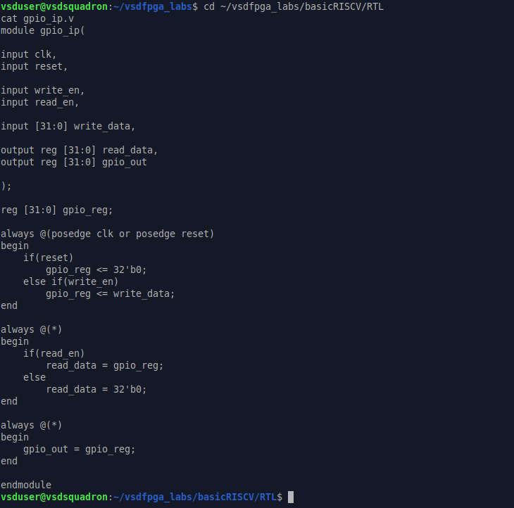

The review confirmed that all GPIO functionality was implemented using a single `gpio_reg`.

---

## GPIO Reference Analysis

A recursive GPIO search was performed to identify all GPIO-related connections.


The search identified:

- GPIO module instantiation
- Signal connections
- GPIO readback path
- Testbench references

This helped determine the required RTL modifications.

---

## Planning Document

A planning document was prepared before implementing the new architecture.

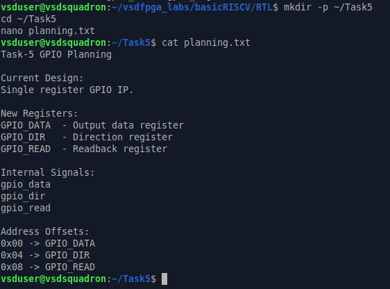

### Planned Registers

| Register | Purpose |
|-----------|----------|
| GPIO_DATA | Stores GPIO output data |
| GPIO_DIR | Stores GPIO direction |
| GPIO_READ | Provides GPIO readback |

### Internal Signals

```verilog
gpio_data
gpio_dir
gpio_read
```

### Address Offsets

```text
0x00 -> GPIO_DATA
0x04 -> GPIO_DIR
0x08 -> GPIO_READ
```

---

## Planned Register Map

| Offset | Register | Description |
|----------|----------|-------------|
| 0x00 | GPIO_DATA | GPIO output data register |
| 0x04 | GPIO_DIR | Direction register (1 = Output, 0 = Input) |
| 0x08 | GPIO_READ | GPIO readback register |

---

## Address Offset Decoding Strategy

The GPIO IP uses register selection logic to access different internal registers.

| Address Offset | Register |
|---------------|----------|
| 0x00 | GPIO_DATA |
| 0x04 | GPIO_DIR |
| 0x08 | GPIO_READ |

This approach enables software to access multiple registers through a single memory-mapped GPIO peripheral.

---

## Design Decisions

The following design decisions were finalized:

1. Separate GPIO_DATA and GPIO_DIR registers.
2. Dedicated GPIO_READ register.
3. Register selection logic for address decoding.
4. Synchronous write operations.
5. Combinational read operations.
6. Prioritize design clarity and correctness over optimization.

---

## Outcome

The existing GPIO IP was successfully analyzed, and a complete multi-register architecture, register map, internal signals, and address decoding strategy were finalized. This planning established the foundation for implementing the enhanced GPIO IP.

---

# Step 2: Implement Multi-Register RTL

## Objective

This step extends the original single-register GPIO IP into a multi-register GPIO peripheral supporting independent data, direction, and readback registers through address decoding.

Key features implemented:

- GPIO_DATA register
- GPIO_DIR register
- GPIO_READ register
- Register selection logic
- Synchronous write operation
- Combinational read operation

---

## Backup of Original Design

Before modifying the RTL, a backup of the original GPIO IP was created.

```bash
cp gpio_ip.v gpio_ip_task4_backup.v
```


This allows the original design to be restored if required.

---

## Original GPIO RTL Review

The original GPIO IP contained only one register:

```verilog
reg [31:0] gpio_reg;
```

It was responsible for:

- GPIO data storage
- Readback
- GPIO output generation

Since a single register handled all operations, separate direction control was not supported.

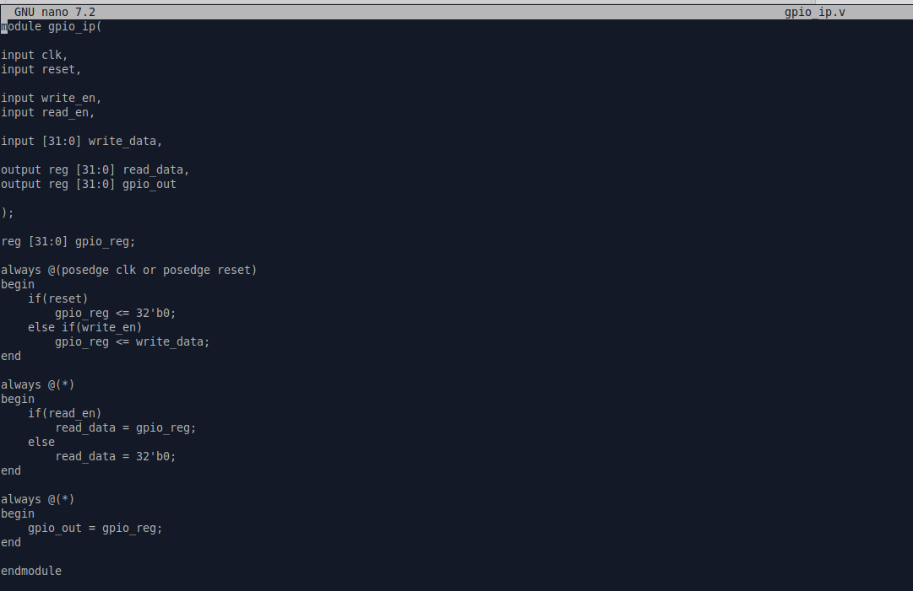

---

# RTL Modifications

The GPIO architecture was updated to support multiple internal registers.

## Register Interface

A register selection signal was introduced.

```verilog
input [1:0] reg_sel;
```

`reg_sel` selects the internal register to be accessed.

---

## Internal Registers

```verilog
reg [31:0] gpio_data;
reg [31:0] gpio_dir;
```

| Register | Function |
|-----------|----------|
| gpio_data | Stores GPIO output data |
| gpio_dir | Stores GPIO direction |

---

## Multi-Register GPIO RTL

The updated RTL implementation is shown below.


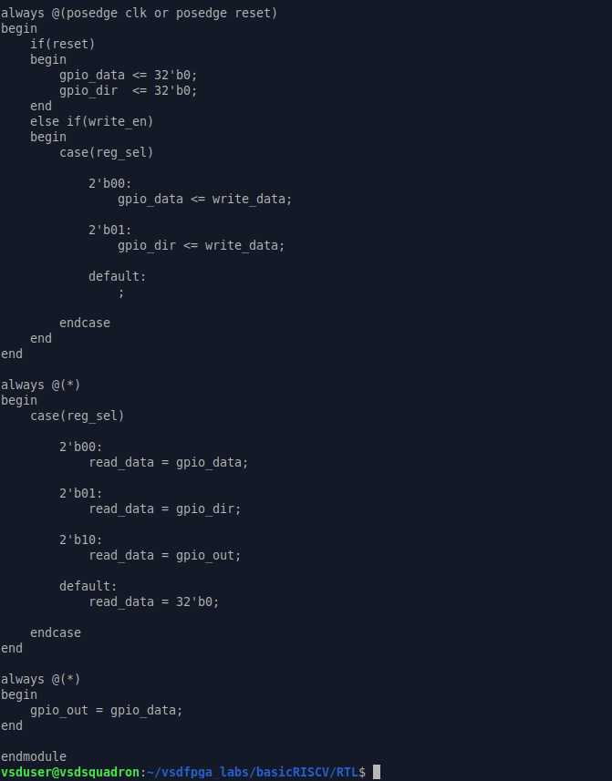

---

## Write Logic

The GPIO registers are updated synchronously on the rising clock edge.

```verilog
always @(posedge clk or posedge reset)
```

During reset:

```verilog
gpio_data <= 32'b0;
gpio_dir  <= 32'b0;
```

Register selection is performed using:

```verilog
case(reg_sel)

2'b00:
    gpio_data <= write_data;

2'b01:
    gpio_dir <= write_data;

default:
    ;

endcase
```

| reg_sel | Selected Register |
|----------|-------------------|
| 00 | GPIO_DATA |
| 01 | GPIO_DIR |

---

## Read Logic

A combinational block returns the selected register value.

```verilog
always @(*)
```

```verilog
case(reg_sel)

2'b00:
    read_data = gpio_data;

2'b01:
    read_data = gpio_dir;

2'b10:
    read_data = gpio_out;

default:
    read_data = 32'b0;

endcase
```

| reg_sel | Read Register |
|----------|---------------|
| 00 | GPIO_DATA |
| 01 | GPIO_DIR |
| 10 | GPIO_READ |

The default case avoids unintended latch generation.

---

## GPIO Output Generation

GPIO outputs are driven directly from the data register.

```verilog
always @(*)
begin
    gpio_out = gpio_data;
end
```

Thus, any value written to `GPIO_DATA` immediately appears on the GPIO outputs.

---

# Register Map

A register map was prepared for software access.

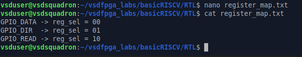

| Offset | Register | reg_sel |
|----------|----------|---------|
| 0x00 | GPIO_DATA | 00 |
| 0x04 | GPIO_DIR | 01 |
| 0x08 | GPIO_READ | 10 |

The register decoder maps each address offset to its corresponding internal register.

---

# Step 2: Implement Multi-Register RTL

## Objective

This step extends the original single-register GPIO IP into a multi-register GPIO peripheral supporting independent data, direction, and readback registers through address decoding.

Key features implemented:

- GPIO_DATA register
- GPIO_DIR register
- GPIO_READ register
- Register selection logic
- Synchronous write operation
- Combinational read operation

---

## Backup of Original Design

Before modifying the RTL, a backup of the original GPIO IP was created.

```bash
cp gpio_ip.v gpio_ip_task4_backup.v
```


This allows the original design to be restored if required.

---

## Original GPIO RTL Review

The original GPIO IP contained only one register:

```verilog
reg [31:0] gpio_reg;
```

It was responsible for:

- GPIO data storage
- Readback
- GPIO output generation

Since a single register handled all operations, separate direction control was not supported.


---

# RTL Modifications

The GPIO architecture was updated to support multiple internal registers.

## Register Interface

A register selection signal was introduced.

```verilog
input [1:0] reg_sel;
```

`reg_sel` selects the internal register to be accessed.

---

## Internal Registers

```verilog
reg [31:0] gpio_data;
reg [31:0] gpio_dir;
```

| Register | Function |
|-----------|----------|
| gpio_data | Stores GPIO output data |
| gpio_dir | Stores GPIO direction |

---

## Multi-Register GPIO RTL

The updated RTL implementation is shown below.


---

## Write Logic

The GPIO registers are updated synchronously on the rising clock edge.

```verilog
always @(posedge clk or posedge reset)
```

During reset:

```verilog
gpio_data <= 32'b0;
gpio_dir  <= 32'b0;
```

Register selection is performed using:

```verilog
case(reg_sel)

2'b00:
    gpio_data <= write_data;

2'b01:
    gpio_dir <= write_data;

default:
    ;

endcase
```

| reg_sel | Selected Register |
|----------|-------------------|
| 00 | GPIO_DATA |
| 01 | GPIO_DIR |

---

## Read Logic

A combinational block returns the selected register value.

```verilog
always @(*)
```

```verilog
case(reg_sel)

2'b00:
    read_data = gpio_data;

2'b01:
    read_data = gpio_dir;

2'b10:
    read_data = gpio_out;

default:
    read_data = 32'b0;

endcase
```

| reg_sel | Read Register |
|----------|---------------|
| 00 | GPIO_DATA |
| 01 | GPIO_DIR |
| 10 | GPIO_READ |

The default case avoids unintended latch generation.

---

## GPIO Output Generation

GPIO outputs are driven directly from the data register.

```verilog
always @(*)
begin
    gpio_out = gpio_data;
end
```

Thus, any value written to `GPIO_DATA` immediately appears on the GPIO outputs.

---

# Register Map

A register map was prepared for software access.


| Offset | Register | reg_sel |
|----------|----------|---------|
| 0x00 | GPIO_DATA | 00 |
| 0x04 | GPIO_DIR | 01 |
| 0x08 | GPIO_READ | 10 |

The register decoder maps each address offset to its corresponding internal register.

---

# Step 3: Integrate into the SoC

## Objective

This step integrates the multi-register GPIO IP into the existing SoC while preserving the Task-2 memory-mapped interface. The integration ensures correct address decoding, GPIO output generation, and readback functionality.

---

# Creating Backup Files

Before modifying the SoC files, backup copies were created.

```bash
cp gpio_output.v gpio_output_backup.v
cp riscv.v riscv_backup_task3.v
```

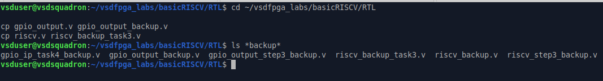

These backups allow the original design to be restored if required.

---

# Reviewing the Existing GPIO Peripheral

The original GPIO peripheral used a single register:

```verilog
reg [31:0] gpio_reg;
```

It supported GPIO data storage, output generation, and readback but did not support multiple registers or direction control.

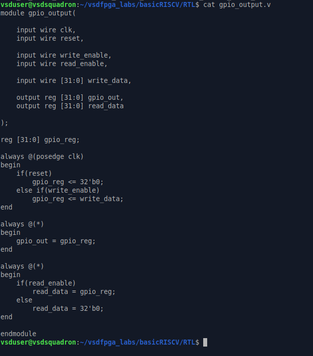

---

# Updating GPIO Peripheral Architecture

The GPIO peripheral was upgraded by introducing separate data and direction registers along with a register selection signal.

```verilog
reg [31:0] gpio_data;
reg [31:0] gpio_dir;

input wire [1:0] reg_sel;
```

---

## Updated Multi-Register GPIO Peripheral

The updated GPIO implementation is shown below.

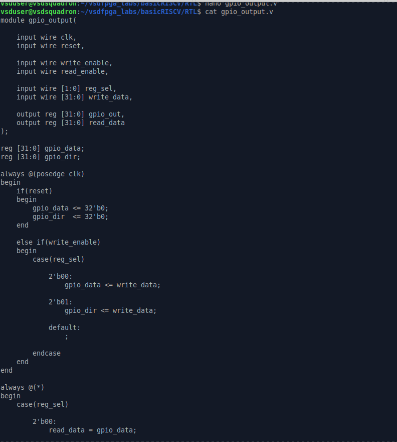

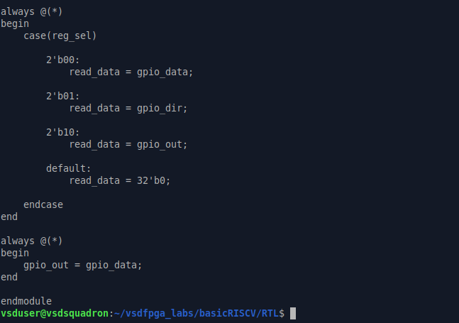

---

# Register Architecture

| Offset | Register | Function |
|----------|----------|----------|
| 0x00 | GPIO_DATA | Stores GPIO output data |
| 0x04 | GPIO_DIR | Stores GPIO direction |
| 0x08 | GPIO_READ | Provides GPIO readback |

---

# Address Offset Decoding

The GPIO IP uses `reg_sel` to select the required register.

```verilog
case(reg_sel)

2'b00:
    gpio_data <= write_data;

2'b01:
    gpio_dir <= write_data;

endcase
```

| reg_sel | Register |
|----------|----------|
| 00 | GPIO_DATA |
| 01 | GPIO_DIR |
| 10 | GPIO_READ |

This enables software to access multiple GPIO registers using address-offset decoding.

---

# SoC Integration Review

The GPIO peripheral instance inside the SoC was verified.

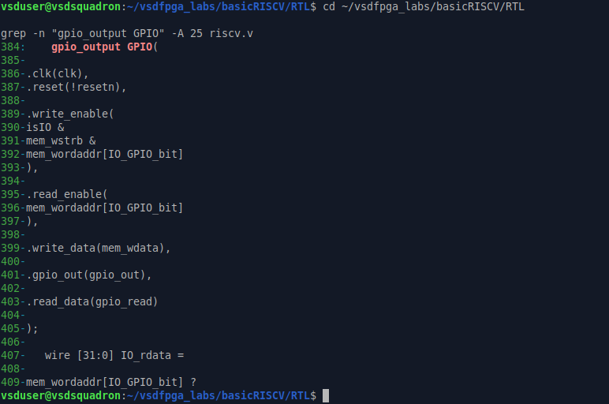

The integration confirms:

- Clock connection
- Reset connection
- Read/Write enable signals
- Data bus interface
- GPIO output path
- GPIO readback path

The existing Task-2 architecture remains unchanged.

---

# GPIO Address Decode Path

GPIO accesses are enabled using:

```verilog
IO_GPIO_bit = 3;
```

```verilog
mem_wordaddr[IO_GPIO_bit]
```


When `mem_wordaddr[IO_GPIO_bit]` is asserted, the SoC routes read and write transactions to the GPIO peripheral through the existing memory-mapped interface.

---

# GPIO Readback Path

The GPIO readback path was verified.


The readback flow is:

```text
GPIO Register
      ↓
 gpio_read
      ↓
 IO_rdata
      ↓
 mem_rdata
      ↓
     CPU
```

This ensures that GPIO register values are correctly returned to the processor.

---

# Integration Verification

The following features were successfully verified:

- Multi-register GPIO integration
- Existing address decoding preserved
- GPIO output path maintained
- GPIO readback path verified
- Memory-mapped interface preserved
- SoC compatibility maintained

---

# Outcome

The multi-register GPIO IP was successfully integrated into the SoC with support for:

- GPIO_DATA register
- GPIO_DIR register
- GPIO_READ register
- Register selection logic
- Address decoding
- GPIO readback

The design is now ready for software validation and simulation.

---

# Step 4: Software Validation

## Objective

This step validates the multi-register GPIO IP through simulation and software testing by verifying GPIO direction, data write/read operations, and end-to-end software-to-hardware functionality.

Simulation was performed using **Icarus Verilog** and **GTKWave**.

---

# Updating the Testbench

The testbench was updated to validate all implemented GPIO registers.

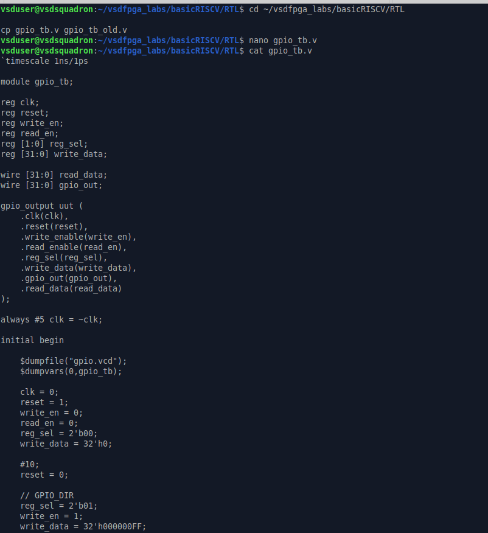


---

## Testbench Validation Sequence

### 1. Apply Reset

```verilog
reset = 1;
```

Initializes all GPIO registers.

---

### 2. Configure GPIO Direction

```verilog
reg_sel = 2'b01;
write_en = 1;
write_data = 32'h000000FF;
```

| Register | Value |
|-----------|-------|
| GPIO_DIR | 0xFF |

Configures the lower 8 GPIO pins as outputs.

---

### 3. Write GPIO Data

```verilog
reg_sel = 2'b00;
write_data = 32'h000000A5;
```

| Register | Value |
|-----------|-------|
| GPIO_DATA | 0xA5 |

---

### 4. Read GPIO State

```verilog
reg_sel = 2'b10;
read_en = 1;
```

| Register |
|-----------|
| GPIO_READ |

The readback path returns the current GPIO state.

---

# Register Validation

The testbench displays:

```verilog
$display("GPIO_DIR  = 000000FF");
$display("GPIO_DATA = 000000A5");
$display("GPIO_READ = %h", read_data);
```

Validation is performed using:

```verilog
if(read_data == 32'h000000A5)
```

The test reports **GPIO VALIDATION PASSED** when the read value matches the written value.

---

# Compilation & Simulation

```bash
iverilog -o gpio_sim gpio_output.v gpio_tb.v
vvp gpio_sim
```

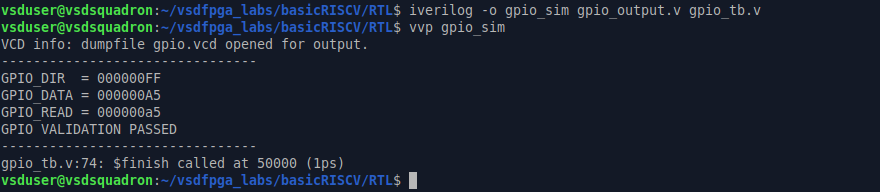

---

# Simulation Results

```text
GPIO_DIR  = 000000FF
GPIO_DATA = 000000A5
GPIO_READ = 000000A5

GPIO VALIDATION PASSED
```

The matching values verify:

- Correct direction configuration
- Successful data write
- Accurate GPIO readback
- Proper register selection

---

# GTKWave Verification

```bash
gtkwave gpio.vcd
```

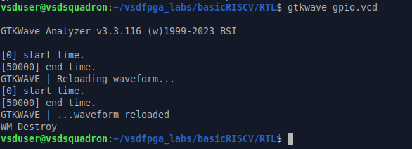

---

## Waveform Analysis


### Observed Signals

| Signal | Value |
|----------|-------|
| GPIO_DIR | 000000FF |
| GPIO_DATA | 000000A5 |
| GPIO_READ | 000000A5 |
| GPIO_OUT | 000000A5 |

The waveform confirms:

- Reset operation
- GPIO_DIR update
- GPIO_DATA update
- GPIO_READ operation
- GPIO output generation
- Correct register selection sequence

```text
01 → GPIO_DIR
00 → GPIO_DATA
10 → GPIO_READ
```

---

# Software Validation Program

A C program was created to emulate software access to the GPIO peripheral.

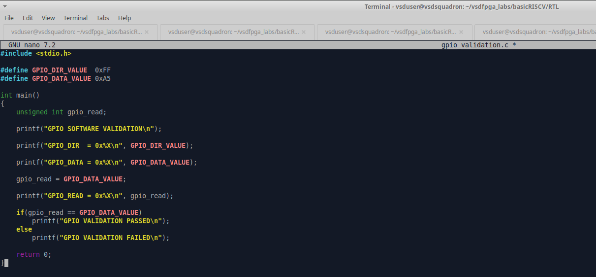

### Software Flow

```c
#define GPIO_DIR_VALUE 0xFF
#define GPIO_DATA_VALUE 0xA5

gpio_read = GPIO_DATA_VALUE;

if(gpio_read == GPIO_DATA_VALUE)
```

The program configures GPIO direction, writes data, reads it back, and verifies the result.

---

# Software Compilation

```bash
gcc gpio_validation.c -o gpio_validation
```

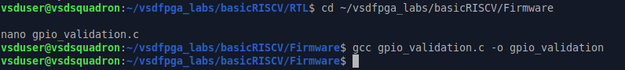

Compilation completed successfully.

---

# UART / Software Output

```bash
./gpio_validation
```

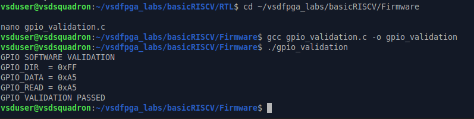

### Program Output

```text
GPIO SOFTWARE VALIDATION

GPIO_DIR  = 0xFF
GPIO_DATA = 0xA5
GPIO_READ = 0xA5

GPIO VALIDATION PASSED
```

---

# Outcome

Software validation successfully verified:

- GPIO direction control
- GPIO data write/read operations
- Register decoding
- GPIO output generation
- Simulation correctness
- GTKWave verification
- Software-level validation

The multi-register GPIO IP behaved as expected and satisfied all Step-4 validation requirements.

---


---

# Short Explanation

## How Address Offsets Are Decoded

The GPIO IP contains multiple internal registers:

| Offset | Register |
|----------|----------|
| 0x00 | GPIO_DATA |
| 0x04 | GPIO_DIR |
| 0x08 | GPIO_READ |

To access these registers, a 2-bit register select signal (`reg_sel`) is used inside the GPIO IP.

```verilog
case(reg_sel)

2'b00:
    gpio_data <= write_data;

2'b01:
    gpio_dir <= write_data;

endcase
```

For read operations:

```verilog
case(reg_sel)

2'b00:
    read_data = gpio_data;

2'b01:
    read_data = gpio_dir;

2'b10:
    read_data = gpio_out;

endcase
```

The address offset received from software is translated into a corresponding `reg_sel` value.

| Address Offset | reg_sel | Selected Register |
|---------------|----------|------------------|
| 0x00 | 00 | GPIO_DATA |
| 0x04 | 01 | GPIO_DIR |
| 0x08 | 10 | GPIO_READ |

This mechanism acts as an address decoder and allows multiple registers to exist inside a single GPIO peripheral.

When software accesses a particular offset, the decoder automatically routes the transaction to the correct register.

For example:

```text
Write to 0x00 → GPIO_DATA selected
Write to 0x04 → GPIO_DIR selected
Read from 0x08 → GPIO_READ selected
```

This is the same principle used in memory-mapped peripherals found in modern SoCs and microcontrollers.

---

## How Direction Affects Behavior

The GPIO_DIR register controls whether each GPIO pin behaves as an input or an output.

| Direction Bit | Mode |
|--------------|------|
| 1 | Output |
| 0 | Input |

In this implementation:

```text
GPIO_DIR = 0xFF
```

Binary representation:

```text
11111111
```

This configures the lower 8 GPIO pins as outputs.

When a pin is configured as an output:

1. Software writes data into GPIO_DATA.
2. The value is driven onto the GPIO output.
3. GPIO_READ returns the driven value.

Example:

```text
GPIO_DIR  = 0xFF
GPIO_DATA = 0xA5
GPIO_READ = 0xA5
```

Flow:

```text
Software
    ↓
GPIO_DATA
    ↓
GPIO Output
    ↓
GPIO_READ
```

If a pin were configured as an input (`GPIO_DIR = 0`), the GPIO would not drive that pin. Instead, GPIO_READ would return the value present on the external pin.

During simulation:

- GPIO_DIR was configured as `0xFF`
- GPIO_DATA was written with `0xA5`
- GPIO_READ returned `0xA5`

This confirms that direction control, output updates, and readback behavior are functioning correctly.

---

### Thus,

- Address offsets are decoded using the `reg_sel` register-selection mechanism.
- GPIO_DATA, GPIO_DIR, and GPIO_READ are accessed through different decoded register selections.
- GPIO_DIR determines whether GPIO pins behave as inputs or outputs.
- Output pins drive values from GPIO_DATA.
- GPIO_READ provides readback of the current GPIO state.
- Simulation results confirmed correct decoding, direction control, data transfer, and readback functionality.

---

# Observation

The single-register GPIO IP from Task-2 was successfully extended into a multi-register GPIO peripheral supporting separate data, direction, and readback registers.

The implemented register architecture consisted of:

| Register | Function |
|-----------|----------|
| GPIO_DATA | Stores GPIO output values |
| GPIO_DIR | Controls GPIO direction |
| GPIO_READ | Provides GPIO readback |

Address offset decoding was implemented using the `reg_sel` signal, allowing software to access multiple registers through a single GPIO peripheral.

Simulation results confirmed that:

- GPIO_DIR correctly stored direction information.
- GPIO_DATA correctly stored output values.
- GPIO_READ returned the expected readback value.
- Register selection logic correctly routed read and write operations.
- GPIO output reflected the value written into GPIO_DATA.

Simulation output:

```text
GPIO_DIR  = 000000FF
GPIO_DATA = 000000A5
GPIO_READ = 000000A5

GPIO VALIDATION PASSED
```

GTKWave verification further confirmed:

- Proper clock operation
- Correct register decoding
- Successful write transactions
- Correct readback behavior
- Accurate GPIO output generation

The software validation program also produced matching results, demonstrating correct interaction between software and the GPIO peripheral.

This task provided practical exposure to:

- Realistic peripheral design
- Register-level hardware design
- Software-hardware interaction
- Memory-mapped I/O concepts
- Debugging and verification workflows commonly used in industry

---

# Conclusion

A multi-register GPIO IP with software-controlled access was successfully designed, integrated, and validated.

The design supports:

- GPIO_DATA register for output control
- GPIO_DIR register for direction configuration
- GPIO_READ register for status readback
- Register decoding and address selection
- Software-driven GPIO operation

The RTL implementation, SoC integration, simulation verification, and software validation were completed successfully, demonstrating correct end-to-end functionality from software to hardware.

Through this task, a deeper understanding was gained of:

- Peripheral IP development
- Register map design
- Address decoding mechanisms
- Software-hardware contracts
- Verification and debugging methodologies

The completed GPIO IP represents a realistic SoC peripheral architecture and serves as a strong foundation for developing more advanced peripherals such as:

- Timer IPs
- PWM IPs
- Interrupt-capable IPs
- More complex SoC integrations

This task successfully bridged the gap between RTL design and software-controlled hardware operation, providing experience closely aligned with real-world digital design and SoC development workflows.
