# Task-6: PWM Peripheral IP Development and SoC Integration

## Overview

In this task, a custom **PWM (Pulse Width Modulation) Peripheral IP** is designed and integrated with a RISC-V based SoC.

The objective of this task is to understand how real hardware peripherals are developed in semiconductor and FPGA design flow. The PWM module works as a memory-mapped peripheral where the processor controls the output waveform by configuring internal registers.

The complete development flow includes RTL design, register implementation, SoC integration, software control, simulation verification, and FPGA hardware validation.


## Objective

The main goal of this task is to build a configurable PWM IP which can generate output signals useful for applications such as:

- LED brightness control
- Servo control signals
- Digital waveform generation

The PWM peripheral allows software running on the RISC-V processor to configure the output waveform by changing period and duty cycle values.


## Task Flow

The implementation follows the complete IP development cycle:

1. **PWM RTL Design**
   - Developed a synchronous Verilog module.
   - Implemented control, period, duty cycle, and status registers.

2. **Register Interface**
   - Created a memory-mapped register structure.
   - Added CPU read/write access support.

3. **SoC Integration**
   - Connected the PWM peripheral with the processor bus.
   - Added address decoding logic.
   - Exposed PWM output signal.

4. **Software Validation**
   - Created a C program to configure PWM registers.
   - Verified CPU control over the peripheral.

5. **Simulation Verification**
   - Verified PWM functionality using testbench simulation.
   - Observed PWM waveform behavior.

6. **FPGA Hardware Validation**
   - Programmed the design on VSDSquadron FPGA board.
   - Connected PWM output to LED for brightness control.


## PWM IP Specification

The PWM peripheral contains four 32-bit memory mapped registers.

| Offset | Register | Access | Description |
|-------|----------|--------|-------------|
| 0x00 | CTRL | R/W | Enable and polarity control |
| 0x04 | PERIOD | R/W | PWM period configuration |
| 0x08 | DUTY | R/W | PWM duty cycle configuration |
| 0x0C | STATUS | R | Debug and running status |


### Control Register

- Bit 0 : PWM Enable  
  - 1 → Enable PWM output  
  - 0 → Disable PWM output

- Bit 1 : Output Polarity  
  - 0 → Active High PWM  
  - 1 → Active Low PWM


## PWM Working Principle

The PWM IP uses an internal counter which counts from 0 to the programmed period value.

The duty register decides for how many clock cycles the output remains HIGH.

PWM output generation:
By modifying the duty value, the ON time of the signal changes, which controls the effective output power delivered to the connected device.

---

---

# PWM IP Directory Structure Creation

Before starting the PWM peripheral development, a separate IP directory structure was created inside the existing RISC-V SoC project.

This follows a modular hardware development approach where RTL design files, test files, firmware code, and documentation are maintained separately.

The PWM IP directory contains:

- `rtl` : Contains Verilog RTL implementation of PWM IP
- `test` : Contains simulation testbench files
- `firmware` : Contains software validation programs
- `README.md` : Contains IP documentation


## Creating PWM IP Folders

The following directory structure was created:

```bash
mkdir -p ip/pwm/rtl
mkdir -p ip/pwm/test
mkdir -p ip/pwm/firmware
```

Existing PWM design files were organized into their respective folders:

- pwm_ip.v → rtl folder
- pwm_tb.v → test folder
- pwm_test.c → firmware folder


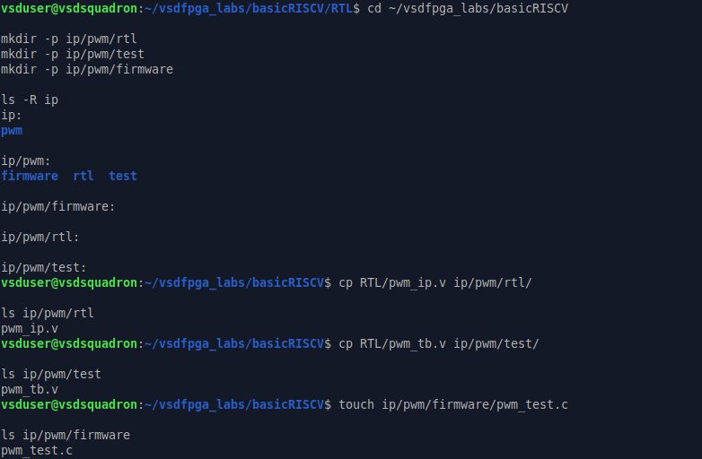


---

## Final PWM IP Structure

The complete PWM IP folder structure was verified using:

```bash
tree ip
```

Final structure:

```text
ip
└── pwm
    ├── firmware
    │   └── pwm_test.c
    ├── README.md
    ├── rtl
    │   └── pwm_ip.v
    └── test
        └── pwm_tb.v
```

This structure keeps the IP reusable and easy to integrate with different SoC designs.


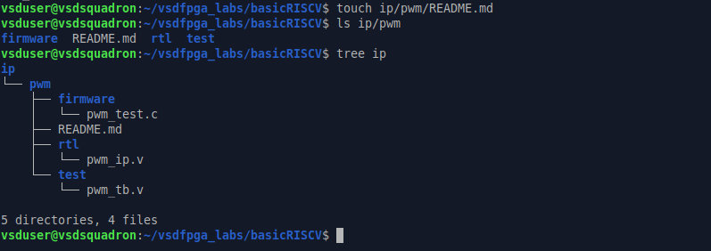


---


# Step 1: Creating PWM Peripheral Files

The first step was to create separate Verilog files for PWM IP design and verification inside the existing RISC-V SoC RTL directory.

The PWM design files created were:

- `pwm_ip.v` : Contains the main PWM peripheral RTL implementation.
- `pwm_tb.v` : Testbench used for simulation and functional verification.

The files were created using Linux terminal commands and edited using nano editor.


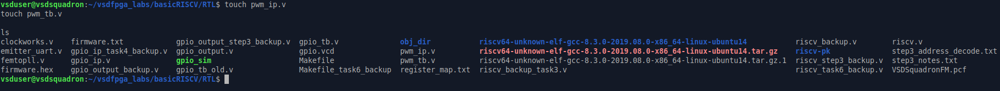


---

# Step 2: PWM IP RTL Implementation

The PWM peripheral was implemented in Verilog as a memory-mapped hardware IP.

The module interface contains:

- Clock and reset signals
- CPU read/write control signals
- Register selection lines
- 32-bit data interface
- PWM output signal


## PWM Register Implementation

The PWM IP contains four internal registers:

- **CTRL Register** : Controls PWM enable and output polarity
- **PERIOD Register** : Stores PWM period count value
- **DUTY Register** : Controls PWM ON time
- **COUNTER Register** : Generates timing reference for PWM waveform


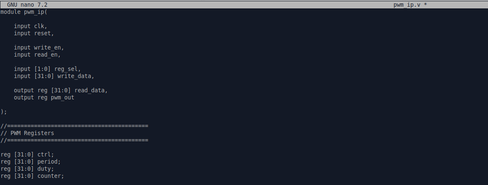


---

## PWM Counter Logic

A synchronous counter is implemented which operates when PWM enable bit is active.

The counter:

- Starts from zero after reset
- Counts till PERIOD-1 value
- Automatically resets after completing one PWM cycle
- Stops counting when PWM is disabled


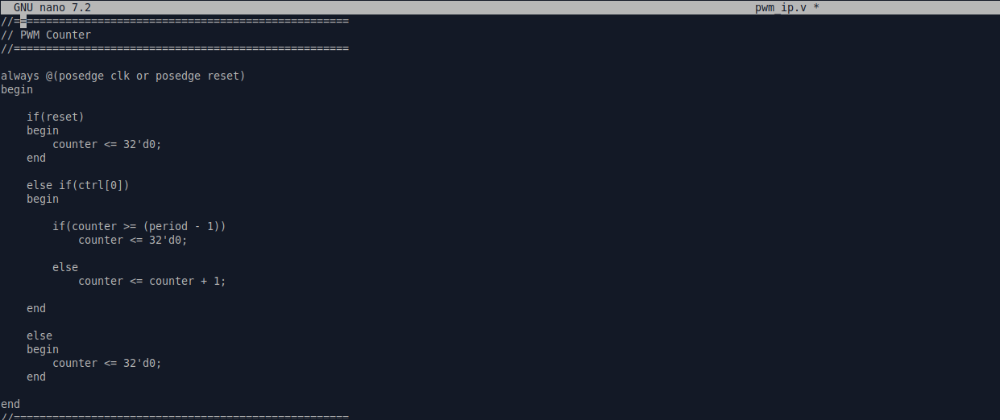

---

## PWM Output Generation Logic

The PWM output is generated by comparing the counter value with the programmed duty cycle.

Logic implemented:

When polarity control is enabled, the PWM output waveform is inverted.

This allows generation of both active-high and active-low PWM signals.


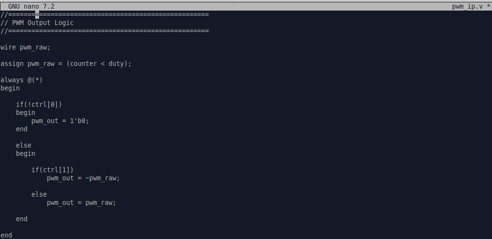


---

## PWM Register Read Logic

The read interface allows the processor to access PWM register values.

Register selection:

| Register Select | Output |
|---|---|
| 00 | CTRL |
| 01 | PERIOD |
| 10 | DUTY |
| 11 | STATUS |

The status register provides information about PWM running condition and counter value.


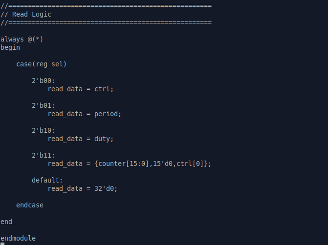


---

# Step 3: PWM Testbench Development

A Verilog testbench was created to verify the functionality of the PWM peripheral before FPGA implementation.

The testbench includes:

- PWM module instantiation
- Clock generation
- Reset control
- Register write operations
- Waveform dump generation


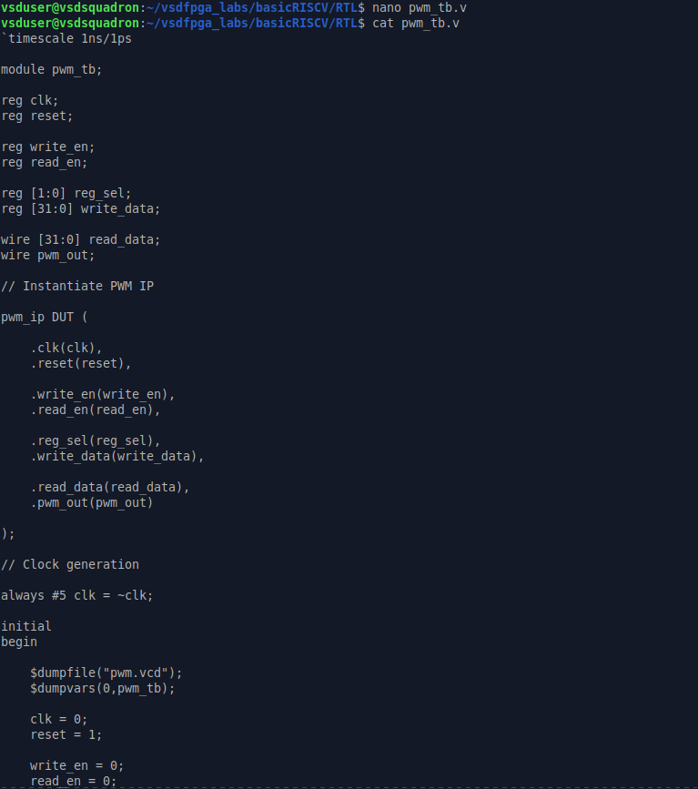

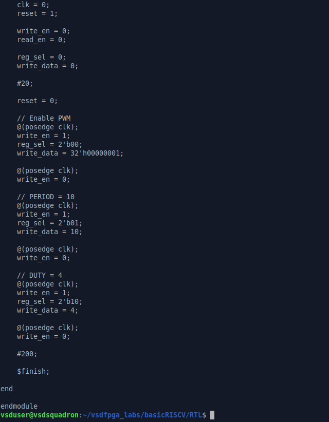


---

---

# Step 4: PWM Simulation Verification

After completing the RTL implementation and testbench development, the PWM IP was verified using simulation tools.

The simulation flow verifies whether the PWM module correctly responds to register configuration and generates the expected output waveform.


## Simulation Setup

The RTL file was copied into the PWM test directory and compiled together with the testbench.

Simulation tools used:

- Icarus Verilog (iverilog)
- GTKWave waveform analyzer


Commands used for simulation:

```bash
cp ../rtl/pwm_ip.v .

iverilog -o pwm_sim pwm_ip.v pwm_tb.v

vvp pwm_sim

gtkwave pwm.vcd
```


The simulation successfully generated the VCD waveform dump file without compilation errors.


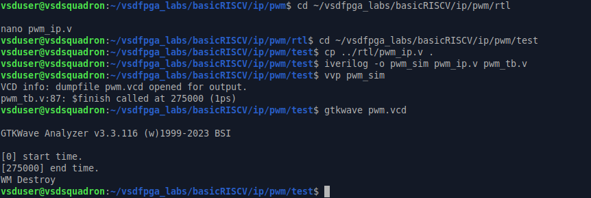


---

## GTKWave Verification

The generated `pwm.vcd` file was analyzed using GTKWave.

Observed signals:

- clk
- reset
- write_en
- reg_sel
- write_data
- pwm_out


During simulation:

- CTRL register enables PWM operation.
- PERIOD register is configured with the required count value.
- DUTY register controls the ON time of PWM output.
- pwm_out toggles according to the programmed duty cycle.


Test configuration:

| Parameter | Value |
|---|---|
| PERIOD | 10 |
| DUTY | 4 |
| Duty Cycle | ~40% |


The waveform confirms correct PWM generation based on the programmed register values.


---

## Simulation Result

The PWM IP successfully passed functional verification.

Verified operations:

✔ Register write functionality  
✔ PWM counter operation  
✔ Duty cycle generation  
✔ PWM output waveform behavior  

This confirms that the PWM peripheral RTL works correctly before SoC integration and FPGA implementation.

---

---

# Step 5: PWM IP Integration with RISC-V SoC

After verifying the standalone PWM module, the next step was integrating the PWM peripheral into the existing RISC-V SoC.

The integration process included:

- Adding PWM address space
- Connecting PWM with CPU memory bus
- Creating read/write paths
- Exposing PWM output signal


## Adding PWM Address Decode

A new IO address bit was assigned for the PWM peripheral inside the RISC-V SoC memory map.

The PWM IP was added as a separate memory-mapped peripheral similar to GPIO and UART.

```verilog
localparam IO_PWM_bit = 4;
```

This allows the processor to identify PWM register accesses using address decoding logic.


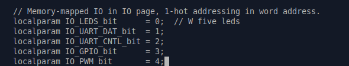


---

## Verifying PWM Connections

After modification, the updated RISC-V SoC file was checked to confirm that the PWM signals were correctly added.

The following signals were verified:

- pwm_read
- pwm_out
- PWM address selection


Commands used:

```bash
grep -n "IO_PWM" riscv.v

grep -n "pwm_read" riscv.v
```


The output confirms successful addition of PWM related signals inside the SoC design.


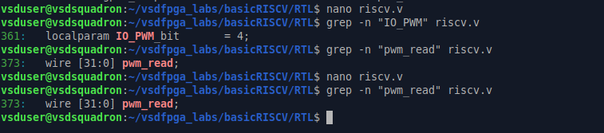


---

## PWM Bus Interface Connection

The PWM IP was connected with the existing processor communication interface.

Additional wires were introduced:

```verilog
wire [31:0] pwm_read;
wire pwm_out;
```


These signals allow:

- CPU write access to PWM registers
- CPU readback from PWM peripheral
- PWM output connection to external hardware


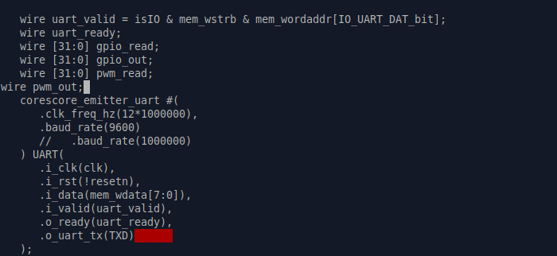


---

# Step 6: Software Validation Setup

To validate hardware control through software, firmware support was added.

The RISC-V firmware directory was used for writing software tests which configure the PWM registers.

Software validation verifies:

- Register configuration from C program
- Period value update
- Duty cycle modification
- PWM enable control


Firmware files were checked inside the project directory:


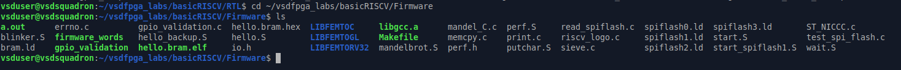


The software layer completes the connection between:

```
C Program
    ↓
RISC-V CPU
    ↓
Memory Bus
    ↓
PWM Hardware IP
    ↓
PWM Output Signal
```


---

## Integration Result

Successfully completed:

✔ PWM address mapping  
✔ SoC level signal connection  
✔ CPU to PWM communication path  
✔ Firmware validation environment setup  

The PWM IP is now integrated as a complete RISC-V controlled hardware peripheral.

---

---

# Step 7: PWM IP Documentation

After completing RTL design, simulation, and SoC integration, a dedicated documentation file was created for the PWM peripheral.

The README documentation describes:

- Purpose of PWM IP
- Register map
- Register access type
- Control bits
- Functional behavior


## PWM Register Description

The PWM peripheral follows a 32-bit memory mapped register structure.

| Offset | Register | Access | Function |
|---|---|---|---|
| 0x00 | CTRL | R/W | PWM enable and polarity control |
| 0x04 | PERIOD | R/W | Sets PWM period count |
| 0x08 | DUTY | R/W | Sets PWM high time |
| 0x0C | STATUS | R | Shows running status |


## Control Register

The CTRL register controls the operation of PWM:

- Bit 0 : EN  
  Enables or disables PWM generation

- Bit 1 : POL  
  Selects PWM output polarity


## Period and Duty Configuration

The PERIOD register decides the complete PWM cycle duration.

The DUTY register decides the amount of time for which PWM output remains HIGH during one period.

Changing the duty value changes the effective duty cycle of the PWM waveform.


## Status Register

The STATUS register provides:

- PWM running state
- Current counter value for debugging


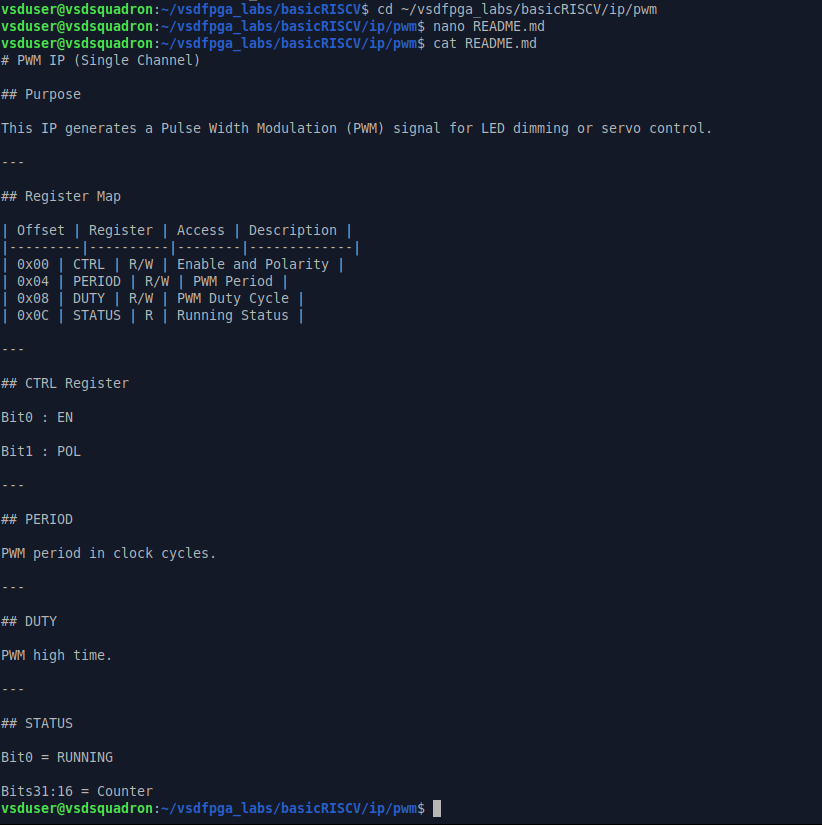


---

## Documentation Result

The PWM IP documentation provides a clear hardware-software interface, making the peripheral easier to integrate, test, and modify.

Completed:

✔ Register map documentation  
✔ Control bit explanation  
✔ Software interface details  
✔ Peripheral usage description  

---

---

# Step 8: PWM Software Validation

After completing hardware integration, software validation was performed using a C program running on the RISC-V processor.

The software test configures the PWM registers and verifies correct peripheral operation through processor control.

The validation program performs:

- CTRL register configuration
- PERIOD value programming
- DUTY cycle update
- PWM enable operation


## PWM Validation Program

The C program defines PWM configuration values:

- CTRL = Enable PWM
- PERIOD = 100 clock cycles
- DUTY = 40 clock cycles

This configuration generates approximately 40% duty cycle PWM output.


```c
#define PWM_CTRL_VALUE    0x01
#define PWM_PERIOD_VALUE  100
#define PWM_DUTY_VALUE    40
```

The software verifies that duty cycle configuration is valid before enabling PWM operation.


---

## Firmware Compilation

The PWM validation program was compiled using the RISC-V GCC toolchain.

The compilation flow generates:

- ELF executable file
- BRAM HEX file
- Firmware image for SoC loading


Command used:

```bash
make pwm_validation.bram.hex
```


The generated firmware image is copied into the RTL directory for SoC execution.


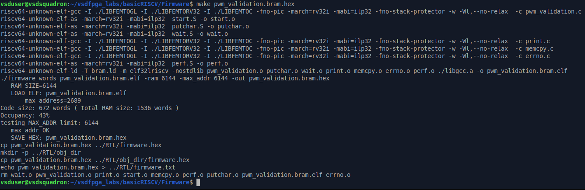


---

# Step 9: FPGA Build and Synthesis

After successful RTL integration and firmware generation, the complete SoC design was synthesized.

The build process includes:

- RTL synthesis
- Technology mapping
- Place and route
- Timing analysis
- Bitstream generation


Command executed:

```bash
make clean

make
```


The toolchain successfully generated FPGA output files:

- SOC.json
- SOC.asc
- SOC.bin


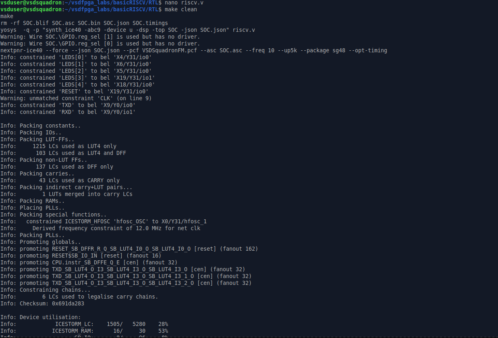


---

## Timing and Resource Report

The FPGA implementation completed successfully with no errors.

Build verification:

- Timing analysis completed
- Device resources mapped successfully
- Bitstream generated for VSDSquadron FPGA board


Important result:

```
1 warning, 0 errors

Info: Program finished normally.
```


This confirms successful hardware implementation of the PWM integrated RISC-V SoC.


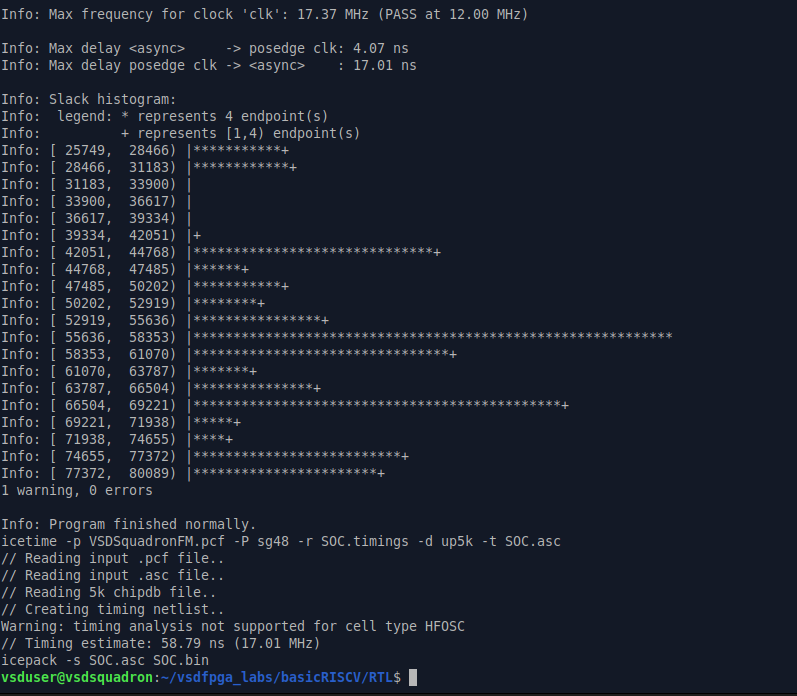


---

# Final Results

The complete PWM peripheral development flow was successfully completed.

Implemented and verified:

✔ PWM RTL Design  
✔ Register based peripheral interface  
✔ RISC-V SoC Integration  
✔ Software controlled PWM configuration  
✔ Functional simulation using GTKWave  
✔ FPGA synthesis and bitstream generation  


---

# We can report that , 

This demonstrates the complete development cycle of a custom hardware peripheral IP similar to an industry-level FPGA and semiconductor workflow.

A configurable PWM IP was designed using Verilog, integrated into a RISC-V based SoC, controlled through software, verified using simulation, and finally synthesized for FPGA hardware implementation.

The project provided practical understanding of hardware-software interaction, memory mapped peripherals, SoC integration, and FPGA based validation.

---

