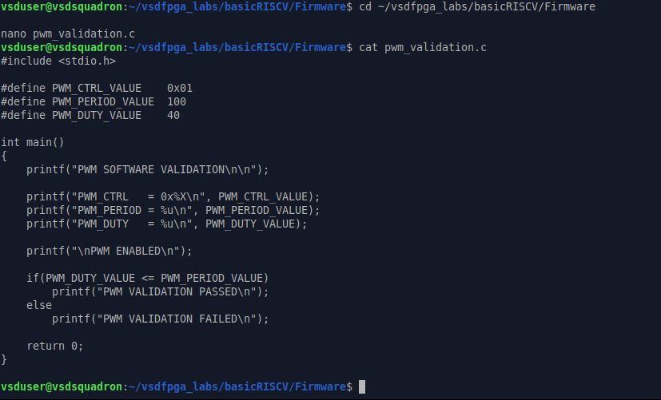
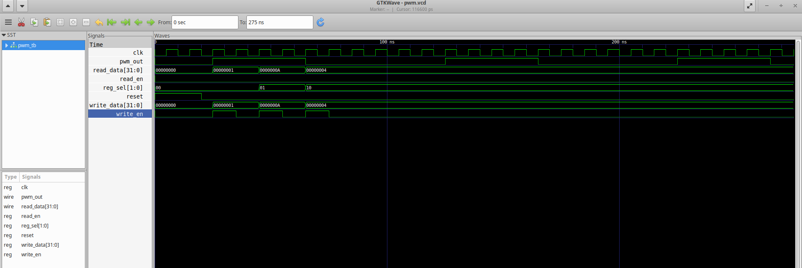
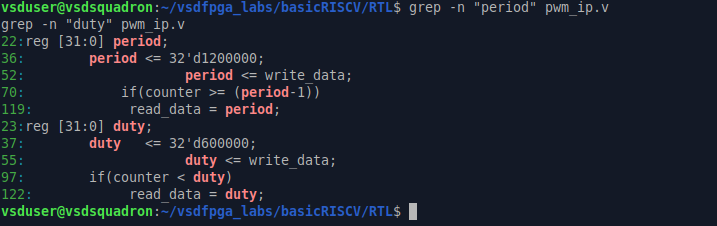
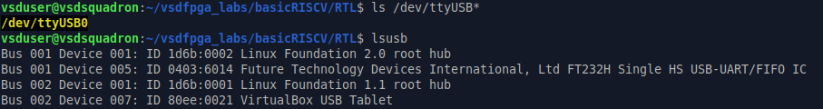
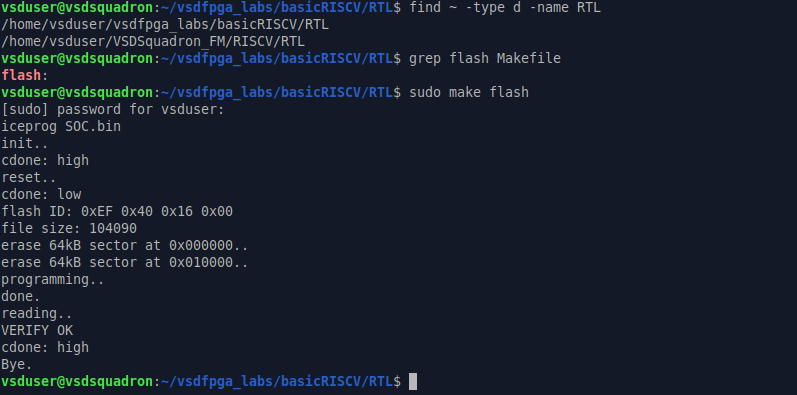
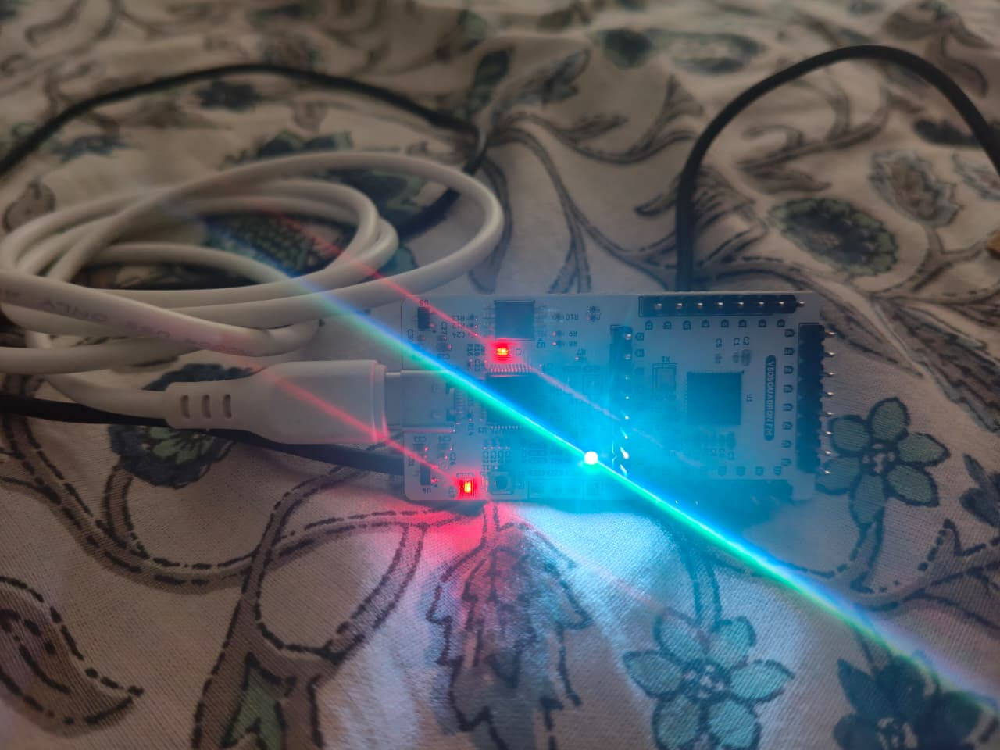

# PWM IP Example Usage


## Software Programming Model

PWM IP is controlled through memory mapped registers.


## Initialization Sequence


1. Configure PERIOD

2. Configure DUTY

3. Enable CTRL register

4. Observe PWM output


---

## Example


```
PERIOD = 10

DUTY = 5
```


Duty cycle:


```
Duty Cycle = DUTY / PERIOD ×100

= 5 / 10 ×100

= 50%
```


---

## C Example


```c
PWM_PERIOD = 10;

PWM_DUTY = 5;

PWM_CTRL = 1;
```


---

## Expected Output

- PWM waveform generated successfully
- Output follows configured duty cycle
- LED brightness changes with duty cycle


---

## Common Issues


|Issue|Reason|
|-|-|
|No Output|PWM disabled|
|Always HIGH|Duty greater than period|
|No LED response|Pin mapping issue|


---

## Validation

PWM IP successfully generates configurable PWM output on VSDSquadron FPGA.

---

---

# Validation Results


## PWM Build Validation and SOC

The PWM IP was successfully validated , integrated and built with the VSDSquadron SoC.




---

## PWM Simulation using GTKWave

The PWM waveform was verified using GTKWave simulation.

Verified signals:

- clk
- pwm_out
- register write operation
- duty cycle behaviour





---

## Duty Cycle Verification

PWM Configuration:

PERIOD = 12000000

DUTY = 6000000


Calculation:

Duty Cycle = (6000000 / 12000000) × 100

Duty Cycle = 50%





---

## FPGA Hardware Programming

The design was successfully flashed using terminal of Virtual Machine onto the VSDSquadron FPGA board.





---

## Board Level Output

The PWM output was verified on actual hardware for 50% duty cycle




---

## Result

The PWM IP successfully generated configurable PWM output and was validated through:

- RTL verification
- Simulation waveform
- SoC integration
- FPGA hardware testing
